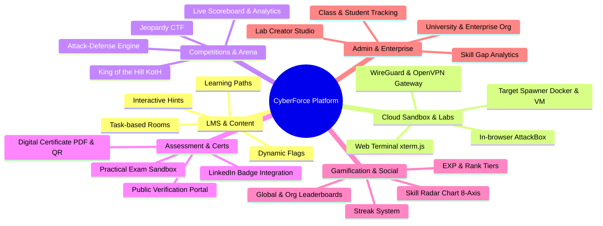
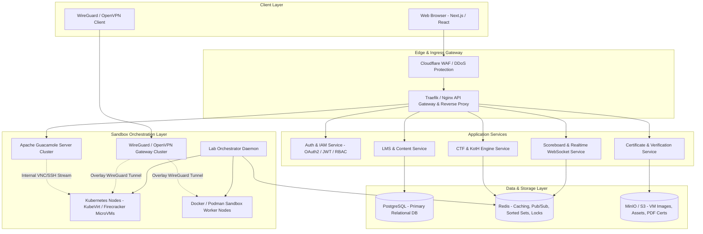

# 🛡️ CyberForce (CyberForge) - Platform Development Plan

> **Nền tảng đào tạo an ninh mạng tương tác, thực hành lab thực chiến, đấu trường đối kháng (CTF/KotH) & Khảo thí cấp chứng chỉ số**
> _Tham chiếu tiêu chuẩn: TryHackMe, HackTheBox, VulnHub_

---

## 1. TỔNG QUAN HỆ THỐNG & TẦM NHÌN DỰ ÁN

**CyberForce** là nền tảng e-Learning kết hợp Cloud Sandbox Range chuyên sâu về an ninh thông tin, giúp người học từ cơ bản đến nâng cao có thể:

1. **Tiếp cận kiến thức có hệ thống:** Học tập theo các lộ trình được chuẩn hóa (Learning Paths) với các phòng thực hành tương tác (Interactive Rooms).
2. **Thực hành không rào cản (Zero Setup Friction):** Thao tác tấn công & phòng thủ trực tiếp trên trình duyệt qua Web AttackBox (Kali Linux stream qua WebRTC/Guacamole) hoặc kết nối an toàn qua VPN (WireGuard/OpenVPN).
3. **Môi trường lab cô lập & an toàn:** Khởi tạo động các máy mục tiêu (Docker containers & Firecracker/QEMU microVMs) với dải mạng riêng biệt, kiểm soát an toàn tuyệt đối chống lạm dụng hạ tầng.
4. **Đấu trường thi đấu thực chiến:** Tổ chức giải Jeopardy CTF, mô hình đối kháng thời gian thực King of the Hill (KotH) và Attack-Defense.
5. **Đánh giá & Cấp chứng chỉ định danh:** Đánh giá năng lực thực hành qua bài thi độc lập (Hands-on Capstone Exams) và cấp chứng chỉ số có thể tra cứu công khai.

---

## 2. PHÂN HỆ CHỨC NĂNG CHI TIẾT (FUNCTIONAL SPECIFICATIONS)



### 2.1. Phân hệ Học tập & Lộ trình (LMS & Interactive Rooms)

- **Learning Paths (Lộ trình chuẩn hóa):**
  - _Pre-Security & Fundamentals:_ Mạng căn bản, Linux/Windows CLI, nguyên lý bảo mật.
  - _Offensive Pentesting:_ Web Exploitation (OWASP Top 10), Privilege Escalation, Active Directory Attacks.
  - _Cyber Defense & SOC:_ SIEM (Splunk/ELK), Traffic Analysis (Wireshark, Zeek), Digital Forensics & Incident Response (DFIR).
  - _Specialized:_ DevSecOps, Reverse Engineering & Malware Analysis, Cloud Security (AWS/GCP/Azure).
- **Interactive Rooms & Tasks:**
  - Chia nhỏ nội dung thành các Task ngắn gọn: Lý thuyết $\rightarrow$ Hướng dẫn $\rightarrow$ Thực hành.
  - Trả lời câu hỏi: Hỗ trợ kiểm tra chuỗi, biểu thức chính quy (Regex) và script validator.
  - Hệ thống gợi ý (Tiered Hints): Mở hint từng mức để hỗ trợ người học khi gặp bế tắc.
  - Walkthroughs/Writeups: Cơ chế tự động khóa cho đến khi hoàn thành bài lab.

---

### 2.2. Phân hệ Ảo hóa & Lab Sandbox (Virtualization & Cloud Range)

- **In-Browser AttackBox:**
  - Máy trạm Kali Linux / Parrot OS chạy trên nền tảng đám mây, truyền tải giao diện mượt mà qua trình duyệt web sử dụng **Apache Guacamole (RDP/VNC qua WebSocket)**.
  - Cài đặt sẵn đầy đủ công cụ pentest tiêu chuẩn (Burp Suite, Metasploit, Nmap, Wireshark, Ghidra, CyberChef, SQLmap).
  - **Web CLI Terminal:** Giao diện shell nhẹ trực tiếp trên web bằng `xterm.js` cho kết nối SSH nhanh chóng.
- **Target Machine Spawner:**
  - **Container Lab:** Dành cho các bài thực hành Web, API, Crypto với thời gian khởi chạy nhanh (< 3 giây).
  - **MicroVM / VM Lab:** Dành cho các bài lab Kernel Exploit, Windows AD, Rootkit sử dụng Firecracker microVMs hoặc QEMU/KVM.
  - **Quản lý vòng đời (Lease Lifecycle):** Cấp phát thời gian 60 phút/phiên, hỗ trợ gia hạn (+1 Hour), cơ chế Reaper Worker tự động dọn dẹp khi hết hạn.
- **Mạng & VPN Access:**
  - Cung cấp file cấu hình VPN cá nhân (`.ovpn` và `.conf` cho WireGuard).
  - Cấp phát IP nội bộ riêng biệt (ví dụ: `10.10.x.y`) cho từng máy mục tiêu của học viên.

---

### 2.3. Phân hệ Thi đấu & Đấu trường (CTF & KotH Arena)

- **Jeopardy CTF Engine:**
  - Hỗ trợ đầy đủ các thể loại: Web, Pwn, Reverse, Crypto, Forensics, OSINT, Misc.
  - Thuật toán tính điểm động (Dynamic Scoring Decay) dựa trên số lượt giải thành công.
  - Bảng điểm trực tiếp (Live Scoreboard) với biểu đồ Timeline và tính năng đóng băng bảng điểm (Scoreboard Freeze).
- **King of the Hill (KotH) Engine:**
  - Phòng đấu đối kháng từ 4 đến 10 người/đội trong 45 phút.
  - Cơ chế trò chơi:
    1. Tấn công chiếm quyền `root`/`Administrator` trên máy mục tiêu.
    2. Ghi danh danh tính người chơi vào file kiểm soát (ví dụ: `/root/king.txt` hoặc API Token).
    3. Vá lỗ hổng, thiết lập phòng thủ chặn đối thủ khác chiếm quyền mà không vi phạm quy tắc SLA.
    4. Hệ thống Tick Engine kiểm tra mỗi 60 giây và cộng điểm cho người/đội đang giữ vị trí King.
- **Attack-Defense CTF Engine:**
  - Mô hình giải đấu theo đội với hệ thống Vulnbox riêng biệt kèm dịch vụ cần bảo vệ và kiểm tra trạng thái SLA định kỳ.

---

### 2.4. Phân hệ Khảo thí & Cấp Chứng chỉ (Exams & Digital Certificates)

- **Hands-on Capstone Exams:**
  - Kỳ thi thực hành 100% trong môi trường mạng cô lập (thời gian làm bài từ 6h đến 24h).
  - Kiểm tra toàn diện kỹ năng: Khai thác đa mục tiêu, Network Pivoting, chiếm quyền miền Active Directory, leo thang đặc quyền.
- **Hệ thống Chứng chỉ Kỹ thuật số:**
  - Tự động tạo tệp chứng chỉ PDF định danh với mã số duy nhất (UUID v4 + Digital Signature).
  - Cổng tra cứu xác thực công khai: `https://cyberforce.domain/verify/[CERT_ID]` hiển thị tên, điểm số, kỹ năng và ngày cấp.
  - Tích hợp huy hiệu OpenBadges và nút chia sẻ trực tiếp lên LinkedIn Certifications.

---

### 2.5. Phân hệ Gamification, Hồ sơ Năng lực & Cộng đồng

- **Gamification Engine:**
  - **Streak Tracking:** Điểm danh học tập hàng ngày, thưởng nhân hệ số EXP.
  - **Rank Tiers:** Bậc xếp hạng từ _Novice $\rightarrow$ Script Kiddie $\rightarrow$ Hacker $\rightarrow$ Elite $\rightarrow$ Guru $\rightarrow$ CyberForge Legend_.
  - **Huy hiệu thành tựu (Badges):** _First Blood, 30-Day Streak, Linux Master, Active Directory Hunter, Bug Hunter_.
- **Cyber Skill Radar Matrix:**
  - Biểu đồ Radar 8 trục đánh giá năng lực: _Web App, Network Pentest, Binary Exploitation, Cryptography, Forensics, Windows/AD, Defensive/BlueTeam, Cloud Security_.
  - Điểm số các trục tự động tính toán dựa trên độ khó và số lượng bài lab đã vượt qua.

---

### 2.6. Phân hệ Quản trị, Creator Studio & Enterprise (B2B/University)

- **Lab Creator Studio:**
  - Trình biên soạn bài lab bằng Markdown/MDX, hỗ trợ nhúng sơ đồ mạng, tệp đính kèm.
  - Cấu hình mẫu máy (Template Specs): Docker image tag, tệp QCOW2/OVA, RAM/CPU limits, networking setup.
- **Enterprise & University Portal:**
  - Quản lý phân cấp theo Tổ chức $\rightarrow$ Phòng ban / Lớp học $\rightarrow$ Thành viên.
  - Giao bài tập theo thời hạn (Assigned Tracks & Deadlines).
  - Báo cáo phân tích lỗ hổng kỹ năng (Skill Gap Analysis) của tổ chức.

---

## 3. THIẾT KẾ KIẾN TRÚC KỸ THUẬT (TECHNICAL ARCHITECTURE)



### 3.1. Danh mục Công nghệ Đề xuất (Tech Stack)

| Thành phần                 | Công nghệ lựa chọn                                                      | Lý do                                                                              |
| :------------------------- | :---------------------------------------------------------------------- | :--------------------------------------------------------------------------------- |
| **Frontend Web App**       | Next.js 14+ (App Router, TypeScript), Tailwind CSS, Shadcn UI, xterm.js | SSR/SSG tối ưu SEO, giao diện hiện đại, render terminal trực tiếp trên web mượt mà |
| **Core API Services**      | Go (Golang) hoặc Node.js (NestJS)                                       | Hiệu năng xử lý concurrency cao, memory footprint thấp, type safety                |
| **Realtime Engine**        | Go / Node.js + WebSocket + Redis Pub/Sub                                | Đảm bảo độ trễ thấp cho Scoreboard, KotH Tick Engine và thông báo hệ thống         |
| **Lab Orchestrator**       | Go Service tương tác Docker SDK / K8s Client / libvirt                  | Khởi tạo, gán IP, cấp phát VLAN và thu hồi tài nguyên sandbox chính xác            |
| **Primary Database**       | PostgreSQL 16+                                                          | Toàn vẹn dữ liệu giao dịch, hỗ trợ JSONB cho cấu hình linh hoạt của bài lab        |
| **Cache & Realtime Store** | Redis Cluster                                                           | Quản lý phiên, rate limiting, Sorted Sets cho bảng xếp hạng, phân tán lock máy lab |
| **Object Storage**         | MinIO / AWS S3                                                          | Lưu trữ an toàn các tệp ISO, VM base image, challenge attachments, chứng chỉ PDF   |
| **In-browser GUI**         | Apache Guacamole Server + Guacamole Client                              | Chuẩn hóa truyền tải RDP/VNC sang WebSocket HTML5 canvas, không cần cài plugin     |
| **Network & Tunneling**    | WireGuard + Calico / Cilium (eBPF)                                      | Tốc độ kết nối VPN cực nhanh, cấu hình Network Policies cô lập mạnh mẽ             |

---

### 3.2. Cơ chế Bảo mật Sandbox & Chống Lạm dụng (Crucial Guardrails)

1. **Khóa Egress Internet triệt để (Zero Outbound Traffic):**
   - Áp dụng iptables / eBPF Network Policies chặn 100% kết nối mạng đi ra Internet từ các máy mục tiêu (trừ DNS nội bộ). Ngăn chặn người dùng biến máy lab thành công cụ DDoS hoặc đào tiền ảo.
2. **Cô lập không gian mạng (Network Isolation):**
   - Mỗi học viên / đội thi được phân bổ một Subnet / VLAN riêng biệt.
   - Cấm hoàn toàn traffic giao tiếp giữa các học viên trên mạng VPN (Client-to-Client isolation), chỉ cho phép `Học viên IP <--> Máy mục tiêu IP`.
3. **Dynamic Flag Generation:**
   - Flag được sinh động tại thời điểm khởi động máy: `flag{HMAC_SHA256(userId, roomId, instanceSalt)}`.
   - Chống hoàn toàn hành vi chia sẻ flag hoặc tải flag có sẵn trên mạng.
4. **Giới hạn tài nguyên & Reaper Service:**
   - Thiết lập cgroups hạn chế CPU, RAM (vd: tối đa 2 vCPU, 2GB RAM cho mỗi container/microVM).
   - Background Reaper Worker quét định kỳ và tự động hủy (kill & purge) các instance hết hạn thời gian thuê.

---

## 4. MÔ HÌNH DỮ LIỆU CỐT LÕI (CORE DATA SCHEMA)

```
[Users] ──────────< [Room_Enrollments] >────────── [Rooms]
   │                                                  │
   ├──────< [Submissions]                             ├──────< [Tasks]
   │                                                  │          │
   ├──────< [Certificates]                            │          └──< [Questions]
   │                                                  │
   ├──────< [KotH_Matches]                            └──────< [Lab_Instances]
   │
   └──────< [User_Badges] >────── [Badges]
```

### Chi tiết các thực thể chính:

- **Users:** `id (UUID), email, username, password_hash, role (student/creator/instructor/admin), exp_points, rank_tier, vpn_config_id, avatar_url, created_at`
- **Learning_Paths:** `id, title, slug, description, difficulty_level, icon_url, order_index, is_published`
- **Rooms:** `id, path_id, title, slug, description, difficulty, room_type (walkthrough/challenge/koth), target_template_id, is_free, published_at`
- **Tasks:** `id, room_id, task_order, title, content_markdown, created_at`
- **Questions:** `id, task_id, question_text, answer_hash, flag_pattern, flag_type (static/dynamic), hint_text, points_reward`
- **Lab_Instances:** `id, user_id, room_id, ip_address, instance_type (docker/firecracker/vm), container_id, status (provisioning/running/terminated), expires_at, created_at`
- **Submissions:** `id, user_id, question_id, submitted_value, is_correct, points_earned, created_at`
- **Certificates:** `id (UUID), user_id, path_id, exam_id, score_percentage, verification_hash, pdf_storage_url, issued_at`
- **KotH_Matches:** `id, room_id, status, start_time, end_time, tick_interval_sec, current_king_user_id`

---

## 5. LỘ TRÌNH PHÁT TRIỂN & KẾ HOẠCH TRIỂN KHAI (ROADMAP)

### 📌 Giai đoạn 1: MVP - Foundation & Web CTF (Tháng 1 - 2)

- [ ] Thiết lập Monorepo / Repo Architecture, chuẩn hóa CI/CD pipeline và Docker setup.
- [ ] Xây dựng Core Auth Service (OAuth2 Google/GitHub, JWT, Role-Based Access Control).
- [ ] Xây dựng Frontend UI Core (Landing Page, Course Catalog, Room Interface, Dashboard).
- [ ] Xây dựng LMS Engine (Quản lý Module, Task Markdown, Question Validator & Hint system).
- [ ] Xây dựng Docker Lab Spawner đơn giản (chạy các bài lab Web Security trên container cô lập).
- [ ] Tích hợp Web Terminal (xterm.js qua WebSocket) cho phép tương tác shell trực tiếp.

### 📌 Giai đoạn 2: Cloud Sandbox, VPN & Gamification (Tháng 3 - 4)

- [ ] Triển khai WireGuard & OpenVPN Gateway, cho phép người học tải file VPN cấu hình cá nhân.
- [ ] Tích hợp cụm Apache Guacamole Server: Cung cấp Web AttackBox (Kali Linux giao diện đồ họa trên web).
- [ ] Hỗ trợ ảo hóa MicroVMs (Firecracker / QEMU) cho các bài lab Privilege Escalation & Linux/Windows.
- [ ] Xây dựng hệ thống Gamification: Streaks, EXP, Huy hiệu thành tựu, Radar Chart kỹ năng 8 trục.
- [ ] Xây dựng Jeopardy CTF Engine với Scoreboard cập nhật thời gian thực.

### 📌 Giai đoạn 3: Đấu trường Đối kháng KotH & Cấp Chứng chỉ (Tháng 5 - 6)

- [ ] Xây dựng King of the Hill (KotH) Engine: Quản lý phòng đối kháng, Tick Engine tính điểm giữ cờ root theo thời gian thực.
- [ ] Xây dựng Phân hệ Khảo thí (Hands-on Exam Room): Môi trường thi độc lập giới hạn thời gian (6h-12h).
- [ ] Xây dựng Hệ thống Cấp Chứng chỉ số tự động (Sinh PDF bảo mật, mã QR, Cổng tra cứu `verify.cyberforce.io`).
- [ ] Xây dựng Enterprise & University Portal: Quản lý lớp học/nhân viên, giao bài tập, báo cáo kỹ năng.

---

## 6. QUẢN LÝ RỦI RO & PHƯƠNG ÁN DỰ PHÒNG (RISK MITIGATION)

| Rủi ro kỹ thuật                                            |      Mức độ      | Phương án xử lý & Dự phòng                                                                               |
| :--------------------------------------------------------- | :--------------: | :------------------------------------------------------------------------------------------------------- |
| **Lạm dụng máy Lab để tấn công mạng ngoài**                | **Nghiêm trọng** | Tường lửa chặn 100% Egress Internet; chỉ cho phép traffic nội bộ từ VPN/Guacamole Gateway.               |
| **Treo/Cạn kiệt tài nguyên máy chủ do nhiều VM**           |     **Cao**      | Áp dụng cgroups quota nghiêm ngặt; Background Reaper tự động dọn dẹp VM sau 60 phút không có người dùng. |
| **Học viên chia sẻ Flag cho nhau**                         |  **Trung bình**  | Tự động sinh **Dynamic Flag** riêng biệt cho từng người dùng dựa trên HMAC SHA-256 kèm salt.             |
| **Lây nhiễm/Tấn công lẫn nhau giữa các học viên trên VPN** |     **Cao**      | Bật Client Isolation trên VPN Gateway; chỉ cho phép giao tiếp `Client <--> Assigned Target Subnet`.      |

---

_Tài liệu này được lưu trữ tại thư mục gốc của dự án để làm kim chỉ nam phát triển kiến trúc và triển khai kỹ thuật cho CyberForce._
