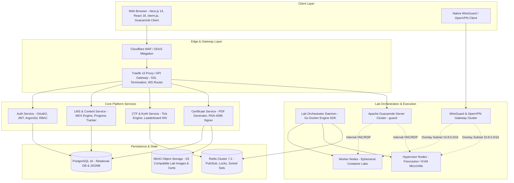

# 🛡️ CyberForce (CyberForge)

> **Next-Generation Cloud Cyber Range, Hands-on Security Training & Verifiable Digital Certification Platform**  
> *Nền tảng đào tạo an ninh mạng thực chiến, đấu trường đối kháng thời gian thực và khảo thí cấp chứng chỉ số thực hành thế hệ mới.*

---

### 🎓 THÔNG TIN ĐỒ ÁN & TÁC GIẢ
* **Sinh viên thực hiện:** **Phạm Như Quốc Như**
* **Mã sinh viên:** **21IT531**
* **Học phần:** **Đồ án môn học Chuyên đề 4**
* **Đề tài:** Nghiên cứu, thiết kế và xây dựng nền tảng Cyber Range thực hành an ninh mạng đám mây (*Cloud-native Cyber Range Platform*)

---

## 📌 Mục lục (Table of Contents)

1. [Giới thiệu Dự án (Introduction & Vision)](#-giới-thiệu-dự-án-introduction--vision)
2. [Vấn đề Thực tế & Giải pháp Đột phá (Problems & Solutions)](#-vấn-đề-thực-tế--giải-pháp-đột-phá)
3. [Các Phân hệ Tính năng Cốt lõi (Core Epics)](#-các-phân-hệ-tính-năng-cốt-lõi-core-epics)
4. [Kiến trúc Kỹ thuật & Công nghệ (Architecture & Tech Stack)](#-kiến-trúc-kỹ-thuật--công-nghệ-architecture--tech-stack)
5. [Cơ chế Bảo mật & Cách ly Mạng (Security & Anti-Abuse)](#-cơ-chế-bảo-mật--cách-ly-mạng-security--anti-abuse)
6. [Cấu trúc Thư mục Dự án (Project Structure)](#-cấu-trúc-thư-mục-dự-án-project-structure)
7. [Hướng dẫn Cài đặt & Chạy Cục bộ (Getting Started)](#-hướng-dẫn-cài-đặt--chạy-cục-bộ-getting-started)
8. [Hệ thống Tài liệu Kỹ thuật (Documentation Hub)](#-hệ-thống-tài-liệu-kỹ-thuật-documentation-hub)
9. [Quy chuẩn Đóng góp & Phát triển (Contributing)](#-quy-chuẩn-đóng-góp--phát-triển-contributing)
10. [Giấy phép (License)](#-giấy-phép-license)

---

## 🌐 Giới thiệu Dự án (Introduction & Vision)

**CyberForce (CyberForge)** là một nền tảng **Cyber Range trên nền tảng đám mây (Cloud-native Cyber Range)** toàn diện, được thiết kế nhằm xóa bỏ hoàn toàn rào cản kỹ thuật tiếp cận (*Zero-Friction*) cho người học và chuyên gia an ninh mạng.

Thay vì phải mất từ 3 đến 6 giờ để cài đặt máy ảo, cấu hình card mạng NAT phức tạp trên máy tính cá nhân, CyberForce cho phép học viên khởi chạy toàn bộ môi trường tấn công (**Kali Linux AttackBox**) và các máy chủ mục tiêu dễ bị tổn thương chỉ bằng **1-Click** trực tiếp trên tab trình duyệt web trong chưa đầy **3 giây**.

```
                           ┌─────────────────────────────────────────────────────────┐
                           │                   CYBERFORCE PILLARS                    │
                           └─────────────────────────────────────────────────────────┘
                                     │                      │                      │
                         ┌───────────▼──────────┐ ┌─────────▼──────────┐ ┌─────────▼──────────┐
                         │  ZERO-SETUP PRACTICE │ │  REAL-TIME ARENA   │ │ VERIFIABLE CERTS   │
                         │ • In-browser Kali    │ │ • King of the Hill │ │ • 100% Practical   │
                         │ • 1-Click Container  │ │ • Dynamic CTF      │ │ • RSA-4096 Sign    │
                         │ • Dual WireGuard VPN │ │ • Live Leaderboard │ │ • Public QR Verify │
                         └──────────────────────┘ └────────────────────┘ └────────────────────┘
```

### 🎯 Tầm nhìn & Sứ mệnh
* **Zero-Friction Access:** Dân chủ hóa giáo dục an ninh mạng. Bất kỳ ai sở hữu một trình duyệt web tiêu chuẩn đều có thể thực hành các kỹ thuật phòng thủ và tấn công mạng mà không cần máy tính cấu hình cao.
* **Grounded Practical Mastery:** Học đến đâu thực hành gõ lệnh đến đó thông qua mô hình phòng học tương tác chia 3 cột (Lý thuyết MDX - Nhiệm vụ câu hỏi - Terminal thực thi).
* **Cryptographic Integrity:** Đánh giá năng lực thực chất bằng kỳ thi Capstone thực hành 12h-24h trong mạng cô lập, cấp chứng chỉ số có chữ ký mật mã RSA-4096 và mã QR tra cứu công khai, chống gian lận tuyệt đối.

---

## 💡 Vấn đề Thực tế & Giải pháp Đột phá

| Vấn đề Hiện tại (Industry Pain Points) | Tác động Tiêu cực | Giải pháp Đột phá của CyberForce |
| :--- | :--- | :--- |
| **Rào cản cài đặt môi trường (Setup Friction)** | Người mới mất hàng giờ cài VMware/VirtualBox, cấu hình ISO Kali $\rightarrow$ 45% bỏ cuộc ngay tuần đầu. | **Cloud Sandbox 1-Click:** Khởi chạy Kali Linux & máy lab trực tiếp trên trình duyệt qua WebSockets/Guacamole trong $< 3$ giây. |
| **Học thụ động & Thiếu phản hồi** | Xem video lý thuyết suông, thiếu phản hồi tức thì và không có bài tập kiểm chứng thực tế. | **Task-Based Interactive Rooms:** Giáo trình chia nhỏ theo nhiệm vụ, tự động chấm cờ (Flags) và gợi ý từng bước (Tiered Hints). |
| **Nạn gian lận & Chia sẻ cờ (Share Flag)** | Các giải CTF và bài tập thường bị chia sẻ đáp án tĩnh lên mạng/Discord, mất tính công bằng. | **Dynamic Flag Engine:** Sinh cờ động ngẫu nhiên theo từng phiên dựa trên thuật toán HMAC-SHA256 bọc Salt cá nhân. |
| **Thiếu môi trường đối kháng thực tế** | Chỉ giải bài tập tĩnh cá nhân, thiếu kỹ năng phản xạ chiến đấu thực chiến và phòng thủ chủ động. | **King of the Hill (KotH):** Đấu trường đối kháng 45 phút, 10 người cùng khai thác, chiếm quyền root và patch lỗ hổng bảo vệ mục tiêu. |
| **Chứng chỉ trắc nghiệm thiếu giá trị** | Chứng chỉ câu hỏi lý thuyết dễ học tủ, nhà tuyển dụng không đo lường được năng lực thực tế. | **Practical Capstone Exams:** Bài thi thực hành 12h-24h trên mạng cô lập đa mục tiêu + Cổng tra cứu minh bạch `verify.cyberforce.io`. |

---

## 🚀 Các Phân hệ Tính năng Cốt lõi (Core Epics)

Hệ thống CyberForce được thiết kế xoay quanh **8 Epics chức năng hoàn chỉnh**:

```
┌────────────────────────────────────────────────────────────────────────────────────────────────────────────────────────┐
│                                             CYBERFORCE CORE CAPABILITIES                                               │
├────────────────────────────────┬───────────────────────────────┬───────────────────────────────────────────────────────┤
│ 1. Identity, Profiles & RBAC   │ 2. Learning Paths & Rooms     │ 3. Ephemeral Cloud Sandbox & AttackBox                │
│ • OAuth2 (GitHub/Google/GitLab)│ • Modular Curriculums         │ • 1-Click Docker Lab Spawner (<3s)                    │
│ • Granular RBAC (4 Vai trò)    │ • Tri-Pane Split Workspace    │ • In-browser Kali Linux (Guacamole RDP/VNC)           │
│ • Radar 8 Trục Kỹ năng         │ • Dynamic Tiered Hints        │ • Embedded xterm.js Web Terminal                      │
├────────────────────────────────┼───────────────────────────────┼───────────────────────────────────────────────────────┤
│ 4. Secure Dual-Stack VPN       │ 5. CTF Battles & KotH Arena   │ 6. Practical Capstone Exams & Certs                   │
│ • WireGuard Siêu tốc (UDP 51820│ • Đấu trường đối kháng KotH   │ • Kỳ thi khảo thí thực hành 12h-24h                   │
│ • OpenVPN TCP/443 dự phòng     │ • 60s Redis Tick Engine       │ • Chứng chỉ số ký RSA-4096                            │
│ • Live Health Check 1-Click    │ • Jeopardy Dynamic Decay CTF  │ • Cổng tra cứu công khai verify.cyberforce.io         │
├────────────────────────────────┴───────────────────────────────┴───────────────────────────────────────────────────────┤
│ 7. Gamification, Daily Streaks & Skill Radar                   │ 8. Lab Creator Studio & Enterprise B2B Analytics      │
│ • Chuỗi ngày Streak theo Local Timezone                        │ • Xưởng soạn thảo bài giảng MDX Live Preview          │
│ • Multiplier thưởng 1.2x & 1.5x EXP                            │ • Cơ chế kiểm thử bắt buộc Sandbox Dry-Run            │
│ • Thang 6 Cấp bậc & Cam kết Bảo toàn Hạng (Rank Invariant)     │ • Ma trận Lỗ hổng Kỹ năng (Skill Gap Heatmap) cho B2B │
└────────────────────────────────────────────────────────────────┴───────────────────────────────────────────────────────┘
```

1. **Epic 1: Quản lý Định danh, Hồ sơ Năng lực & Phân quyền Đa tầng (Identity & RBAC)**
   - Xác thực đa phương thức: OAuth2 (GitHub, Google, GitLab) và Email/Mật khẩu mã hóa Argon2id.
   - Hệ thống phân quyền chặt chẽ: `Student`, `Creator`, `Admin`, và `Enterprise Manager`.
   - Hồ sơ năng lực cá nhân với **Biểu đồ Radar 8 trục** chuyên môn (Web, Network, Binary, Crypto, DFIR, Windows/AD, Blue Team, Cloud/DevSecOps).

2. **Epic 2: Lộ trình Đào tạo Chuẩn hóa & Phòng học Tương tác (Curriculum & Rooms)**
   - Các lộ trình chuyên sâu: *Pre-Security, Certified Offensive Web Associate, SOC Analyst Tier 1, Active Directory Exploitation*.
   - Giao diện phòng học 3 cột độc quyền (*Tri-Pane Workspace*): Cột trái (Lý thuyết MDX) - Cột giữa (Nhiệm vụ & Nộp cờ) - Cột phải (Terminal nhúng).
   - Cơ chế lưu nháp ngoại tuyến an toàn (*Offline-First Auto-Draft*).

3. **Epic 3: Môi trường Thực hành Đám mây Không Cài Đặt (Ephemeral Cloud Sandbox)**
   - Điều phối vùng chứa Docker chỉ trong **< 3 giây** cho các bài lab cơ bản.
   - Ảo hóa sâu **MicroVM (Firecracker / KVM)** cho các bài lab can thiệp Kernel, Active Directory và Windows Server.
   - Tích hợp máy trạm **Kali Linux AttackBox** chạy trực tiếp trên canvas HTML5 thông qua cụm máy chủ Apache Guacamole.

4. **Epic 4: Cổng Kết nối Mạng Riêng Ảo Kép (Dual-Stack VPN Gateway)**
   - Hỗ trợ **WireGuard** (giao thức mặc định, băng thông cao, độ trễ cực thấp qua cổng UDP 51820).
   - Cung cấp cấu hình **OpenVPN** (TCP 443) vượt tường lửa tại các môi trường mạng trường học/doanh nghiệp có kiểm duyệt khắt khe.
   - Công cụ kiểm tra kết nối 1-click (*Live Diagnostic Tool*) trên thanh điều hướng.

5. **Epic 5: Đấu trường Đối kháng King of the Hill (KotH) & Thi đấu CTF**
   - Đấu trường KotH 45 phút: Người chơi tấn công máy chủ mục tiêu, ghi danh vào tệp `/root/king.txt`, giữ quyền kiểm soát và gia cố phòng thủ.
   - Bộ đếm nhịp **Redis Sorted Sets Tick Engine (60 giây/nhịp)** tính điểm real-time.
   - Giải đấu Jeopardy CTF với công thức tính điểm động suy giảm dần theo số lượng người giải (*Dynamic Score Decay*).

6. **Epic 6: Khảo thí Capstone Thực hành & Chứng chỉ Số Mật mã (Exams & Certifications)**
   - Môi trường thi cô lập 12 giờ liên tục trên mạng đa máy mục tiêu (DMZ, Database, Domain Controller).
   - Tự động chấm điểm thực hành 100% dựa trên các cờ chứng minh root/user.
   - Chứng chỉ số định dạng PDF chất lượng cao, tích hợp chữ ký mật mã **RSA-4096** và mã QR định tuyến về cổng tra cứu công khai `verify.cyberforce.io`.

7. **Epic 7: Trò chơi hóa, Chuỗi Streak & Thăng hạng Danh vọng (Gamification & Streaks)**
   - Tính toán chuỗi ngày học (*Daily Streak*) theo đúng múi giờ địa phương (`00:00 - 23:59`), phân biệt rõ bài giải mới và bài ôn tập cũ.
   - Kích hoạt hệ số nhân điểm **1.2x EXP (24h)** khi đạt chuỗi 7 ngày và **1.5x EXP (48h)** khi đạt 30 ngày.
   - Hệ thống 6 cấp bậc danh vọng (*Novice* $\rightarrow$ *Cyber Guru*) với nguyên tắc **Bảo toàn Cấp bậc Bất biến (Rank Invariant Guarantee)**: không bao giờ bị giáng cấp khi trừ điểm mở gợi ý.

8. **Epic 8: Xưởng Sáng tạo Bài Lab & Báo cáo Năng lực Doanh nghiệp (Creator Studio & Analytics)**
   - **Lab Creator Studio:** Trình soạn thảo Markdown/MDX chia đôi màn hình với khung xem trước trực tiếp theo góc nhìn học viên.
   - **Sandbox Dry-Run bắt buộc:** Giảng viên bắt buộc phải khởi chạy máy lab staging và tự giải đúng 100% cờ trước khi hệ thống mở khóa nút gửi duyệt bài.
   - **B2B Workforce Analytics:** Bảng nhiệt ma trận lỗ hổng kỹ năng (*Skill Gap Heatmap*) cho doanh nghiệp/đại học, hỗ trợ giao bài tập bổ sung 1-click và xuất báo cáo PDF/CSV chuẩn nhân sự.

---

## 🏗️ Kiến trúc Kỹ thuật & Công nghệ (Architecture & Tech Stack)

Hệ thống được xây dựng theo mô hình **Modular Monolith kết hợp Edge Microservices**, tối ưu hóa cho độ trễ truyền dẫn cực thấp và khả năng cô lập bảo mật tuyệt đối.

### Sơ đồ Kiến trúc Hệ thống (System Topology)



### Bảng Ngăn xếp Công nghệ Lựa chọn (Tech Stack Matrix)

| Tầng Hệ thống | Công nghệ Sử dụng | Lý do Lựa chọn Kỹ thuật |
| :--- | :--- | :--- |
| **Frontend Framework** | **Next.js 14 (App Router, TypeScript)** | Server-Side Rendering (SSR) chuẩn SEO, React Server Components, tối ưu hóa hiệu năng. |
| **Giao diện & Thẩm mỹ** | **Vanilla CSS Tokens / Tailwind CSS v4** | **Tactical Cyber-HUD**, góc bo sắc nhọn `0px - 2px`, Dark Obsidian (`#070A0F`), triệt để **không sử dụng màu tím** (*Strict Purple Ban*). |
| **Web Terminal** | **xterm.js + WebSockets** | Trải nghiệm dòng lệnh chân thực, mượt mà chuẩn 60 FPS, hỗ trợ copy/paste và resize PTY động. |
| **In-Browser GUI** | **Apache Guacamole (guacd)** | Chuyển mã RDP/VNC sang giao thức HTML5 Canvas nhẹ nhàng, không yêu cầu cài plugin trình duyệt. |
| **Backend Core** | **Go (Golang) / NestJS** | Khả năng xử lý đồng thời cao (concurrency), độ trễ thấp, quản lý tiến trình mạng an toàn. |
| **Real-time Arena** | **Redis 7.2 (Pub/Sub & Sorted Sets)** | Vận hành thuật toán nhịp KotH 60 giây và cập nhật bảng xếp hạng tức thời (< 50ms). |
| **Lab Orchestrator** | **Go + Docker Engine SDK** | Giao tiếp trực tiếp với Docker socket/API daemon, khởi tạo và hủy container trong < 3 giây. |
| **MicroVM Hypervisor**| **Firecracker / KVM** | Công nghệ máy ảo siêu nhẹ của AWS, khởi động máy ảo Linux chỉ trong vài trăm mili-giây với mức độ cô lập Kernel tuyệt đối. |
| **Cơ sở Dữ liệu Chính**| **PostgreSQL 16** | Đảm bảo tính toàn vẹn giao dịch (ACID), hỗ trợ kiểu dữ liệu linh hoạt JSONB cho cấu trúc lab. |
| **Lưu trữ Đối tượng** | **MinIO (S3 Compatible)** | Lưu trữ snapshot máy ảo, tài nguyên bài giảng và các tệp PDF chứng chỉ số đã ký mật mã. |

---

## 🔒 Cơ chế Bảo mật & Cách ly Mạng (Security & Anti-Abuse)

Là một nền tảng huấn luyện tấn công mạng thực hành, an toàn thông tin là ưu tiên số một của CyberForce:

1. **Chính sách Zero Outbound Egress (Chặn toàn bộ chiều đi ra ngoài):**
   - Toàn bộ máy ảo và container bài lab của học viên bị chặn 100% lưu lượng truy cập ra ngoài Internet thông qua quy tắc `iptables` và `nftables`.
   - Ngăn chặn triệt để hành vi lợi dụng máy lab để đào tiền ảo (cryptomining), tấn công DDoS hoặc phát tán thư rác (spam).
2. **Cô lập Phân đoạn Mạng (Network Micro-Segmentation):**
   - Mỗi người dùng khi khởi chạy lab sẽ được cấp một dải mạng ảo riêng biệt (`/24` subnet trong dải nội bộ `10.10.x.0/24`).
   - Học viên ở các phiên khác nhau hoàn toàn không thể quét cổng hoặc tấn công lẫn nhau (ngoại trừ đấu trường KotH được cấu hình có chủ đích).
3. **Giới hạn Tài nguyên Nghiêm ngặt (cgroups v2 Quotas):**
   - Mỗi container bị giới hạn cứng: tối đa **1.0 Core CPU**, **1024 MB RAM**, và **5 GB dung lượng lưu trữ tạm thời** (ephemeral disk).
   - Cơ chế tự động dọn dẹp (*Auto-Reap Daemon*): Tự động tiêu hủy các máy ảo không có hoạt động quá 15 phút hoặc hết hạn hợp đồng thuê (lease time 2 giờ).
4. **Chống Gian Lận Động (Dynamic Flag Engine):**
   - Cờ bài tập được sinh theo công thức: `CYBERFORCE{FLAG_<USER_UUID>_<HMAC_SHA256(SECRET, USER_ID, ROOM_ID)>}`.
   - Nếu học viên chia sẻ chuỗi cờ của mình lên mạng, hệ thống phát hiện được ngay danh tính người làm lộ đề.

---

## 📁 Cấu trúc Thư mục Dự án (Project Structure)

Dự án được tổ chức khoa học theo nguyên tắc tách bạch trách nhiệm (*Separation of Concerns*):

```text
CyberForge/
├── .agents/                        # Trợ lý AI và hệ thống Rules tự động (AG Kit)
│   ├── agent/                      # Định nghĩa các Persona (frontend, docs, security...)
│   ├── memory/                     # Bộ nhớ dự án và quyết định kiến trúc lâu dài
│   ├── rules/                      # Quy tắc cốt lõi (Core protocol, code rules, routing)
│   ├── skills/                     # Kỹ năng nghiệp vụ chuyên biệt
│   └── workflows/                  # Kịch bản tự động hóa (/plan, /create, /verify...)
├── docs/                           # Trung tâm Tài liệu Kỹ thuật Toàn diện
│   ├── 01-product/                 # PRD, Tầm nhìn, Yêu cầu Nghiệp vụ (What & Why)
│   │   └── PRD_CYBERFORCE.md
│   ├── 02-architecture/            # Thiết kế Kỹ thuật TDD, Sơ đồ, Schema CSDL (How)
│   │   └── TDD_CYBERFORCE.md
│   ├── 03-guidelines/              # Quy chuẩn Git, Branching, Commit Standards
│   │   └── GIT_GUIDELINES.md
│   ├── 04-reports/                 # Báo cáo kỹ thuật, đo đạc hiệu năng
│   ├── 05-epics/                   # Đặc tả chi tiết 8 Epics chức năng (US & Gherkin)
│   │   ├── EPIC_01_IDENTITY_PROFILES_RBAC.md
│   │   ├── EPIC_02_LEARNING_PATHS_ROOMS.md
│   │   ├── EPIC_03_EPHEMERAL_CLOUD_LAB.md
│   │   ├── EPIC_04_VPN_ACCESS_GATEWAY.md
│   │   ├── EPIC_05_CTF_KOTH_ARENA.md
│   │   ├── EPIC_06_PRACTICAL_EXAMS_CERTIFICATES.md
│   │   ├── EPIC_07_GAMIFICATION_STREAKS_SKILL_RADAR.md
│   │   └── EPIC_08_LAB_CREATOR_STUDIO_ANALYTICS.md
│   ├── 06-user-flow/               # Luồng Trải nghiệm Người dùng Chi tiết (Mermaid)
│   │   ├── EPIC_01_USER_FLOW_IDENTITY_PROFILES_RBAC.md
│   │   ├── EPIC_02_USER_FLOW_LEARNING_PATHS_ROOMS.md
│   │   ├── EPIC_03_USER_FLOW_CLOUD_LAB.md
│   │   ├── EPIC_04_USER_FLOW_VPN_GATEWAY.md
│   │   ├── EPIC_05_USER_FLOW_CTF_KOTH.md
│   │   ├── EPIC_06_USER_FLOW_CAPSTONE_EXAMS_CERTIFICATES.md
│   │   ├── EPIC_07_USER_FLOW_GAMIFICATION_STREAKS.md
│   │   └── EPIC_08_USER_FLOW_CREATOR_STUDIO_ANALYTICS.md
│   └── 07-wireframes/              # Bản vẽ Wireframe Kiến trúc Giao diện Chi tiết (Low-Fi HUD)
│       ├── EPIC_01_WIREFRAMES_IDENTITY_PROFILES_RBAC.md
│       ├── EPIC_02_WIREFRAMES_LEARNING_PATHS_ROOMS.md
│       ├── EPIC_03_WIREFRAMES_CLOUD_LAB.md
│       ├── EPIC_04_WIREFRAMES_VPN_GATEWAY.md
│       ├── EPIC_05_WIREFRAMES_CTF_KOTH.md
│       ├── EPIC_06_WIREFRAMES_CAPSTONE_EXAMS_CERTIFICATES.md
│       ├── EPIC_07_WIREFRAMES_GAMIFICATION_STREAKS.md
│       └── EPIC_08_WIREFRAMES_CREATOR_STUDIO_ANALYTICS.md
├── docker-compose.yml              # Cấu hình khởi chạy cụm dịch vụ phụ trợ cục bộ
└── README.md                       # Tài liệu tổng quan dự án (Bản bạn đang đọc)
```

---

## ⚡ Hướng dẫn Cài đặt & Chạy Cục bộ (Getting Started)

### 1. Yêu cầu Tiên quyết (Prerequisites)
* **Hệ điều hành:** Linux (Ubuntu 22.04 LTS / Debian 12 khuyến nghị) hoặc macOS (với Docker Desktop).
* **Docker & Docker Compose:** Docker Engine $\ge 24.0$ và Docker Compose $\ge v2.20$.
* **Môi trường Lập trình:** Node.js $\ge 20.x$ LTS, Go $\ge 1.22$.
* **Công cụ bổ trợ:** WireGuard Tools (`wg`, `wg-quick`) nếu muốn kiểm thử kết nối VPN từ máy trạm.

### 2. Khởi chạy Cụm Hạ tầng Cục bộ (Local Infrastructure)
Clone kho lưu trữ mã nguồn và thiết lập biến môi trường:

```bash
# 1. Clone repository
git clone https://github.com/PhamNhuQuocBao/CyberForce.git
cd CyberForge

# 2. Khởi tạo file cấu hình môi trường
cp .env.example .env

# 3. Khởi chạy cụm hạ tầng phụ trợ bằng Docker Compose
docker compose up -d postgres redis minio traefik
```

Kiểm tra trạng thái các vùng chứa:
```bash
docker compose ps
```

| Dịch vụ | Cổng Mặc định | Mục đích Sử dụng |
| :--- | :--- | :--- |
| **Traefik Gateway** | `80`, `443`, `8080` (Dashboard) | Điểm tiếp nhận API, định tuyến WebSockets và SSL |
| **PostgreSQL 16** | `5432` | Cơ sở dữ liệu chính |
| **Redis 7.2** | `6379` | Quản lý Pub/Sub, Khóa phân tán và Điểm đấu trường |
| **MinIO Console** | `9000` (API), `9001` (Web Console) | Lưu trữ tệp ảnh lab và chứng chỉ số PDF |

---

## 📚 Hệ thống Tài liệu Kỹ thuật (Documentation Hub)

Để tìm hiểu chi tiết về từng khía cạnh kỹ thuật, vui lòng tham khảo các tài liệu chuyên sâu:

* **Tài liệu Yêu cầu Sản phẩm (PRD):** [`docs/01-product/PRD_CYBERFORCE.md`](file:///home/quocbao/Documents/University/ChuyenDe4/CyberForge/docs/01-product/PRD_CYBERFORCE.md)
* **Tài liệu Thiết kế Kỹ thuật (TDD):** [`docs/02-architecture/TDD_CYBERFORCE.md`](file:///home/quocbao/Documents/University/ChuyenDe4/CyberForge/docs/02-architecture/TDD_CYBERFORCE.md)
* **Quy chuẩn Git & Quy trình Phát triển:** [`docs/03-guidelines/GIT_GUIDELINES.md`](file:///home/quocbao/Documents/University/ChuyenDe4/CyberForge/docs/03-guidelines/GIT_GUIDELINES.md)
* **Thư viện Đặc tả 8 Epics:** [`docs/05-epics/`](file:///home/quocbao/Documents/University/ChuyenDe4/CyberForge/docs/05-epics/)
* **Luồng Trải nghiệm Người dùng (User Flows):** [`docs/06-user-flow/`](file:///home/quocbao/Documents/University/ChuyenDe4/CyberForge/docs/06-user-flow/)
* **Bản vẽ Wireframe Kiến trúc Giao diện:** [`docs/07-wireframes/`](file:///home/quocbao/Documents/University/ChuyenDe4/CyberForge/docs/07-wireframes/)

---

## 🤝 Quy chuẩn Đóng góp & Phát triển (Contributing)

Chúng tôi luôn chào đón sự đóng góp của cộng đồng an ninh mạng và các nhà phát triển mã nguồn mở! Vui lòng tuân thủ các quy tắc sau:

1. **Quy chuẩn Nhánh (Branching Model):**
   - `main`: Nhánh production, luôn ở trạng thái sẵn sàng phát hành.
   - `develop`: Nhánh tích hợp chính của đội ngũ kỹ thuật.
   - `feature/<epic-code>-<short-description>`: Nhánh phát triển tính năng mới (Ví dụ: `feature/epic-03-docker-spawner`).
2. **Quy chuẩn Thông điệp Commit (Conventional Commits):**
   - Cú pháp: `feat(scope): short description in imperative mood`
   - Ví dụ: `feat(arena): implement 60-second redis tick runner for koth`
3. **Quy chuẩn Giao diện (Aesthetic Enforcement):**
   - Tuân thủ phong cách **Tactical Cyber-HUD**: Tương phản cao, góc cạnh sắc nhọn `0px - 2px`, font đơn cách `JetBrains Mono`.
   - **Tuyệt đối tuân thủ Purple Ban:** Không sử dụng sắc tím/violet trong bất kỳ thành phần giao diện nào.

---

## 📄 Giấy phép (License)

Dự án được phân phối dưới giấy phép **MIT License**. Bạn được toàn quyền sử dụng, nghiên cứu và phát triển cho mục đích giáo dục và thương mại. Chi tiết xem tại tệp `LICENSE`.

---

<div align="center">

**Forging Elite Defenders & Ethical Hackers — One Flag at a Time.**  
*Xây dựng bởi Đội ngũ Kỹ thuật & Nghiên cứu An toàn Thông tin CyberForce.*

</div>
