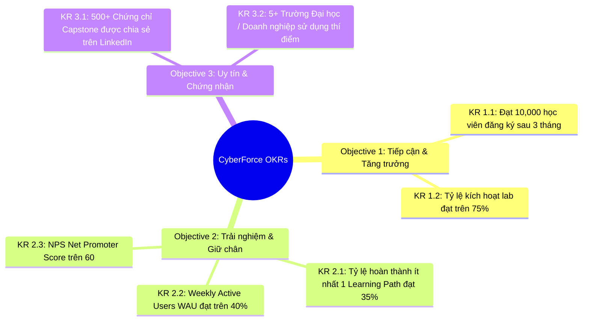
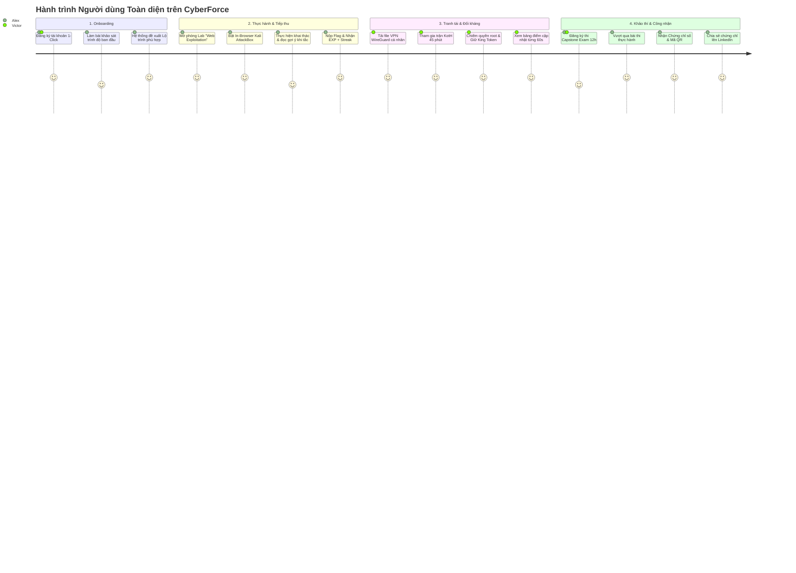
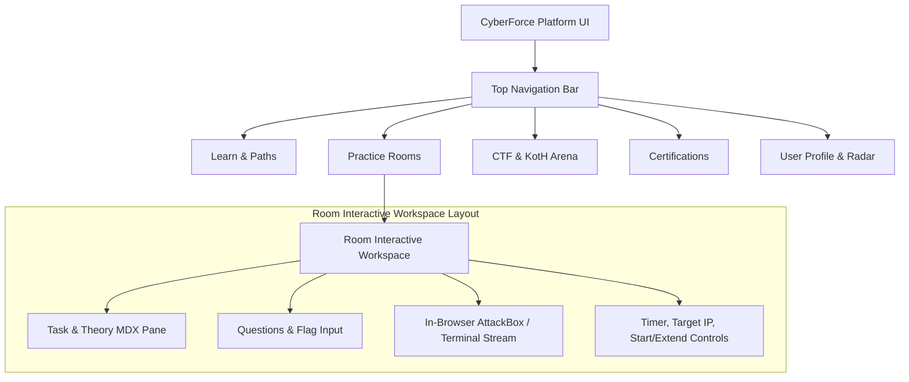
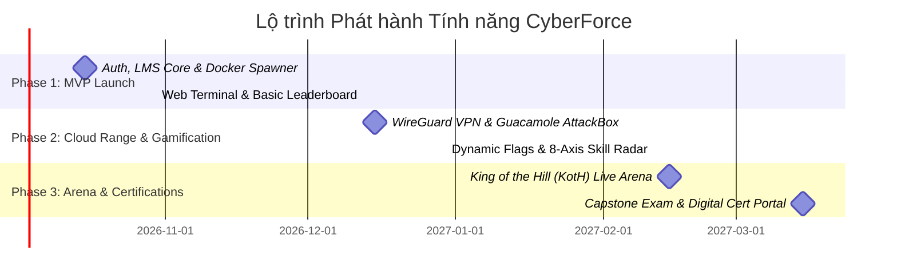

# 📋 CyberForce (CyberForge) - Product Requirements Document (PRD)

> **Document Owner:** Product Management Team (PM / PO / BA)  
> **Status:** Approved / Ready for Engineering Handoff  
> **Version:** 2.0.0 (Refactored to Standard Separation of Concerns)  
> **Core Focus:** **WHAT** to build and **WHY** (Business & User Voice)  
> **Target Technical Specification:** See [TDD_CYBERFORCE.md](file:///home/quocbao/Documents/University/ChuyenDe4/CyberForge/docs/02-architecture/TDD_CYBERFORCE.md) for technical architecture, database schemas, and API designs.

---

## 📑 MỤC LỤC (TABLE OF CONTENTS)

1. [Executive Summary & Vision](#1-executive-summary--vision)
2. [Problem Statement & Market Gap](#2-problem-statement--market-gap)
3. [Business Goals, OKRs & Success Metrics (KPIs)](#3-business-goals-okrs--success-metrics-kpis)
4. [Target Personas & Empathy Map](#4-target-personas--empathy-map)
5. [End-to-End User Journeys](#5-end-to-end-user-journeys)
6. [Product Scope & MoSCoW Prioritization](#6-product-scope--moscow-prioritization)
7. [Functional Requirements & Epics (with Gherkin Acceptance Criteria)](#7-functional-requirements--epics)
   - [Epic 1: User Identity, Profiles & Granular RBAC](#epic-1-user-identity-profiles--granular-rbac)
   - [Epic 2: Structured Learning Paths & Interactive Rooms](#epic-2-structured-learning-paths--interactive-rooms)
   - [Epic 3: Zero-Setup Cloud Lab & In-Browser Practice](#epic-3-zero-setup-cloud-lab--in-browser-practice)
   - [Epic 4: Secure VPN Access Gateway](#epic-4-secure-vpn-access-gateway)
   - [Epic 5: CTF Competitions & Real-Time King of the Hill (KotH) Arena](#epic-5-ctf-competitions--real-time-king-of-the-hill-koth-arena)
   - [Epic 6: Practical Capstone Exams & Verifiable Digital Certificates](#epic-6-practical-capstone-exams--verifiable-digital-certificates)
   - [Epic 7: Gamification, Streaks & 8-Axis Skill Radar](#epic-7-gamification-streaks--8-axis-skill-radar)
   - [Epic 8: Lab Creator Studio & University/Enterprise Analytics](#epic-8-lab-creator-studio--universityenterprise-analytics)
8. [Business Rules, Policies & Edge Cases](#8-business-rules-policies--edge-cases)
9. [User Experience (UX) Principles & Information Architecture](#9-user-experience-ux-principles--information-architecture)
10. [Non-Functional Requirements (Product & User Perspective)](#10-non-functional-requirements-product--user-perspective)
11. [Out-of-Scope (Boundaries for v1 Launch)](#11-out-of-scope-boundaries-for-v1-launch)
12. [Assumptions, Risks & Product Dependencies](#12-assumptions-risks--product-dependencies)
13. [Product Release Milestones](#13-product-release-milestones)

---

## 1. Executive Summary & Vision

### 1.1. Tầm nhìn Sản phẩm (Product Vision)

**CyberForce** là nền tảng đào tạo an ninh mạng tương tác toàn diện, tích hợp **Cloud Cyber Range**, đấu trường đối kháng thời gian thực (**KotH/CTF**) và hệ thống **khảo thí cấp chứng chỉ số thực hành**.

Sứ mệnh của CyberForce là **xóa bỏ hoàn toàn rào cản kỹ thuật tiếp cận (Zero-Friction)** cho người học, chuyển hóa việc học lý thuyết an ninh mạng khô khan thành trải nghiệm thực hành trực tiếp, thi đấu đối kháng và công nhận năng lực bằng chứng chỉ có giá trị thực tiễn cao.

```
          ┌─────────────────────────────────────────────────────────┐
          │                    CYBERFORCE PILLARS                   │
          └─────────────────────────────────────────────────────────┘
                    │                      │                      │
        ┌───────────▼──────────┐ ┌─────────▼──────────┐ ┌─────────▼──────────┐
        │  ZERO-SETUP PRACTICE │ │  REAL-TIME ARENA   │ │ VERIFIABLE CERTS   │
        │ - In-browser Kali    │ │ - King of the Hill │ │ - Hands-on Exams   │
        │ - 1-Click Sandbox    │ │ - Dynamic CTF      │ │ - Public Verify    │
        │ - WireGuard Tunnel   │ │ - Live Leaderboard │ │ - LinkedIn Badges  │
        └──────────────────────┘ └────────────────────┘ └────────────────────┘
```

---

## 2. Problem Statement & Market Gap

| Vấn đề Hiện tại (Pain Points)                   | Tác động Tiêu cực                                                                                     | Giải pháp Đột phá của CyberForce                                                                                 |
| :---------------------------------------------- | :---------------------------------------------------------------------------------------------------- | :--------------------------------------------------------------------------------------------------------------- |
| **Rào cản cài đặt môi trường (Setup Friction)** | Người mới mất từ 3-6 giờ cài máy ảo, card mạng NAT, ISO Kali $\rightarrow$ 45% bỏ cuộc ngay tuần đầu. | **Thực hành 1-Click:** Khởi chạy Kali Linux & máy mục tiêu trực tiếp trên tab trình duyệt trong $< 3$ giây.      |
| **Học tập thụ động & thiếu lộ trình**           | Học qua video/tài liệu tĩnh, thiếu phản hồi tức thì và không có hướng dẫn từng bước.                  | **Task-Based Interactive Rooms:** Học đến đâu thực hành gõ lệnh đến đó, kèm hệ thống gợi ý và tự động chấm điểm. |
| **Nạn gian lận / Share Flag**                   | Các giải CTF và bài tập thường bị chia sẻ đáp án tĩnh lên mạng/Discord.                               | **Dynamic Flag Engine:** Mỗi người dùng nhận một mã cờ duy nhất được sinh động theo phiên.                       |
| **Thiếu môi trường đối kháng thời gian thực**   | Chỉ có bài tập tĩnh cá nhân, thiếu kỹ năng phản xạ chiến đấu thực tế (Red vs Blue).                   | **King of the Hill (KotH):** Đấu trường đối kháng 45 phút, liên tục tấn công, chiếm quyền và gia cố phòng thủ.   |
| **Chứng chỉ thiếu giá trị thực hành**           | Chứng chỉ trắc nghiệm lý thuyết dễ học vẹt, nhà tuyển dụng khó tin tưởng.                             | **Hands-on Capstone Exams:** Bài thi thực hành thực chiến 6h-24h trong mạng cô lập + Cổng tra cứu công khai.     |

---

## 3. Business Goals, OKRs & Success Metrics (KPIs)

### 3.1. Mục tiêu Kinh doanh & Sản phẩm (OKRs)



### 3.2. Bảng Chỉ số Hiệu quả Trọng yếu (KPIs)

| Chỉ số (Metric)                   | Định nghĩa & Công thức                                        | Mục tiêu MVP      | Mục tiêu 6 Tháng  |
| :-------------------------------- | :------------------------------------------------------------ | :---------------- | :---------------- |
| **Time-to-First-Lab (TTFL)**      | Thời gian từ lúc đăng ký đến khi gõ lệnh đầu tiên trên lab    | $< 2$ phút        | $< 60$ giây       |
| **Lab Start Success Rate**        | Tỷ lệ phiên máy lab khởi chạy thành công không lỗi            | $\ge 99.0\%$      | $\ge 99.8\%$      |
| **Daily Streak Retention**        | Tỷ lệ người học duy trì chuỗi học tập $\ge 7$ ngày            | $\ge 20\%$        | $\ge 35\%$        |
| **KotH Match Engagement**         | Số lượng trận đấu đối kháng được tổ chức mỗi tuần             | $\ge 50$ trận     | $\ge 300$ trận    |
| **Certificate Verification Rate** | Lượt truy cập tra cứu chứng chỉ từ bên ngoài (nhà tuyển dụng) | $\ge 2$ lượt/cert | $\ge 5$ lượt/cert |

---

## 4. Target Personas & Empathy Map

```
┌────────────────────────────────────────────────────────────────────────────────────────┐
│                                 CYBERFORCE PERSONAS                                    │
├──────────────────────────┬──────────────────────────┬──────────────────────────────────┤
│ Alex (Student / Beginner)│ Victor (CTF / Red Team)  │ Elena (SOC Analyst / Blue Team)  │
│ "Em muốn học pentest     │ "Tôi muốn đấu trường đối │ "Tôi cần bài lab thực tế về điều │
│ nhưng máy em yếu không   │ kháng thời gian thực để  │ tra log SIEM, phát hiện mã độc   │
│ cài nổi VMware."         │ thử lửa kỹ năng."        │ và ứng phó sự cố."              │
├──────────────────────────┼──────────────────────────┼──────────────────────────────────┤
│ David (Lab Creator)      │ Sarah (Enterprise Admin) │                                  │
│ "Tôi muốn công cụ soạn   │ "Tôi cần báo cáo trực    │                                  │
│ bài tập và chấm điểm lab │ quan về năng lực và lỗ   │                                  │
│ tự động cho sinh viên."  │ hổng kỹ năng của team."  │                                  │
└──────────────────────────┴──────────────────────────┴──────────────────────────────────┘
```

### Chi tiết Hồ sơ Persona

#### 1. Alex - Người học mới bắt đầu (Primary Persona)

- **Đặc điểm:** Sinh viên CNTT / Người chuyển ngành, máy tính cấu hình cơ bản, kiến thức mạng/Linux còn hạn chế.
- **Mục tiêu:** Học an ninh mạng từ con số 0, có lộ trình bài bản, thực hành ngay trên trình duyệt mà không bị lỗi môi trường.
- **Nỗi sợ:** Lạc trong tài liệu lý thuyết, lỗi cấu hình mạng máy ảo không ai sửa giúp, nản chí khi gặp bài quá khó.

#### 2. Victor - CTF Competitor & Pentester (Secondary Persona)

- **Đặc điểm:** Có kiến thức Web/Binary/Network, thường tham gia các giải CTF, thích leo rank và tranh tài.
- **Mục tiêu:** Chơi các phòng lab thực tế, tham gia phòng đối kháng King of the Hill, rèn luyện kỹ năng tốc độ và leo rank.
- **Nỗi sợ:** Máy lab giật lag, đề thi bị lộ flag từ trước, phòng chơi mất tính công bằng do cheat/bot.

#### 3. Elena - Chuyên viên Phòng thủ SOC / Incident Response

- **Đặc điểm:** Đã đi làm hoặc định hướng Blue Team, quan tâm đến phân tích lưu lượng mạng, log sự kiện và săn tìm mối đe dọa (Threat Hunting).
- **Mục tiêu:** Môi trường lab cung cấp sẵn SIEM (Splunk/ELK), traffic mẫu và kịch bản tấn công thực tế để diễn tập phòng thủ.

#### 4. David - Giảng viên / Chuyên gia Sáng tạo Nội dung

- **Đặc điểm:** Giảng viên đại học hoặc chuyên gia an ninh mạng muốn chia sẻ kiến thức và tạo bài tập cho học viên.
- **Mục tiêu:** Soạn giáo trình bằng Markdown trực quan, cấu hình máy mục tiêu dễ dàng, tự động chấm điểm bài nộp.

#### 5. Sarah - Quản lý Đào tạo Doanh nghiệp & Đại học (B2B Persona)

- **Đặc điểm:** Trưởng phòng nhân sự/đào tạo hoặc Trưởng khoa CNTT cần nâng cao chất lượng nguồn nhân lực an ninh mạng.
- **Mục tiêu:** Quản lý danh sách lớp học/nhân viên, giao bài theo tiến độ và xem ma trận kỹ năng (Skill Gap Analysis).

---

## 5. End-to-End User Journeys



---

## 6. Product Scope & MoSCoW Prioritization

### 6.1. Bảng Phân bổ Tính năng theo MoSCoW

| Nhóm Tính năng            | MUST HAVE (Giai đoạn 1 - MVP)                                                                                                       | SHOULD HAVE (Giai đoạn 2)                                                                                               | COULD HAVE (Giai đoạn 3)                                                                                  | WON'T HAVE (v1 Launch)                  |
| :------------------------ | :---------------------------------------------------------------------------------------------------------------------------------- | :---------------------------------------------------------------------------------------------------------------------- | :-------------------------------------------------------------------------------------------------------- | :-------------------------------------- |
| **Xác thực & Người dùng** | - OAuth2 Google/GitHub<br>- Email/Password + JWT<br>- Phân quyền RBAC cơ bản                                                        | - 2FA (TOTP Authenticator)<br>- Quản lý phiên đăng nhập                                                                 | - SSO SAML cho Doanh nghiệp<br>- Đăng nhập qua Web3 ví                                                    | - Đăng nhập bằng sinh trắc học thiết bị |
| **LMS & Nội dung**        | - Lộ trình học (Learning Paths)<br>- Phòng lab tương tác (Rooms/Tasks)<br>- Trình hiển thị Markdown/MDX<br>- Chấm cờ Static & Regex | - Hệ thống gợi ý có trừ điểm<br>- Tự động mở Walkthrough khi xong                                                       | - Tích hợp AI Tutor hỗ trợ học tập<br>- Bình luận & Thảo luận phòng học                                   | - Trình tạo video bài giảng tự động     |
| **Môi trường Thực hành**  | - Khởi tạo Docker Lab 1-Click<br>- Web Terminal nhúng (xterm.js)<br>- Thời hạn thuê lab 60 phút + nút gia hạn                       | - WireGuard VPN Gateway<br>- Kali AttackBox trên trình duyệt<br>- Dynamic Salted Flags<br>- MicroVMs cho Rootkit/Kernel | - Kịch bản mạng đa mục tiêu (Multi-node Range)<br>- Snapshot & Rollback trạng thái máy                    | - Giả lập phần cứng IoT chuyên dụng     |
| **Thi đấu & Arena**       | - Bảng xếp hạng điểm EXP toàn cầu                                                                                                   | - Jeopardy CTF Engine<br>- Dynamic Decay Scoring<br>- Đóng băng Scoreboard giải đấu                                     | - Đấu trường King of the Hill (KotH)<br>- Tick Engine tính điểm thời gian thực<br>- Chế độ Attack-Defense | - Giải đấu thực tế ảo VR Cyber Arena    |
| **Khảo thí & Chứng chỉ**  | - Theo dõi tiến độ hoàn thành lộ trình                                                                                              | - Kỳ thi Capstone thực hành 6h-12h<br>- Sinh chứng chỉ PDF có mã QR<br>- Cổng tra cứu `verify.cyberforce.io`            | - OpenBadges & 1-Click LinkedIn<br>- Thu hồi & Tái cấp chứng chỉ                                          | - Giám thị thi bằng AI quét khuôn mặt   |
| **Quản trị & B2B**        | - Dashboard quản trị viên CRUD nội dung                                                                                             | - Lab Creator Studio cơ bản                                                                                             | - Cổng Doanh nghiệp & Đại học<br>- Skill Gap Analytics Matrix                                             | - Tích hợp hệ thống tính lương HR       |

---

## 7. Functional Requirements & Epics

### Epic 1: User Identity, Profiles & Granular RBAC

#### 1.1. Mục tiêu

Cung cấp giải pháp nhận dạng an toàn, nhanh chóng và phân quyền chặt chẽ theo vai trò người dùng trong hệ sinh thái.

#### 1.2. Danh sách User Stories & Tiêu chuẩn Nghiệm thu (Gherkin)

##### User Story 1.1: Đăng ký & Đăng nhập 1-Click

> **Là một** người dùng mới,  
> **Tôi muốn** đăng ký/đăng nhập nhanh bằng GitHub hoặc Google OAuth2,  
> **Để** tôi có thể truy cập bài học ngay mà không cần qua nhiều bước xác minh email phiền toái.

```
Feature: One-Click Authentication
  Scenario: Đăng ký thành công lần đầu qua GitHub
    Given Người dùng chưa có tài khoản trên CyberForce
    When Người dùng nhấn nút "Continue with GitHub" trên trang Đăng ký
    And Chấp thuận quyền truy cập email và profile từ GitHub
    Then Hệ thống tạo tài khoản mới với vai trò "Student"
    And Tự động khởi tạo hồ sơ học viên (Rank: Novice, EXP: 0, Streak: 1 ngày)
    And Đăng nhập thành công và điều hướng đến Dashboard

  Scenario: Xử lý trùng Email từ nhà cung cấp OAuth khác
    Given Người dùng đã có tài khoản trên hệ thống liên kết với email "quocbao@example.com" qua Google
    When Người dùng nhấn "Continue with GitHub" và GitHub trả về cùng email "quocbao@example.com"
    Then Hệ thống KHÔNG tự động gộp tài khoản
    And Hiển thị thông báo yêu cầu xác thực thủ công để liên kết tài khoản (Manual Account Linking)
    And Sau khi người dùng xác nhận thành công qua mật khẩu hoặc mã OTP email, hai định danh được liên kết vào cùng một User ID
```

##### User Story 1.2: Hồ sơ Năng lực Cá nhân (Public Profile)

> **Là một** học viên,  
> **Tôi muốn** có trang hồ sơ cá nhân công khai hiển thị thành tích, huy hiệu, chuỗi ngày học và biểu đồ radar kỹ năng,  
> **Để** tôi có thể đưa vào CV giới thiệu bản thân với nhà tuyển dụng.

```
Feature: Public Profile
  Scenario: Khách truy cập xem hồ sơ công khai của học viên
    Given Học viên "quocbao" đã bật chế độ "Public Profile"
    When Khách truy cập vào đường dẫn "/user/quocbao"
    Then Trang hiển thị Avatar, Cấp bậc (Rank Tier), Tổng điểm EXP
    And Hiển thị Biểu đồ Radar năng lực 8 trục
    And Hiển thị danh sách Huy hiệu (Badges) và Chứng chỉ đã đạt được
```

##### User Story 1.3: Quản lý Phân quyền & Xét duyệt Creator (Granular RBAC)

> **Là một** Quản trị viên (Admin),  
> **Tôi muốn** duyệt các yêu cầu cấp quyền Creator thông qua Admin Dashboard,  
> **Để** kiểm soát chất lượng nội dung bài lab và tránh việc người dùng tự ý tạo máy ảo gây quá tải hạ tầng.

```
Feature: Creator Role Approval
  Scenario: Admin phê duyệt thủ công quyền Creator cho học viên
    Given Học viên gửi yêu cầu trở thành Creator kèm thông tin hồ sơ
    When Admin truy cập "Admin Dashboard > Role Requests" và nhấn "Approve"
    Then Vai trò của tài khoản được cập nhật từ "Student" sang "Creator"
    And Hệ thống gửi thông báo kích hoạt quyền tạo lab cho người dùng
```

---

### Epic 2: Structured Learning Paths & Interactive Rooms

#### 2.1. Mục tiêu

Tổ chức nội dung học tập theo lộ trình chuẩn hóa, chia nhỏ bài học thành các Task ngắn gọn kết hợp lý thuyết và câu hỏi thực hành có phản hồi tức thì.

#### 2.2. Danh sách User Stories & Tiêu chuẩn Nghiệm thu

##### User Story 2.1: Duyệt & Theo dõi Lộ trình học (Learning Path Flow)

> **Là một** người học,  
> **Tôi muốn** theo dõi tiến độ hoàn thành lộ trình (ví dụ: "Pre-Security" 65%),  
> **Để** tôi biết mình đang ở đâu và cần làm gì tiếp theo.

```
Feature: Learning Path Progress
  Scenario: Mở khóa phòng học tiếp theo khi hoàn thành phòng tiên quyết
    Given Học viên đã hoàn thành 100% các Task trong Room "Linux Basics 1"
    When Học viên quay lại trang Lộ trình "Linux Fundamentals"
    Then Trạng thái Room "Linux Basics 2" chuyển từ "Locked" sang "Available"
    And Thanh tiến độ của Lộ trình tăng tương ứng theo tỷ lệ trọng số

  Scenario: Xử lý tiến độ khi Lộ trình được cập nhật thêm nội dung mới
    Given Học viên đã đạt trạng thái "Completed" (100%) của Lộ trình trước đó
    When Tác giả/Admin bổ sung thêm Room hoặc Task mới vào Lộ trình
    Then Trạng thái của Lộ trình chuyển từ "Completed" sang "Update Available"
    And Thanh tiến độ được tự động tính toán lại dựa trên tổng số Task mới (ví dụ: giảm về 85%)
    And Học viên nhận được thông báo về nội dung kiến thức mới cần hoàn thành
```

##### User Story 2.2: Hệ thống Gợi ý Bậc thang (Tiered Hint System)

> **Là một** học viên gặp bế tắc khi giải một câu hỏi thực hành,  
> **Tôi muốn** mở gợi ý theo từng nấc với mức trừ điểm minh bạch,  
> **Để** tôi có thể tiếp tục bài học mà vẫn giữ được tính thử thách.

```
Feature: Tiered Hints
  Scenario: Học viên mở gợi ý có trừ điểm
    Given Câu hỏi có giá trị thưởng tối đa là 50 EXP và có 2 mức gợi ý (mỗi mức trừ 10 EXP)
    When Học viên nhấn "Show Hint 1" và xác nhận
    Then Gợi ý mức 1 hiển thị nội dung hướng dẫn
    And Điểm thưởng tối đa của câu hỏi cập nhật còn 40 EXP
    And Gợi ý mức 2 vẫn ở trạng thái ẩn cho đến khi có yêu cầu tiếp theo
```

---

### Epic 3: Zero-Setup Cloud Lab & In-Browser Practice

#### 3.1. Mục tiêu

Cung cấp môi trường thực hành ảo hóa cô lập, khởi tạo tức thì chỉ với 1 cú click chuột và tương tác hoàn toàn trên trình duyệt.

#### 3.2. Danh sách User Stories & Tiêu chuẩn Nghiệm thu

##### User Story 3.1: Khởi chạy Máy mục tiêu tức thì (Instant Target Spawner)

> **Là một** học viên đang làm bài thực hành,  
> **Tôi muốn** nhấn nút "Start Machine" và có máy mục tiêu sẵn sàng nhanh chóng theo SLA chuẩn hóa (Container $< 3$s, Virtual Machine $< 60$s),  
> **Để** tôi bắt đầu thao tác tấn công/khám phá ngay lập tức mà không phải chờ đợi lâu.

```
Feature: Instant Target Spawner
  Scenario: Khởi chạy thành công máy mục tiêu dạng Linux Container
    Given Học viên đang ở phòng lab "Web SQL Injection" (sử dụng Docker Container)
    When Nhấn nút "Start Machine"
    Then Nút chuyển sang trạng thái "Starting..." và hoàn tất trong $< 3$ giây
    And Giao diện hiển thị: Địa chỉ IP nội bộ của máy (thuộc dải `100.64.0.0/10`), thời gian thuê còn lại `60:00`
    And Nút "Start Machine" chuyển thành "Stop Machine" và xuất hiện nút "+1 Hour"

  Scenario: Khởi chạy thành công máy mục tiêu dạng Virtual Machine (Windows/Kernel Lab)
    Given Học viên đang ở phòng lab yêu cầu máy ảo chuyên sâu (MicroVM/Windows VM)
    When Nhấn nút "Start Machine"
    Then Nút chuyển sang trạng thái "Provisioning VM..." kèm thanh tiến trình trực quan
    And Quá trình khởi tạo hoàn tất trong $< 60$ giây
    And Giao diện hiển thị IP nội bộ và đồng hồ đếm ngược thuê máy
```

##### User Story 3.2: Kali Linux AttackBox trên Trình duyệt

> **Là một** học viên không có máy trạm Linux,  
> **Tôi muốn** mở giao diện đồ họa Kali Linux trực tiếp trên tab trình duyệt,  
> **Để** tôi sử dụng các công cụ Burp Suite, Nmap, Metasploit mà không cần cài đặt phần mềm.

```
Feature: In-Browser AttackBox
  Scenario: Tương tác với AttackBox qua giao diện web
    Given Học viên kích hoạt "Start AttackBox"
    When Giao diện máy Kali Linux hiển thị trên trình duyệt
    Then Học viên có thể gõ lệnh trên Terminal của Kali, thao tác chuột mượt mà (độ trễ $< 80\text{ms}$)
    And Có thể sao chép/dán văn bản giữa máy cá nhân và AttackBox qua Clipboard hỗ trợ hai chiều
```

---

### Epic 4: Secure VPN Access Gateway

#### 4.1. Mục tiêu

Cho phép người dùng sử dụng máy trạm cá nhân kết nối an toàn vào hạ tầng phòng lab thông qua giao thức VPN tốc độ cao (WireGuard) hoặc OpenVPN.

#### 4.2. Danh sách User Stories & Tiêu chuẩn Nghiệm thu

##### User Story 4.1: Tải File Cấu hình VPN Cá nhân hóa

> **Là một** Pentester muốn dùng hệ điều hành máy thật,  
> **Tôi muốn** tải file cấu hình VPN WireGuard (`.conf`) hoặc OpenVPN (`.ovpn`) có chứa thông tin xác thực cá nhân,  
> **Để** tôi kết nối vào dải mạng phòng lab và ping được IP máy mục tiêu.

```
Feature: VPN Profile Download
  Scenario: Tạo và tải cấu hình WireGuard thành công
    Given Học viên đã đăng nhập và vào trang "Access & VPN"
    When Nhấn "Download WireGuard Config"
    Then Trình duyệt tự động tải về file `cyberforce-user.conf`
    And Trạng thái trên web hiển thị hướng dẫn kết nối
    And Dải IP VPN và Lab mục tiêu được chuẩn hóa trên subnet chuyên biệt `100.64.0.0/10` (CGNAT RFC 6598) để triệt tiêu hoàn toàn xung đột với dải mạng LAN gia đình/văn phòng (`192.168.x.x` hoặc `10.x.x.x`)
    And Khi học viên kích hoạt VPN trên máy cá nhân, biểu tượng trạng thái trên web chuyển sang màu xanh lá "Connected (100.64.10.42)"
```

---

### Epic 5: CTF Competitions & Real-Time King of the Hill (KotH) Arena

#### 5.1. Mục tiêu

Tạo sân chơi tranh tài hấp dẫn với 2 thể loại: Jeopardy CTF (giải câu đố theo chủ đề) và King of the Hill (đối kháng thời gian thực chiếm và giữ máy chủ).

#### 5.2. Danh sách User Stories & Tiêu chuẩn Nghiệm thu

##### User Story 5.1: Thi đấu King of the Hill (KotH Engine)

> **Là một** người chơi CTF đối kháng,  
> **Tôi muốn** tham gia phòng đấu KotH 45 phút, khai thác lỗ hổng leo quyền `root` và ghi mã định danh cá nhân vào tệp `/root/king.txt`,  
> **Để** hệ thống cộng điểm tích lũy cho tôi sau mỗi chu kỳ Tick 60 giây.

```
Feature: King of the Hill Match Lifecycle
  Scenario: Người chơi giữ cờ King và nhận điểm theo chu kỳ Tick
    Given Trận đấu KotH đang diễn ra (còn 25 phút)
    And Người chơi "ZeroDay" đã chiếm root và ghi "ZeroDay" vào `/root/king.txt`
    When Đồng hồ hệ thống chạm mốc Tick (mỗi 60 giây)
    Then Hệ thống xác thực "ZeroDay" đang giữ vị trí King và dịch vụ máy chủ vẫn sống
    And Bảng điểm trực tiếp cộng 10 điểm cho "ZeroDay"
    And Phát thông báo âm thanh và hiệu ứng visual "ZeroDay is the King!" tới tất cả người chơi

  Scenario: Chống phá hoại (Anti-Sabotage) và Tự động phục hồi dịch vụ (Service Auto-heal)
    Given Trận đấu KotH đang diễn ra và người chơi cố tình phá hoại OS (vd: xoá binary cốt lõi, tắt firewall cấm cửa, chattr bất tử file king.txt)
    When Daemon KotH Arbiter phát hiện dịch vụ bị gián đoạn trái quy chế hoặc file king.txt bị khóa quyền
    Then Hệ thống kích hoạt "Service Auto-heal" khôi phục dịch vụ và quyền file về mặc định trong vòng 15 giây
    And Đánh dấu vi phạm quy chế thi đấu của người chơi gây lỗi
    And Áp dụng hình phạt: Trừ điểm tick hiện tại và tự động khóa tài khoản (Block Account) trong 3 ngày sau khi trận đấu kết thúc nếu tái phạm
```

##### User Story 5.2: Tính điểm Động (Dynamic Decay Scoring) trong Jeopardy CTF

> **Là một** thí sinh tham gia giải CTF,  
> **Tôi muốn** điểm số của bài thi tự động giảm dần khi có nhiều người giải được,  
> **Để** đảm bảo sự công bằng và phản ánh chính xác độ khó thực tế của thử thách.

```
Feature: Dynamic Decay Scoring
  Scenario: Điểm thử thách giảm khi có thêm lượt giải thành công
    Given Thử thách "Binary Pwn 01" có điểm ban đầu là 500 điểm (1 lượt giải)
    When Có thêm 9 người giải thành công thử thách này (tổng 10 lượt)
    Then Điểm số của thử thách tự động tính toán lại giảm còn 340 điểm
    And Điểm số của tất cả 10 người đã giải trước đó tự động cập nhật về mức 340 điểm
```

---

### Epic 6: Practical Capstone Exams & Verifiable Digital Certificates

#### 6.1. Mục tiêu

Tổ chức kỳ thi thực hành toàn diện và cấp chứng chỉ số có tính xác thực cao, ngăn chặn hoàn toàn việc làm giả bằng công nghệ chữ ký số và mã QR.

#### 6.2. Danh sách User Stories & Tiêu chuẩn Nghiệm thu

##### User Story 6.1: Tham gia Kỳ thi Thực hành Độc lập (Hands-on Capstone Exam)

> **Là một** học viên chuẩn bị tốt nghiệp lộ trình,  
> **Tôi muốn** tham gia kỳ thi thực hành với thời lượng được cấu hình linh hoạt bởi Admin (ví dụ: 6h, 12h hoặc 24h) trong môi trường mạng cô lập gồm nhiều máy mục tiêu,  
> **Để** tôi kiểm tra năng lực tổng hợp (Pivoting, Active Directory, Privilege Escalation) và nhận kết quả tức thì qua hệ thống chấm cờ tự động.

```
Feature: Hands-on Capstone Exam
  Scenario: Học viên bắt đầu kỳ thi Capstone
    Given Học viên đã hoàn thành 100% các phòng học bắt buộc trong Lộ trình
    When Nhấn "Start Capstone Exam" và đồng ý với Quy chế thi
    Then Hệ thống cấp phát mạng thi riêng biệt gồm các máy mục tiêu của đề thi
    And Bắt đầu đếm ngược thời gian làm bài theo cấu hình của kỳ thi đó (Admin Setting, ví dụ: 12:00:00)
    And Khóa tính năng xem gợi ý và thảo luận công cộng trong suốt thời gian thi
    And Kết quả thi được chấm HOÀN TOÀN TỰ ĐỘNG qua việc nộp Flag (100% Automated Flag Grading), cấp chứng chỉ ngay khi đạt điểm chuẩn mà không cần nộp báo cáo thủ công
```

##### User Story 6.2: Cấp & Tra cứu Chứng chỉ Kỹ thuật số

> **Là một** nhà tuyển dụng / Doanh nghiệp,  
> **Tôi muốn** quét mã QR trên chứng chỉ của ứng viên hoặc truy cập `https://cyberforce.io/verify/[CERT_ID]`,  
> **Để** xem chi tiết điểm số, ngày cấp, các kỹ năng đã được kiểm chứng mà không sợ bằng giả.

```
Feature: Certificate Verification Portal
  Scenario: Xác thực chứng chỉ hợp lệ
    Given Chứng chỉ có mã "CF-CERT-2026-8891A" đã được cấp cho "Nguyen Van A"
    When Nhà tuyển dụng truy cập "/verify/CF-CERT-2026-8891A"
    Then Trang hiển thị dấu tích xanh "Verified Authentic"
    And Hiển thị Họ tên: Nguyen Van A, Tên kỳ thi: Certified Offensive Pentester
    And Hiển thị Điểm số: 92/100, Ngày cấp: 08/09/2026, Chữ ký số hợp lệ
```

---

### Epic 7: Gamification, Streaks & 8-Axis Skill Radar

#### 7.1. Mục tiêu

Tạo động lực học tập liên tục thông qua cơ chế trò chơi hóa (Gamification), điểm danh hàng ngày và biểu đồ radar kỹ năng 8 khía cạnh chuyên sâu.

#### 7.2. Danh sách User Stories & Tiêu chuẩn Nghiệm thu

##### User Story 7.1: Chuỗi Ngày Học Liên tục (Daily Streak & Multiplier)

> **Là một** học viên,  
> **Tôi muốn** được ghi nhận Streak mỗi ngày khi giải thành công ít nhất một Task mới lần đầu tiên theo múi giờ địa phương của tôi,  
> **Để** tôi duy trì thói quen học tập liên tục và nhận hệ số nhân điểm EXP mà không bị tính sai lệch múi giờ.

```
Feature: Daily Streak System
  Scenario: Học viên học liên tục ngày thứ 7
    Given Học viên đang có chuỗi Streak 6 ngày
    When Học viên hoàn thành ít nhất 1 Task mới (chưa từng giải trước đó) trước 23:59:59 theo múi giờ địa phương (Local Timezone)
    Then Chuỗi Streak tăng lên 7 ngày
    And Mở khóa Huy hiệu "7-Day Warrior"
    And Kích hoạt hệ số thưởng "1.2x EXP Multiplier" cho tất cả bài tập trong 24 giờ tiếp theo

  Scenario: Học viên giải lại task cũ đã hoàn thành
    Given Học viên đã hoàn thành Task "Linux File Permissions" từ tuần trước
    When Học viên giải lại Task này trong ngày hôm nay
    Then Hệ thống cộng EXP ôn tập (nếu có) nhưng KHÔNG tính điểm duy trì chuỗi Streak mới
```

##### User Story 7.2: Biểu đồ Năng lực 8 Trục (8-Axis Cyber Radar)

> **Là một** học viên,  
> **Tôi muốn** theo dõi điểm số năng lực phân bổ trên 8 trục chuyên môn bằng **điểm tích lũy tuyệt đối (Absolute Cumulative EXP)** và hỗ trợ **cộng điểm song song đa kỹ năng (Multi-tag Parallel Scoring)**:
>
> 1. Web Application Security
> 2. Network Penetration Testing
> 3. Binary Exploitation & Pwn
> 4. Cryptography & PKI
> 5. Digital Forensics & Incident Response (DFIR)
> 6. Windows & Active Directory Attacks
> 7. Defensive & Blue Team / SOC
> 8. Cloud & DevSecOps
>
> **Để** tôi biết rõ điểm mạnh và điểm yếu thực tế của mình (ví dụ: giải 1 task Cloud Pentest được cộng song song điểm cho cả trục Cloud & DevSecOps lẫn Network Pentest).

```
Feature: Multi-Tag Parallel Skill Radar
  Scenario: Cộng điểm song song vào nhiều trục radar khi giải task tích hợp
    Given Task "AWS IAM Privilege Escalation" được gán 2 tag kỹ năng: "Cloud & DevSecOps" (100 EXP) và "Network Penetration Testing" (100 EXP)
    When Học viên nộp cờ thành công Task này
    Then Điểm tích lũy tuyệt đối trên trục "Cloud & DevSecOps" tăng +100 điểm
    And Điểm tích lũy tuyệt đối trên trục "Network Penetration Testing" tăng +100 điểm
    And Biểu đồ Radar 8 trục tự động mở rộng vùng hiển thị tương ứng
```

---

### Epic 8: Lab Creator Studio & University/Enterprise Analytics (Phase 2 & Phase 3)

> ⚠️ **Scope Lock:** Tính năng này **chính thức nằm ngoài phạm vi MVP (Phase 1)** để tập trung nguồn lực phát hành ngày 15/10/2026. Trong Phase 1, toàn bộ nội dung phòng lab và lộ trình học được quản trị viên khởi tạo và biên tập tập trung qua **Admin CMS**. Epic 8 sẽ được triển khai chi tiết từ Giai đoạn 2 (Creator Studio) và Giai đoạn 3 (B2B Portal).

#### 8.1. Mục tiêu

Cung cấp công cụ cho giảng viên biên soạn bài lab (Giai đoạn 2) và bảng điều khiển cho doanh nghiệp/trường học quản lý học viên theo tổ chức (Giai đoạn 3).

#### 8.2. Danh sách User Stories & Tiêu chuẩn Nghiệm thu

##### User Story 8.1: Soạn thảo Bài Lab bằng Markdown Trực quan (Creator Studio)

> **Là một** Giảng viên / Creator,  
> **Tôi muốn** soạn thảo nội dung phòng học bằng giao diện MDX hỗ trợ xem trước (Live Preview),  
> **Để** tạo ra các bài giảng trực quan, đẹp mắt và dễ hiểu cho học viên.

##### User Story 8.2: Báo cáo Phân tích Lỗ hổng Kỹ năng (Skill Gap Matrix)

> **Là một** Quản lý Đào tạo Doanh nghiệp,  
> **Tôi muốn** xem báo cáo tổng hợp kỹ năng của toàn bộ nhân viên trong phòng ban,  
> **Để** phát hiện các mảng kiến thức còn yếu (ví dụ: Cloud Security yếu) và lên kế hoạch đào tạo bổ sung.

---

## 8. Business Rules, Policies & Edge Cases

```
┌─────────────────────────────────────────────────────────────────────────┐
│                      CYBERFORCE BUSINESS RULES                          │
├─────────────────────────────────────────────────────────────────────────┤
│ 1. LEASE RULE:     1 phòng lab = 60 phút cơ bản, gia hạn tối đa 3 lần   │
│ 2. REAPER RULE:    Hết hạn -> Grace period 3 phút -> Auto kill instance │
│ 3. ANTI-CHEAT:     1 tài khoản chỉ mở tối đa 1 máy lab tại một thời điểm│
│ 4. SUBMIT RATE:    Tối đa 5 lần nộp flag sai / 60 giây (Chống bruteforce│
│ 5. EXAM RULE:      Thời lượng do Admin set, chấm 100% Flag tự động      │
│ 6. KOTH RULE:      Auto-heal dịch vụ; Khóa account nếu cố tình phá hoại │
│ 7. STREAK RULE:    Chốt theo Local Timezone, chỉ tính Task mới giải đầu │
│ 8. RADAR RULE:     Điểm tích lũy tuyệt đối, cộng song song nhiều tag    │
└─────────────────────────────────────────────────────────────────────────┘
```

### 8.1. Quy tắc Quản lý Phiên Máy Lab (Lab Lease Lifecycle)

1. **Giới hạn Đồng thời (Concurrency Limit):** Mỗi tài khoản người dùng thông thường chỉ được phép chạy tối đa **01 máy lab mục tiêu** và **01 AttackBox** tại một thời điểm để đảm bảo tài nguyên hệ thống.
2. **Thời hạn Thuê (Lease Duration):**
   - Mặc định mỗi máy cấp phát thời gian sống ban đầu là **60 phút**.
   - Người dùng có thể nhấn nút "+1 Hour" để gia hạn thời gian tối đa **3 lần** (tổng thời gian tối đa cho 1 phiên liên tục là 4 giờ).
3. **Cơ chế Thu hồi (Reaper Policy):**
   - Khi đồng hồ đếm ngược về `00:00`, máy chuyển sang trạng thái cảnh báo trong vòng **3 phút (Grace Period)**. Hệ thống hiển thị popup cảnh báo kèm âm thanh thông báo.
   - Nếu không có thao tác gia hạn, hệ thống tự động tiêu hủy máy và giải phóng tài nguyên.

### 8.2. Quy tắc Chấm điểm & Gợi ý (Scoring & Hint Policy)

1. **Điểm thưởng cơ bản:** Mỗi câu hỏi có mức điểm thưởng cố định hoặc tính theo Dynamic Decay.
2. **Khấu trừ điểm khi mở gợi ý:**
   - Mở Gợi ý cấp 1: Trừ $10\%$ tổng điểm câu hỏi.
   - Mở Gợi ý cấp 2: Trừ thêm $20\%$ tổng điểm câu hỏi.
   - Xem Lời giải chi tiết (Walkthrough): Điểm thưởng của câu hỏi đó sẽ bằng $0$ (chỉ phục vụ mục đích học tập).
3. **Chống dò đáp án (Brute-force Protection):**
   - Người dùng nộp sai quá 5 lần liên tiếp trong 60 giây sẽ bị tạm khóa quyền nộp bài câu hỏi đó trong 3 phút.

### 8.3. Quy tắc Đấu trường King of the Hill (KotH Arena Policy)

1. **Thời gian trận đấu:** Cố định **45 phút / trận**. Số lượng người chơi từ **4 đến 10 người/đội**.
2. **Quy tắc Tính điểm:**
   - Hệ thống Tick Engine kích hoạt mỗi **60 giây**.
   - Người chơi có tên hợp lệ trong `/root/king.txt` nhận được **+10 điểm / tick**.
3. **Quy tắc Duy trì Dịch vụ (SLA Check) & Chống Phá hoại (Anti-Sabotage):**
   - Nếu người chơi phòng thủ làm sập các dịch vụ thiết yếu (ví dụ: tắt SSH, tắt Web server, chặn toàn bộ cổng mạng bằng firewall sai quy định), Tick đó bị coi là **SLA FAILED** $\rightarrow$ Không ai nhận được điểm trong tick đó.
   - **Tự phục hồi dịch vụ (Service Auto-heal):** Daemon KotH Arbiter tự động kiểm tra và cưỡng chế phục hồi dịch vụ thiết yếu và quyền truy cập file `/root/king.txt` về trạng thái chuẩn trong vòng 15 giây.
   - **Xử lý vi phạm (Disciplinary Action):** Người chơi cố tình phá hoại môi trường máy chủ OS (xoá binary hệ thống, khoá file bất tử `chattr +i`, phá hoại hạ tầng) sẽ bị trừ toàn bộ điểm tick đó và **tự động khóa tài khoản (Block Account) trong 3 ngày**.

### 8.4. Quy tắc Khảo thí Kỳ thi Capstone (Capstone Exam Policy)

1. **Thời lượng linh hoạt:** Thời lượng làm bài được cấu hình linh động bởi Admin theo từng kỳ thi cụ thể (ví dụ: 6h, 12h hoặc 24h).
2. **Chấm điểm tự động 100%:** Kỳ thi được chấm hoàn toàn tự động thông qua Flag nộp lên hệ thống. Không yêu cầu nộp file báo cáo thẩm định (Report) để chấm thủ công ở phiên bản MVP.
3. **Kỷ luật phòng thi:** Khóa toàn bộ tính năng gợi ý (Hints) và diễn đàn thảo luận; cấm thay đổi IP VPN trong suốt thời gian làm bài thi.

### 8.5. Quy tắc Chuỗi Ngày học (Streak) & Radar Kỹ năng

1. **Tính Streak theo Múi giờ địa phương (Local Timezone):** Chu kỳ 1 ngày học được tính từ 00:00:00 đến 23:59:59 theo múi giờ đã lưu trong hồ sơ tài khoản của người học.
2. **Tiêu chí giữ Streak:** Chỉ tính khi người học giải thành công **ít nhất 01 Task mới lần đầu tiên** (giải lại Task cũ chỉ nhận EXP ôn tập, không tính streak).
3. **Thang điểm Radar 8 trục:** Tính bằng **điểm tích lũy tuyệt đối (Absolute Cumulative EXP)**. Một Task mang nhiều nhãn kỹ năng sẽ được cộng điểm song song cho tất cả các trục tương ứng.

---

## 9. User Experience (UX) Principles & Information Architecture



### 9.1. Triết lý Thiết kế UX (UX Principles)

1. **All-in-One Workspace:** Toàn bộ nội dung lý thuyết, câu hỏi nộp bài, terminal điều khiển và màn hình máy ảo đều nằm trong một giao diện duy nhất (Split-pane View), không bắt học viên phải chuyển đổi qua lại giữa nhiều cửa sổ.
2. **Dark-Mode First Cyber Aesthetic:** Giao diện tối hiện đại, đậm chất an ninh mạng với độ tương phản cao, tối ưu cho mắt khi học tập và làm bài lab nhiều giờ liên tục.
3. **Instant Visual Feedback:** Mọi thao tác đúng/sai khi nộp flag, thay đổi trạng thái máy lab, điểm số cập nhật đều có phản hồi tức thì bằng hiệu ứng vi mô (micro-interactions) và âm thanh tinh tế.

---

## 10. Non-Functional Requirements (Product & User Perspective)

| Tiêu chuẩn NFR                           | Yêu cầu từ góc độ Trải nghiệm Người dùng                                                                                         | Mức độ Ưu tiên    |
| :--------------------------------------- | :------------------------------------------------------------------------------------------------------------------------------- | :---------------- |
| **Độ trễ Khởi động (Speed)**             | Phân tách SLA: Máy lab Docker Linux khởi động trong $< 3$ giây; Máy ảo chuyên sâu (VM/Windows) $< 60$ giây.                      | **P0 (Critical)** |
| **Độ mượt Màn hình (Smoothness)**        | AttackBox stream qua trình duyệt không bị giật, phản hồi chuột và bàn phím tức thì ($< 80\text{ms}$).                            | **P0 (Critical)** |
| **Độ sẵn sàng (Availability)**           | Nền tảng hoạt động ổn định với thời gian Uptime tối thiểu **99.9%** (không gián đoạn giữa các giải đấu).                         | **P0 (Critical)** |
| **Bảo mật & Cô lập (Safety)**            | Cô lập mạng tuyệt đối giữa các học viên, chuẩn hóa subnet `100.64.0.0/10` (RFC 6598), chặn 100% ra ngoài Internet (Zero Egress). | **P0 (Critical)** |
| **Khả năng Tương thích (Compatibility)** | Chạy mượt mà trên tất cả trình duyệt hiện đại (Chrome, Firefox, Safari, Edge) trên Windows, macOS, Linux.                        | **P1 (High)**     |
| **Trợ năng & Trực quan (Accessibility)** | Tuân thủ độ tương phản WCAG 2.1 AA, hỗ trợ đầy đủ phím tắt thao tác nhanh trong phòng lab.                                       | **P2 (Medium)**   |

---

## 11. Out-of-Scope (Boundaries for v1 Launch)

Để đảm bảo tiến độ ra mắt bản MVP chất lượng cao đúng hạn, các tính năng sau **tạm thời nằm ngoài phạm vi phiên bản v1**:

- ❌ Hỗ trợ thiết bị phần cứng thực tế (Hardware IoT / ICS / SCADA testbeds).
- ❌ Giám thị thi bằng AI quét khuôn mặt / Eye-tracking qua webcam (ở v1 áp dụng giám sát mạng và kiểm tra báo cáo thực hành).
- ❌ Tích hợp sàn tuyển dụng tự động (Job Marketplace matching).
- ❌ Ứng dụng di động Native (iOS/Android) — v1 tập trung 100% trải nghiệm Web Responsive trên máy tính.

---

## 12. Assumptions, Risks & Product Dependencies

### 12.1. Giả định (Assumptions)

- Người dùng có đường truyền Internet ổn định với băng thông tối thiểu $5\text{ Mbps}$ khi sử dụng Web AttackBox.
- Trình duyệt người dùng hỗ trợ WebSockets và HTML5 Canvas.

### 12.2. Rủi ro Sản phẩm & Biện pháp Xử lý

| Rủi ro Sản phẩm                                             |  Khả năng  |    Mức độ    | Biện pháp Phòng ngừa & Xử lý                                                                     |
| :---------------------------------------------------------- | :--------: | :----------: | :----------------------------------------------------------------------------------------------- |
| **Học viên chia sẻ Flag đề thi lên mạng**                   |    Cao     |     Cao      | Áp dụng **Dynamic Flag Engine** sinh mã cờ riêng theo từng phiên người dùng.                     |
| **Chi phí hạ tầng máy chủ tăng vọt do người dùng treo máy** |    Cao     |     Cao      | Triển khai **Reaper Worker** tự động tắt máy sau 60 phút nếu không có hoạt động.                 |
| **Hacker lợi dụng máy lab để tấn công mạng ngoài**          | Trung bình | Nghiêm trọng | Thiết lập chính sách mạng **Zero Outbound Egress** chặn 100% traffic ra ngoài Internet.          |
| **Người chơi cố tình phá hoại máy chủ trong KotH Arena**    |    Cao     |     Cao      | Tích hợp **Service Auto-heal Daemon** (khôi phục trong 15s) và áp dụng **Block Account 3 ngày**. |
| **Xung đột bảng định tuyến VPN với mạng LAN gia đình/cty**  | Trung bình |     Cao      | Chuẩn hóa dải mạng VPN/Lab trên subnet chuyên dụng **`100.64.0.0/10` (RFC 6598)**.               |

---

## 13. Product Release Milestones



---

_Tài liệu PRD này là tài sản chuẩn hóa của CyberForce, làm cơ sở bàn giao cho Đội ngũ Kỹ sư (Engineering) để triển khai chi tiết trong [TDD_CYBERFORCE.md](file:///home/quocbao/Documents/University/ChuyenDe4/CyberForge/docs/TDD_CYBERFORCE.md)._
