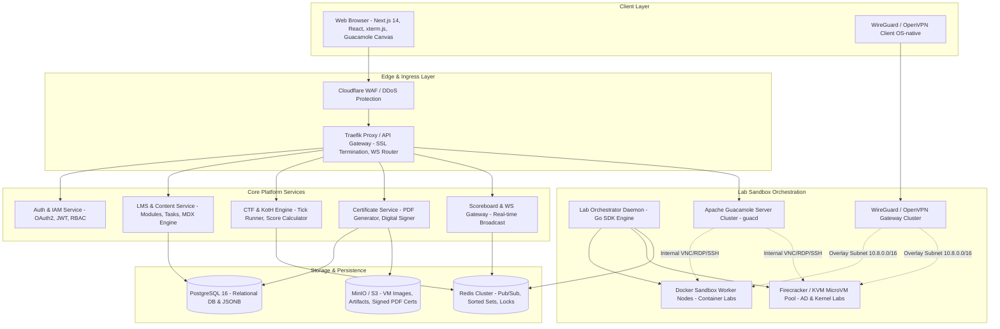
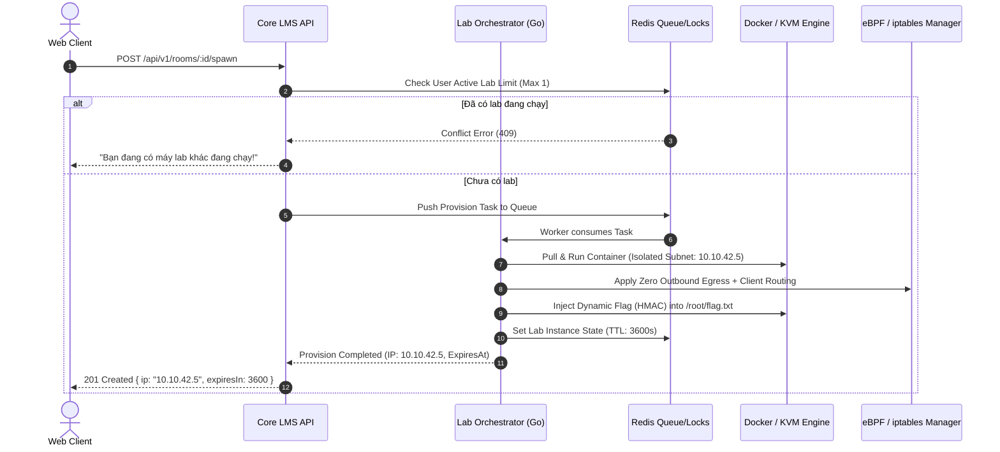
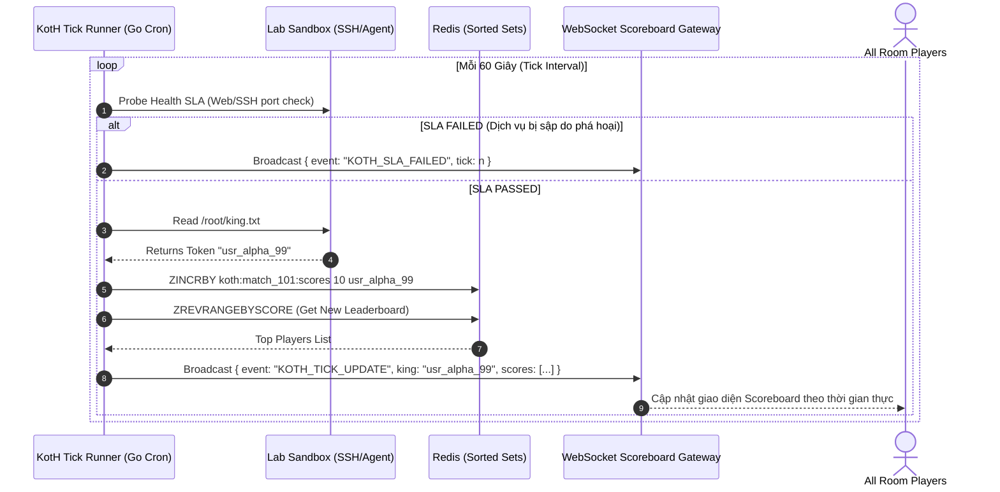
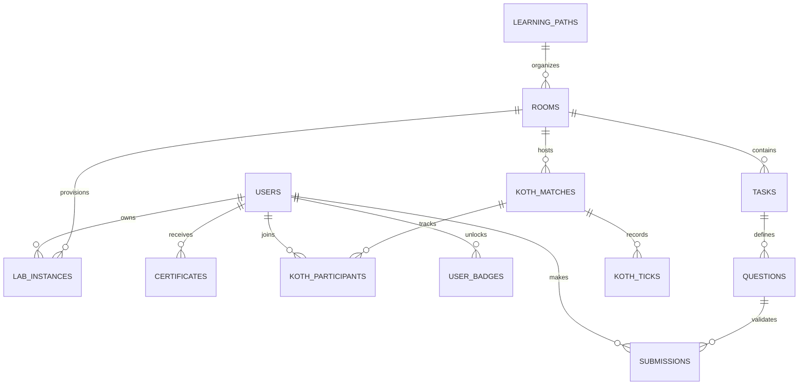
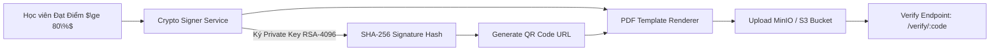

# 🛠️ CyberForce (CyberForge) - Technical Design Document (TDD)

> **Document Owner:** Tech Lead & Systems Architect  
> **Status:** Draft / Ready for Engineering Implementation  
> **Version:** 1.0.0  
> **Core Focus:** **HOW** to build the system (Technical Architecture, Schemas, APIs, Infrastructure & Security)  
> **Companion Product Specification:** [PRD_CYBERFORCE.md](file:///home/quocbao/Documents/University/ChuyenDe4/CyberForge/docs/01-product/PRD_CYBERFORCE.md)

---

## 📑 MỤC LỤC (TABLE OF CONTENTS)
1. [System Overview & High-Level Topology](#1-system-overview--high-level-topology)
2. [Architectural Decision Records (ADRs) & Tech Stack](#2-architectural-decision-records-adrs--tech-stack)
3. [Component Interaction & Sequence Diagrams](#3-component-interaction--sequence-diagrams)
4. [Database Design & Data Dictionary (PostgreSQL + Redis)](#4-database-design--data-dictionary)
5. [API & WebSocket Real-Time Interface Specifications](#5-api--websocket-real-time-interface-specifications)
6. [Cloud Sandbox & Virtualization Subsystem](#6-cloud-sandbox--virtualization-subsystem)
7. [In-Browser Guacamole & Web Terminal Architecture](#7-in-browser-guacamole--web-terminal-architecture)
8. [Network Isolation, WireGuard & Anti-Abuse Engineering](#8-network-isolation-wireguard--anti-abuse-engineering)
9. [King of the Hill (KotH) Tick Engine & Dynamic Flags](#9-king-of-the-hill-koth-tick-engine--dynamic-flags)
10. [Cryptographic Digital Certificate Engine](#10-cryptographic-digital-certificate-engine)
11. [Deployment Topology, CI/CD & Observability](#11-deployment-topology-cicd--observability)

---

## 1. System Overview & High-Level Topology

CyberForce được thiết kế theo kiến trúc **Microservices / Modular Monolith kết hợp Edge Gateway**, tối ưu hóa cho độ trễ thấp khi stream đồ họa/terminal và cô lập tuyệt đối các môi trường thực hành ảo hóa.



---

## 2. Architectural Decision Records (ADRs) & Tech Stack

```
┌─────────────────────────────────────────────────────────────────────────┐
│                     CYBERFORCE TECH STACK MATRIX                        │
├──────────────────────┬─────────────────────────────┬────────────────────┤
│ Tầng Hệ thống        │ Công nghệ Lựa chọn          │ Lý do Kỹ thuật     │
├──────────────────────┼─────────────────────────────┼────────────────────┤
│ Frontend Web App     │ Next.js 14 (App Router, TS) │ SSR SEO, Shadcn UI │
│ Web Terminal         │ xterm.js + WebSockets       │ Render shell 60FPS │
│ In-Browser AttackBox │ Apache Guacamole (guacd)    │ RDP/VNC sang HTML5 │
│ Backend API Core     │ Go (Golang) / NestJS (TS)   │ High Concurrency   │
│ Real-time Gateway    │ Go WebSocket + Redis PubSub │ Low latency < 50ms │
│ Lab Orchestrator     │ Go + Docker Engine SDK      │ Direct daemon call │
│ MicroVM Hypervisor   │ Firecracker / QEMU KVM      │ Boot in < 5s, safe │
│ Primary Database     │ PostgreSQL 16 (JSONB)       │ ACID, JSON config  │
│ Caching & Arena      │ Redis 7.2 (Sorted Sets)     │ Atomic rank engine │
│ Object Storage       │ MinIO (S3 Compatible)       │ On-prem VM images  │
│ VPN Gateway          │ WireGuard (Kernel Module)   │ High performance   │
│ Network Security     │ eBPF (Cilium) + iptables    │ Zero egress policy │
└──────────────────────┴─────────────────────────────┴────────────────────┘
```

### ADR-001: Lựa chọn Hypervisor cho Lab Sandbox (Docker Containers vs MicroVMs)
- **Quyết định:** Kết hợp mô hình lai (**Hybrid Model**):
  - **Docker Containers:** Dành cho 80% các bài lab ứng dụng (Web Security, Cryptography, Forensics, Reverse Engineering). Khởi động tức thì ($< 3\text{s}$), tiêu tốn ít RAM ($< 256\text{MB}$).
  - **Firecracker MicroVMs / QEMU KVM:** Dành cho 20% các bài lab nâng cao yêu cầu can thiệp Kernel, Privilege Escalation, Rootkit, hoặc Windows Active Directory.

### ADR-002: Lựa chọn In-Browser Remote Desktop
- **Quyết định:** Sử dụng **Apache Guacamole Client/Server (guacd)** chuyển đổi giao thức VNC/RDP sang WebSocket Canvas stream. Không yêu cầu cài đặt bất kỳ extension hay plugin nào trên trình duyệt người dùng.

### ADR-003: Giao thức Mạng VPN
- **Quyết định:** Ưu tiên **WireGuard** làm giao thức VPN mặc định (kết hợp OpenVPN dự phòng). WireGuard chạy trực tiếp trong Linux Kernel space cho thông lượng cao gấp 4 lần OpenVPN và thiết lập kết nối chỉ trong $< 100\text{ms}$.

---

## 3. Component Interaction & Sequence Diagrams

### 3.1. Luồng Khởi chạy Máy Lab (Lab Provisioning Flow)



### 3.2. Luồng Vận hành KotH Tick Engine (60s Realtime Cycle)



---

## 4. Database Design & Data Dictionary



### 4.1. Chi tiết Bảng & Khóa (PostgreSQL Schema DDL)

```sql
-- 1. BẢNG USERS
CREATE TABLE users (
    id UUID PRIMARY KEY DEFAULT gen_random_uuid(),
    email VARCHAR(255) UNIQUE NOT NULL,
    username VARCHAR(50) UNIQUE NOT NULL,
    password_hash VARCHAR(255),
    avatar_url TEXT,
    role VARCHAR(20) DEFAULT 'student' CHECK (role IN ('student', 'creator', 'instructor', 'org_admin', 'superadmin')),
    exp_points INTEGER DEFAULT 0,
    rank_tier VARCHAR(30) DEFAULT 'Novice',
    streak_days INTEGER DEFAULT 0,
    last_active_at TIMESTAMPTZ DEFAULT NOW(),
    created_at TIMESTAMPTZ DEFAULT NOW()
);

-- 2. BẢNG LEARNING_PATHS
CREATE TABLE learning_paths (
    id UUID PRIMARY KEY DEFAULT gen_random_uuid(),
    title VARCHAR(255) NOT NULL,
    slug VARCHAR(255) UNIQUE NOT NULL,
    description TEXT,
    difficulty_level VARCHAR(20) DEFAULT 'Beginner',
    icon_url TEXT,
    order_index INTEGER DEFAULT 0,
    is_published BOOLEAN DEFAULT FALSE,
    created_at TIMESTAMPTZ DEFAULT NOW()
);

-- 3. BẢNG ROOMS
CREATE TABLE rooms (
    id UUID PRIMARY KEY DEFAULT gen_random_uuid(),
    path_id UUID REFERENCES learning_paths(id) ON DELETE SET NULL,
    title VARCHAR(255) NOT NULL,
    slug VARCHAR(255) UNIQUE NOT NULL,
    description TEXT,
    difficulty VARCHAR(20) DEFAULT 'Easy',
    room_type VARCHAR(20) DEFAULT 'walkthrough' CHECK (room_type IN ('walkthrough', 'challenge', 'koth', 'exam')),
    target_template_spec JSONB NOT NULL, -- Cấu hình Docker Image, RAM, CPU limits
    is_free BOOLEAN DEFAULT TRUE,
    published_at TIMESTAMPTZ,
    created_at TIMESTAMPTZ DEFAULT NOW()
);

-- 4. BẢNG TASKS & QUESTIONS
CREATE TABLE tasks (
    id UUID PRIMARY KEY DEFAULT gen_random_uuid(),
    room_id UUID NOT NULL REFERENCES rooms(id) ON DELETE CASCADE,
    task_order INTEGER NOT NULL,
    title VARCHAR(255) NOT NULL,
    content_mdx TEXT NOT NULL,
    created_at TIMESTAMPTZ DEFAULT NOW()
);

CREATE TABLE questions (
    id UUID PRIMARY KEY DEFAULT gen_random_uuid(),
    task_id UUID NOT NULL REFERENCES tasks(id) ON DELETE CASCADE,
    question_text TEXT NOT NULL,
    answer_hash VARCHAR(255),
    flag_pattern VARCHAR(255),
    flag_type VARCHAR(20) DEFAULT 'static' CHECK (flag_type IN ('static', 'regex', 'dynamic_hmac')),
    hint_tiers JSONB, -- Mảng các gợi ý kèm mức trừ điểm
    points_reward INTEGER DEFAULT 50,
    created_at TIMESTAMPTZ DEFAULT NOW()
);

-- 5. BẢNG LAB_INSTANCES (Quản lý phiên Sandbox)
CREATE TABLE lab_instances (
    id UUID PRIMARY KEY DEFAULT gen_random_uuid(),
    user_id UUID NOT NULL REFERENCES users(id) ON DELETE CASCADE,
    room_id UUID NOT NULL REFERENCES rooms(id) ON DELETE CASCADE,
    ip_address INET NOT NULL,
    instance_type VARCHAR(20) DEFAULT 'docker',
    container_id VARCHAR(128),
    status VARCHAR(20) DEFAULT 'provisioning' CHECK (status IN ('provisioning', 'running', 'terminating', 'terminated')),
    dynamic_salt VARCHAR(64) NOT NULL,
    expires_at TIMESTAMPTZ NOT NULL,
    created_at TIMESTAMPTZ DEFAULT NOW()
);

-- 6. BẢNG CERTIFICATES
CREATE TABLE certificates (
    id UUID PRIMARY KEY DEFAULT gen_random_uuid(),
    certificate_code VARCHAR(50) UNIQUE NOT NULL,
    user_id UUID NOT NULL REFERENCES users(id) ON DELETE CASCADE,
    path_id UUID NOT NULL REFERENCES learning_paths(id),
    score_percentage NUMERIC(5,2) NOT NULL,
    verification_hash VARCHAR(255) NOT NULL,
    pdf_s3_key TEXT NOT NULL,
    issued_at TIMESTAMPTZ DEFAULT NOW()
);
```

---

## 5. API & WebSocket Real-Time Interface Specifications

### 5.1. RESTful API Contracts (OpenAPI Standard)

#### `POST /api/v1/rooms/:id/spawn` (Khởi chạy Lab Instance)
- **Headers:** `Authorization: Bearer <jwt_token>`
- **Response `201 Created`:**
```json
{
  "success": true,
  "data": {
    "instanceId": "ins_8829a-99f1",
    "roomId": "room_sqli_basics",
    "targetIp": "10.10.42.5",
    "status": "running",
    "allocatedAt": "2026-09-08T10:30:00Z",
    "expiresAt": "2026-09-08T11:30:00Z",
    "remainingSeconds": 3600,
    "extensionCount": 0,
    "maxExtensions": 3
  }
}
```

#### `POST /api/v1/tasks/:id/submit` (Nộp Flag / Câu trả lời)
- **Request Body:**
```json
{
  "questionId": "q_77812",
  "submittedValue": "flag{e83921bf7a8109dca8721094}"
}
```
- **Response `200 OK` (Chính xác):**
```json
{
  "isCorrect": true,
  "pointsEarned": 50,
  "totalExp": 1450,
  "unlockedNext": true,
  "message": "Congratulations! Correct flag submitted."
}
```

### 5.2. WebSocket Arena Protocol (`wss://cyberforce.io/ws/arena`)

- **Subscribing to Match:**
```json
{ "action": "join_match", "matchId": "koth_match_9921" }
```
- **Tick Event Broadcast (Mỗi 60 giây):**
```json
{
  "event": "KOTH_TICK",
  "payload": {
    "tick": 18,
    "timeRemainingSec": 1620,
    "currentKing": {
      "userId": "u_9921",
      "username": "ShadowByte"
    },
    "slaPassed": true,
    "leaderboard": [
      { "rank": 1, "username": "ShadowByte", "score": 180 },
      { "rank": 2, "username": "CyberWolf", "score": 120 }
    ]
  }
}
```

---

## 6. Cloud Sandbox & Virtualization Subsystem

```
┌─────────────────────────────────────────────────────────────────────────┐
│                    LAB ORCHESTRATOR ARCHITECTURE                        │
│                                                                         │
│   [ API Gateway ] ────> [ RabbitMQ / Redis Queue ]                      │
│                                   │                                     │
│                                   ▼                                     │
│                   [ Go Lab Controller Daemon ]                          │
│                   ├── Instance Allocator (Subnet 10.10.x.y)             │
│                   ├── Flag Injector (HMAC Engine)                       │
│                   └── Reaper Engine (Sweeper every 30s)                 │
│                                   │                                     │
│        ┌──────────────────────────┴──────────────────────────┐          │
│        ▼                                                     ▼          │
│  [ Docker Engine SDK ]                            [ Firecracker Daemon ]│
│  - Web / Crypto / Binary Labs                     - Kernel / AD Labs    │
│  - cgroups: 2 vCPU, 2GB RAM                       - microVM jailer      │
│  - OverlayFS ephemeral layer                      - Rootfs cow image    │
└─────────────────────────────────────────────────────────────────────────┘
```

### 6.1. Docker Sandbox Controller (Go Implementation Pattern)
- Tương tác trực tiếp qua Unix Socket `/var/run/docker.sock`.
- Cấu hình HostConfig cách ly nghiêm ngặt:
  - `CapDrop: ["ALL"]` (Hủy toàn bộ Linux capabilities nguy hiểm như `CAP_SYS_ADMIN`, `CAP_NET_RAW` trừ khi lab yêu cầu).
  - `Memory: 2147483648` (Hard limit 2GB RAM).
  - `NanoCPUs: 2000000000` (Tối đa 2.0 vCPU).
  - `PidsLimit: 512` (Chống Fork Bomb).

### 6.2. Reaper Lifecycle Worker
- Tiến trình Go chạy nền quét mỗi 30 giây:
```go
func (r *ReaperWorker) SweepExpiredInstances(ctx context.Context) {
    expiredList := r.db.GetExpiredInstances(time.Now())
    for _, inst := range expiredList {
        r.orchestrator.Terminate(ctx, inst.ID)
        r.netManager.RevokeSubnet(inst.IPAddress)
        r.db.MarkTerminated(inst.ID)
    }
}
```

---

## 7. In-Browser Guacamole & Web Terminal Architecture

### 7.1. Apache Guacamole HTML5 Canvas Pipeline
- **Kiến trúc:** Client (`guacamole-common-js`) $\leftrightarrow$ WebSocket Gateway (Go/Java HTTP Tunnel) $\leftrightarrow$ `guacd` Daemon $\leftrightarrow$ Target Desktop (VNC/RDP port 5900/3389).
- **Tối ưu hóa Băng thông:** Bật WebP/PNG dynamic compression, hạ sample rate âm thanh để duy trì FPS $\ge 30$ trên mạng $3\text{Mbps}$.

### 7.2. Web Terminal xterm.js
- Kết nối trực tiếp qua Secure WebSocket tới SSH Proxy Service.
- Hỗ trợ đầy đủ ANSI Colors, Resize event handler (`TIOCSWINSZ`), copy/paste clipboard trực tiếp.

---

## 8. Network Isolation, WireGuard & Anti-Abuse Engineering

```
┌─────────────────────────────────────────────────────────────────────────┐
│                      ZERO-TRUST NETWORK ISOLATION                       │
│                                                                         │
│  [ Student A (10.8.0.2) ]              [ Student B (10.8.0.3) ]         │
│             │                                       │                   │
│             ▼                                       ▼                   │
│  ┌───────────────────────────────────────────────────────────────────┐  │
│  │                  WIREGUARD GATEWAY (10.8.0.1)                     │  │
│  │   iptables -A FORWARD -s 10.8.0.0/16 -d 10.8.0.0/16 -j DROP       │  │
│  │   (Client-to-Client Isolation: Chặn học viên scan lẫn nhau)       │  │
│  └───────────────────────────────────────────────────────────────────┘  │
│             │                                       │                   │
│             ▼                                       ▼                   │
│  [ Target Lab A (10.10.2.5) ]         [ Target Lab B (10.10.3.5) ]      │
│  ┌───────────────────────────────────────────────────────────────────┐  │
│  │                     EBPF ZERO-EGRESS FIREWALL                     │  │
│  │   DROP all traffic to 0.0.0.0/0 except local subnet 10.10.0.0/16  │  │
│  │   (Ngăn chặn máy lab bị dùng làm botnet / đào tiền ảo)           │  │
│  └───────────────────────────────────────────────────────────────────┘  │
└─────────────────────────────────────────────────────────────────────────┘
```

### 8.1. Các quy tắc Firewall (iptables / eBPF Cilium Policies)
1. **Zero Outbound Internet Policy:**
```bash
# Chặn toàn bộ traffic đi ra ngoài Internet từ dải máy Lab
iptables -A FORWARD -s 10.10.0.0/16 ! -d 10.10.0.0/16 -j DROP
```
2. **Client-to-Client Isolation:**
```bash
# Chặn các client VPN nhìn thấy nhau
iptables -A FORWARD -i wg0 -o wg0 -j DROP
```

---

## 9. King of the Hill (KotH) Tick Engine & Dynamic Flags

### 9.1. Dynamic Flag Formula (HMAC-SHA256)
Mỗi máy lab được khởi tạo với một chuỗi muối bí mật `instanceSalt`. Cờ sinh động được tính toán:
$$\text{FlagPayload} = \text{HMAC\_SHA256}(\text{userId} + \text{roomId} + \text{instanceSalt}, \text{PlatformMasterKey})$$
$$\text{DynamicFlag} = \text{"flag\{"} + \text{HexEncode}(\text{FlagPayload})[0:24] + \text{"\}"}$$

### 9.2. KotH Tick Algorithm
- Mỗi 60 giây, Tick Runner thực hiện:
1. **SLA HTTP/TCP Check:** Gửi heartbeat ping kiểm tra port 80/22 trên máy mục tiêu. Nếu timeout $\rightarrow$ SLA Failed, không tính điểm.
2. **King Token Verification:** Đọc nội dung file `/root/king.txt`. Kiểm tra token có khớp với User ID trong trận đấu hay không.
3. **Atomic Score Increment:** Gọi lệnh Redis `ZINCRBY` tăng 10 điểm cho người chơi.

---

## 10. Cryptographic Digital Certificate Engine



- **Quy trình Xác thực:**
  - Mã định danh chứng chỉ: `CF-CERT-YYYY-XXXXX`.
  - Chữ ký số kiểm tra bằng Public Key của CyberForce.
  - Cổng tra cứu công khai: `https://cyberforce.io/verify/CF-CERT-2026-8891A` render trang xác thực kèm nút "Add to LinkedIn" chuẩn OIDC OpenBadges.

---

## 11. Deployment Topology, CI/CD & Observability

### 11.1. Local Development (`docker-compose.yml`)
Môi trường phát triển bao gồm đầy đủ:
- `postgres:16-alpine`
- `redis:7.2-alpine`
- `traefik:v3.0`
- `minio/minio`
- `cyberforce-api` (Go / Node.js)
- `cyberforce-web` (Next.js 14)
- `guacd` (Apache Guacamole Daemon)

### 11.2. Observability Stack
- **Metrics:** Prometheus thu thập chỉ số CPU/RAM Worker Nodes, số lượng Container đang chạy.
- **Visual Dashboard:** Grafana hiển thị biểu đồ Active Sandboxes, Tick Engine Latency, VPN Bandwidth.
- **Tracing & Logging:** OpenTelemetry + Grafana Loki cho kiểm toán toàn diện (Audit Trail).

---

_Tài liệu TDD này định nghĩa đầy đủ kiến trúc kỹ thuật của CyberForce, làm kim chỉ nam thực thi cho toàn bộ đội ngũ kỹ sư._
