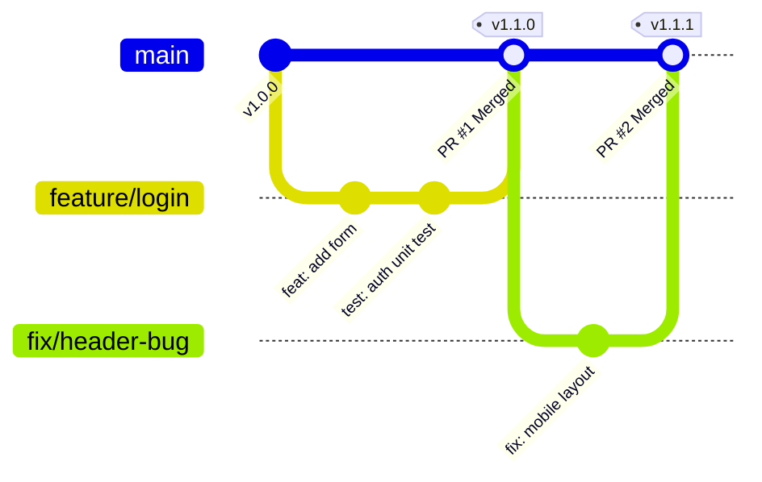
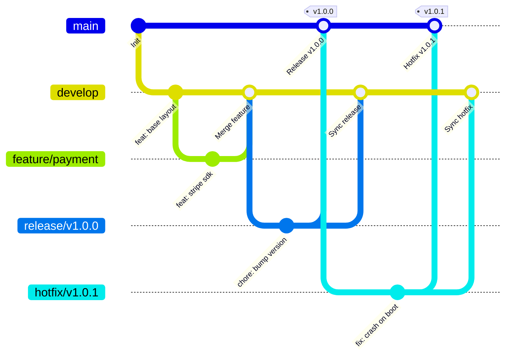
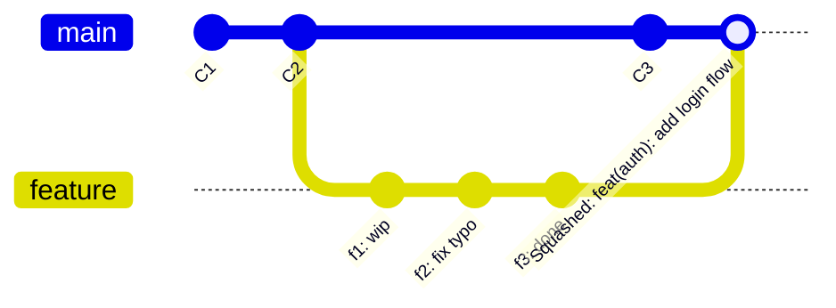

# 📘 CẨM NANG GIT TOÀN DIỆN: WORKFLOWS, CONVENTIONS & KỸ NĂNG THỰC CHIẾN (GIT MASTERY GUIDE)

Tài liệu chuẩn hóa toàn bộ quy trình làm việc với Git, quy ước đặt tên commit/branch chuẩn quốc tế (Conventional Commits, SemVer) và các kỹ năng xử lý tình huống nâng cao cho lập trình viên và nhóm phát triển.

---

## 📑 MỤC LỤC
1. [🌊 Git Workflows (Mô hình Luồng làm việc)](#1--git-workflows-mô-hình-luồng-làm-việc)
   - [1.1. GitHub Flow (Khuyên dùng cho Web & CI/CD)](#11-github-flow-khuyên-dùng-cho-web--cicd)
   - [1.2. GitFlow Workflow (Dự án phát hành theo phiên bản)](#12-gitflow-workflow-dự-án-phát-hành-theo-phiên-bản)
   - [1.3. Trunk-Based Development (Tốc độ cao / Doanh nghiệp lớn)](#13-trunk-based-development-tốc-độ-cao--doanh-nghiệp-lớn)
   - [1.4. Bảng so sánh lựa chọn Workflow](#14-bảng-so-sánh-lựa-chọn-workflow)
2. [🏷️ Git Conventions (Quy chuẩn Đặt tên & Commit)](#2-️-git-conventions-quy-chuẩn-đặt-tên--commit)
   - [2.1. Conventional Commits 1.0.0](#21-conventional-commits-100)
   - [2.2. Branch Naming Convention (Quy tắc đặt tên nhánh)](#22-branch-naming-convention-quy-tắc-đặt-tên-nhánh)
   - [2.3. Semantic Versioning (SemVer 2.0.0) & Git Tags](#23-semantic-versioning-semver-200--git-tags)
   - [2.4. Pull Request (PR) & Code Review Guidelines](#24-pull-request-pr--code-review-guidelines)
3. [⚡ Git Skills & Practical Mastery (Kỹ năng Thực chiến & Mẹo nâng cao)](#3--git-skills--practical-mastery-kỹ-năng-thực-chiến--mẹo-nâng-cao)
   - [3.1. Chiến lược Gộp nhánh: Merge vs Rebase vs Squash](#31-chiến-lược-gộp-nhánh-merge-vs-rebase-vs-squash)
   - [3.2. Chỉnh sửa & Tinh chỉnh Commit (Amend, Autosquash)](#32-chỉnh-sửa--tinh-chỉnh-commit-amend-autosquash)
   - [3.3. Cứu hộ Dữ liệu & Hoàn tác (Reflog, Reset, Revert)](#33-cứu-hộ-dữ-liệu--hoàn-tác-reflog-reset-revert)
   - [3.4. Quản lý Đa tác vụ: Git Stash & Git Worktree](#34-quản-lý-đa-tác-vụ-git-stash--git-worktree)
   - [3.5. Truy vết & Săn Bug: Bisect, Blame & Pickaxe Search](#35-truy-vết--săn-bug-bisect-blame--pickaxe-search)
   - [3.6. Cấu hình Tối ưu, Git Aliases & Git Hooks](#36-cấu-hình-tối-ưu-git-aliases--git-hooks)

---

## 1. 🌊 Git Workflows (Mô hình Luồng làm việc)

### 1.1. GitHub Flow (Khuyên dùng cho Web & CI/CD)
Phù hợp nhất cho các dự án Web, SaaS, Microservices nơi việc triển khai (deployment) diễn ra liên tục (Continuous Deployment).



#### Quy trình 6 bước chuẩn:
1. **Branch từ `main`**: Tạo nhánh với tên mô tả rõ ràng (`feature/user-auth`, `fix/navbar-overflow`).
2. **Commit cục bộ**: Viết commit đều đặn, tuân thủ commit convention.
3. **Mở Pull Request (PR)**: Đẩy nhánh lên Remote và mở PR sớm để thảo luận, review code và kích hoạt CI.
4. **Code Review & CI Testing**: Tối thiểu 1 reviewer phê duyệt (Approve) và toàn bộ Test/Linter phải Pass.
5. **Merge vào `main`**: Sử dụng `Squash and Merge` hoặc `Rebase and Merge` để giữ lịch sử nhánh chính gọn gàng.
6. **Deploy ngay lập tức**: `main` luôn ở trạng thái sẵn sàng deploy lên Production bất kỳ lúc nào.

---

### 1.2. GitFlow Workflow (Dự án phát hành theo phiên bản)
Phù hợp cho các ứng dụng Mobile (iOS/Android), ứng dụng Desktop, Embedded hoặc Enterprise Software có chu kỳ phát hành định kỳ (Release Cycles/Sprints).



#### Cấu trúc các nhánh trong GitFlow:
| Tên nhánh | Nhánh gốc (Base) | Nhánh gộp vào (Merge to) | Mục đích |
|---|---|---|---|
| `main` | - | - | Chứa code Production ổn định tuyệt đối. Mỗi commit đều gắn tag version. |
| `develop` | `main` | - | Nhánh tích hợp chính chứa các tính năng mới cho release tiếp theo. |
| `feature/*` | `develop` | `develop` | Phát triển một tính năng cụ thể. |
| `release/*` | `develop` | `main` & `develop` | Chuẩn bị phát hành, chỉ fix bug nhẹ, cập nhật docs/metadata, không thêm feature. |
| `hotfix/*` | `main` | `main` & `develop` | Vá lỗi khẩn cấp trực tiếp từ Production. |

---

### 1.3. Trunk-Based Development (Tốc độ cao / Doanh nghiệp lớn)
Được áp dụng tại Google, Meta, Netflix. Toàn bộ lập trình viên commit trực tiếp hoặc qua các nhánh ngắn hạn (Short-lived branches sống < 1-2 ngày) vào `main` (gọi là Trunk).

- **Nguyên tắc cốt lõi**:
  - Không có nhánh tồn tại quá 48 giờ.
  - Sử dụng **Feature Flags (Feature Toggles)** để giấu code chưa hoàn thiện ở môi trường Production.
  - Yêu cầu hệ thống Automated Tests (Unit, Integration, E2E) cực mạnh để kiểm tra tức thì trước khi merge.

---

### 1.4. Bảng so sánh lựa chọn Workflow

| Tiêu chí | GitHub Flow | GitFlow | Trunk-Based |
|---|---|---|---|
| **Độ phức tạp** | Thấp ⭐ | Cao ⭐⭐⭐ | Trung bình ⭐⭐ |
| **Tần suất Deploy** | Nhiều lần / ngày | Theo tuần / tháng / quý | Liên tục nhiều lần / ngày |
| **Số nhánh dài hạn** | 1 (`main`) | 2 (`main`, `develop`) | 1 (`main`) |
| **Phù hợp nhất với** | Web apps, SaaS, Startups | Mobile App, Desktop, HĐH | Nhóm Senior, CI/CD mạnh, Scale lớn |

---

## 2. 🏷️ Git Conventions (Quy chuẩn Đặt tên & Commit)

### 2.1. Conventional Commits 1.0.0
Quy chuẩn commit message thống nhất giúp tự động sinh Changelog (`standard-version`, `release-please`), tự động tính toán SemVer và dễ dàng đọc hiểu lịch sử dự án.

#### Cấu trúc chuẩn:
```text
<type>(<scope>): <short summary>

[optional body: giải thích CHI TIẾT nguyên nhân và giải pháp]

[optional footer(s): BREAKING CHANGE hoặc link Issue/Ticket]
```

#### Bảng danh sách `<type>` quy ước:

| Type | Ý nghĩa | Khi nào sử dụng | Ảnh hưởng SemVer |
|---|---|---|---|
| `feat` | Feature mới | Thêm chức năng, tính năng mới cho người dùng | **MINOR** (`0.X.0`) |
| `fix` | Sửa lỗi | Vá bug trong code logic | **PATCH** (`0.0.X`) |
| `docs` | Tài liệu | Thay đổi README, Wiki, comments code | Không đổi hoặc PATCH |
| `style` | Định dạng | Sửa format, khoảng trắng, dấu chấm phẩy (không đổi logic code) | Không đổi |
| `refactor` | Tái cấu trúc | Viết lại code nhưng không sửa bug cũng không thêm feature | Không đổi |
| `perf` | Hiệu năng | Tối ưu tốc độ, giảm memory, tối ưu database query | **PATCH** |
| `test` | Kiểm thử | Thêm/sửa unit test, e2e test, mock data | Không đổi |
| `build` | Hệ thống build | Đổi config npm, webpack, vite, cargo, gradle | Không đổi |
| `ci` | CI/CD | Sửa file GitHub Actions, GitLab CI, Dockerfile | Không đổi |
| `chore` | Việc vặt | Cập nhật dependencies, cấu hình tooling, dọn dẹp | Không đổi |
| `revert` | Hoàn tác | Revert lại một commit trước đó | Tùy ngữ cảnh |

#### Quy tắc viết Summary / Title:
1. Sử dụng thể mệnh lệnh ở thì hiện tại (ví dụ: `add` thay vì `added` / `adds`).
2. Không viết hoa chữ cái đầu tiên của subject (trừ tên riêng/mã).
3. Không đặt dấu chấm (`.`) ở cuối dòng summary.
4. Giới hạn dòng đầu tiên tối đa **50 - 72 ký tự**.

#### Ví dụ chuẩn thực tế:

##### 1. Commit thêm tính năng thông thường:
```text
feat(auth): add OAuth2 Google login button

Implement OAuth2 authorization code flow with PKCE support.
Includes error handling for popup blockers and session timeout.

Closes #142
```

##### 2. Commit sửa bug:
```text
fix(payment): prevent duplicate checkout requests on double click

Disable the submit button immediately upon initial click
and attach debounce timer to payment handler.

Fixes #289
```

##### 3. Commit chứa Breaking Change (thay đổi làm hỏng tương thích ngược):
```text
feat(api)!: change user profile response schema

BREAKING CHANGE: The `avatar_url` field is renamed to `avatarUrl`
and `userId` is now formatted as UUID instead of integer.
```
> 💡 *Lưu ý: Dấu `!` sau type/scope hoặc mục `BREAKING CHANGE:` ở footer sẽ kích hoạt tăng **MAJOR** version (`1.0.0` -> `2.0.0`).*

---

### 2.2. Branch Naming Convention (Quy tắc đặt tên nhánh)

#### Cấu trúc chuẩn:
```text
<prefix>/<ticket-id>-<short-description-in-kebab-case>
```

#### Bảng tiền tố nhánh (`<prefix>`):
- `feature/` hoặc `feat/`: Tính năng mới (VD: `feature/CYBER-102-user-dashboard`)
- `bugfix/` hoặc `fix/`: Sửa bug thông thường trong sprint (VD: `fix/CYBER-205-login-redirect`)
- `hotfix/`: Sửa bug nghiêm trọng trên Production (VD: `hotfix/v1.2.1-payment-null-pointer`)
- `refactor/`: Tái cấu trúc mã nguồn (VD: `refactor/CYBER-310-auth-middleware`)
- `perf/`: Tối ưu hóa hiệu năng (VD: `perf/CYBER-401-lazy-load-images`)
- `chore/`: Việc cấu hình, cập nhật thư viện (VD: `chore/upgrade-tailwind-v4`)
- `docs/`: Viết hoặc cập nhật tài liệu (VD: `docs/api-v2-swagger-specs`)

#### Nguyên tắc vàng khi đặt tên nhánh:
- ✅ **NÊN**: Dùng chữ thường (`lowercase`), nối từ bằng dấu gạch ngang (`-` kebab-case), chứa mã định danh công việc (Jira/GitHub Issue ID).
  - *Ví dụ tốt*: `feature/CF-42-jwt-authentication`
- ❌ **TRÁNH**: Chữ hoa lộn xộn, dấu gạch dưới `_`, khoảng trắng, dấu tiếng Việt hoặc tên mơ hồ.
  - *Ví dụ xấu*: `feature/New_Login_Page`, `fix_bug`, `bao/update-code`

---

### 2.3. Semantic Versioning (SemVer 2.0.0) & Git Tags

Cấu trúc định danh phiên bản: **`vMAJOR.MINOR.PATCH`** (Ví dụ: `v2.4.1`)

```
v 2 . 4 . 1
  │   │   └── PATCH: Sửa lỗi có tính tương thích ngược (Bug fixes)
  │   └────── MINOR: Thêm tính năng mới có tính tương thích ngược (New features)
  └────────── MAJOR: Thay đổi phá vỡ tương thích cũ (Breaking changes)
```

#### Lệnh Git Tag chuẩn:
```bash
# Tạo Annotated Tag (Luôn khuyên dùng thay vì lightweight tag)
git tag -a v1.2.0 -m "Release version 1.2.0: Add SSO and Dark Mode support"

# Push tag lên remote server
git push origin v1.2.0

# Push tất cả các tag chưa có trên remote
git push origin --tags

# Xóa tag ở local và remote (nếu lỡ tạo sai)
git tag -d v1.2.0
git push origin --delete v1.2.0
```

---

### 2.4. Pull Request (PR) & Code Review Guidelines

#### Tiêu đề PR chuẩn:
```text
[<PREFIX>] <Ticket ID>: <Tóm tắt thay đổi ngắn gọn>
Ví dụ: [FEAT] CF-88: Add biometric authentication for mobile app
```

#### Mẫu Pull Request Description Template (`.github/pull_request_template.md`):
```markdown
## 📌 Tóm tắt (Summary)
<!-- Mô tả ngắn gọn mục đích của PR này -->
Thêm tính năng đăng nhập bằng sinh trắc học (FaceID / Fingerprint) cho mobile client.

## 🔗 Liên kết liên quan (Related Tickets)
- Closes #CF-88
- Blocks #CF-92

## 🛠️ Chi tiết thay đổi (Changes Made)
- [x] Tích hợp thư viện `react-native-biometrics`.
- [x] Tạo service quản lý khóa KeyStore / Keychain an toàn.
- [x] Bổ sung fallback về mã PIN nếu thiết bị không hỗ trợ.

## 🧪 Cách kiểm thử (How to Test)
1. Chạy app trên máy ảo hoặc thiết bị thật hỗ trợ FaceID/TouchID.
2. Vào màn hình `Settings` -> Bật `Enable Biometrics`.
3. Đăng xuất và đăng nhập lại bằng vân tay/khuôn mặt.

## 📸 Ảnh chụp / Video minh chứng (Screenshots/Recordings)
| Trước (Before) | Sau (After) |
|---|---|
| (Ảnh minh họa) | (Ảnh chụp màn hình) |

## ✅ Checklist trước khi yêu cầu Review
- [ ] Code đã tự kiểm tra (Self-reviewed) và chạy linter không có lỗi (`npm run lint`).
- [ ] Đã viết Unit Test và toàn bộ test pass (`npm run test`).
- [ ] Không chứa credentials, tokens, hay debug code thừa (`console.log`).
- [ ] Đã rebase code mới nhất từ nhánh đích (`main`/`develop`).
```

---

## 3. ⚡ Git Skills & Practical Mastery (Kỹ năng Thực chiến & Mẹo nâng cao)

### 3.1. Chiến lược Gộp nhánh: Merge vs Rebase vs Squash

```
1. Normal Merge (git merge --no-ff):
   Tạo ra một Merge Commit đặc biệt có 2 commit cha.
   Ưu điểm: Giữ nguyên lịch sử gốc 100%.
   Nhược điểm: Cây git bị rối nếu quá nhiều nhánh lồng nhau.

2. Rebase (git rebase):
   Bứng toàn bộ commit của nhánh hiện tại và đặt lên trên đỉnh của nhánh đích.
   Ưu điểm: Lịch sử commit hoàn toàn thẳng tắp (linear history).
   Nhược điểm: Làm thay đổi commit hash (SHA-1).

3. Squash and Merge (git merge --squash):
   Gộp toàn bộ 10-20 commit vụn vặt của nhánh feature thành đúng 1 commit duy nhất trên main.
   Ưu điểm: Nhánh main cực kỳ sạch đẹp, rollback 1 tính năng rất dễ.
```



> ⚠️ **Quy tắc vàng của Rebase (Golden Rule of Rebase)**:
> **TUYỆT ĐỐI KHÔNG** rebase trên các nhánh công khai chung (`main`, `develop`) mà người khác đang cùng làm việc. Chỉ rebase trên nhánh cá nhân của bạn trước khi tạo Pull Request!

---

### 3.2. Chỉnh sửa & Tinh chỉnh Commit (Amend, Autosquash)

#### Tình huống 1: Quên sửa 1 dòng code hoặc viết sai chính tả commit vừa xong
```bash
# 1. Sửa file bị thiếu
git add path/to/forgotten-file.ts

# 2. Gộp ngay vào commit gần nhất (không đổi nội dung message)
git commit --amend --no-edit

# 3. Hoặc gộp và muốn sửa lại commit message
git commit --amend -m "feat(auth): correct spelling and include token validation"
```

#### Tình huống 2: Sửa một commit cũ trong quá khứ bằng Autosquash
Thay vì mở `git rebase -i` thủ công để tìm commit:
```bash
# 1. Tạo commit sửa lỗi với cờ --fixup trỏ tới hash của commit gốc cần sửa
git commit --fixup <commit-hash-cần-sửa>

# 2. Chạy rebase với cờ --autosquash (Git sẽ tự động di chuyển commit fixup vào đúng vị trí và gộp lại)
git rebase -i --autosquash <nhánh-gốc-hoặc-hash-trước-đó>
```

---

### 3.3. Cứu hộ Dữ liệu & Hoàn tác (Reflog, Reset, Revert)

```
                     ┌───────────────────┐
                     │   Working Tree    │
                     └─────────┬─────────┘
                               │ git add
                               ▼
                     ┌───────────────────┐
                     │   Staging Area    │
                     └─────────┬─────────┘
                               │ git commit
                               ▼
                     ┌───────────────────┐
                     │   Local Commit    │
                     └───────────────────┘

  git reset --soft HEAD~1 : Chỉ lùi commit, giữ nguyên Staging & Working Tree
  git reset --mixed HEAD~1: Lùi commit & xóa Staging, giữ lại code trong Working Tree (Mặc định)
  git reset --hard HEAD~1 : XÓA SẠCH mọi thay đổi ở cả 3 khu vực (Cực kỳ nguy hiểm!)
```

#### 1. `git reflog` – Chiếc hộp đen vạn năng (Cứu code khi lỡ reset --hard hoặc xóa nhầm nhánh)
Mọi hành động di chuyển con trỏ `HEAD` (commit, rebase, checkout, reset) đều được ghi lại trong reflog:
```bash
# 1. Xem lịch sử mọi bước di chuyển của HEAD
git reflog

# Kết quả mẫu:
# 7a92b1c HEAD@{0}: reset: moving to HEAD~1 (bị mất commit)
# e3f4a21 HEAD@{1}: commit: feat(user): crucial business logic (commit bị mất nằm ở đây)

# 2. Phục hồi lại trạng thái trước khi bị mất:
git reset --hard e3f4a21
# Hoặc tạo nhánh mới từ commit đó:
git branch recovered-branch e3f4a21
```

#### 2. `git revert` – Hoàn tác an toàn cho nhánh đã Push lên Server
Khi bạn đã lỡ push code lỗi lên `main` và không được phép dùng `reset --hard` vì sẽ phá hỏng git của đồng đội:
```bash
# Tạo một commit mới mang nội dung đối nghịch để triệt tiêu commit lỗi
git revert <commit-hash-lỗi>
git push origin main
```

#### 3. Khôi phục file chưa commit (Hủy thay đổi dở dang):
```bash
# Hủy thay đổi của một file cụ thể về trạng thái commit gần nhất
git restore path/to/file.ts

# Hủy toàn bộ thay đổi chưa stage trong thư mục hiện tại
git restore .

# Đưa file từ Staging area quay trở lại Unstaged
git restore --staged path/to/file.ts

# Xóa sạch các file mới tạo chưa được Git theo dõi (Untracked files)
git clean -fd
```

---

### 3.4. Quản lý Đa tác vụ: Git Stash & Git Worktree

#### Kỹ năng 1: `git stash` toàn tập
Đang làm dở tính năng thì có task khẩn cấp chèn vào:

```bash
# Lưu tạm toàn bộ thay đổi (kể cả file mới chưa add -u) kèm ghi chú rõ ràng
git stash push -u -m "WIP: đang làm dở form thanh toán"

# Xem danh sách các stash đang lưu
git stash list

# Xem chi tiết thay đổi trong stash
git stash show -p stash@{0}

# Khôi phục và xóa stash khỏi danh sách
git stash pop

# Khôi phục nhưng vẫn giữ lại stash trong danh sách
git stash apply stash@{0}

# Chuyển stash thành một branch mới riêng biệt
git stash branch feature/from-stash stash@{0}
```

#### Kỹ năng 2: `git worktree` – Kỹ năng của Senior Developer
Thay vì phải stash, chuyển nhánh, đợi build lại `node_modules` hoặc clone một repo thứ hai, `git worktree` cho phép bạn mở đồng thời nhiều nhánh ở các thư mục vật lý khác nhau từ cùng một kho Git!

```bash
# Cấu trúc: Bạn đang ở thư mục /CyberForge (nhánh main)

# 1. Tạo một thư mục song song để code tính năng 'feature/ai-assistant'
git worktree add ../CyberForge-AI feature/ai-assistant

# 2. Mở cửa sổ IDE thứ hai tại ../CyberForge-AI và làm việc độc lập song song!

# 3. Xem danh sách các worktree đang hoạt động
git worktree list

# 4. Sau khi xong việc và merge, xóa worktree
git worktree remove ../CyberForge-AI
```

---

### 3.5. Truy vết & Săn Bug: Bisect, Blame & Pickaxe Search

#### 1. `git bisect` – Tìm commit gây lỗi bằng thuật toán Tìm kiếm nhị phân
Khi phát hiện một bug nhưng không biết commit nào trong số 50 commit gần đây gây ra:

```bash
# 1. Bắt đầu phiên điều tra
git bisect start

# 2. Đánh dấu commit hiện tại là lỗi
git bisect bad

# 3. Đánh dấu một commit cũ trong quá khứ mà bạn chắc chắn app vẫn chạy tốt
git bisect good v1.0.0

# 4. Git sẽ tự động checkout về commit ở giữa (binary search).
# Bạn test app. Nếu app chạy đúng gõ:
git bisect good
# Nếu app bị lỗi gõ:
git bisect bad

# 5. Lặp lại 4-5 lần, Git sẽ chỉ chính xác 100% commit đầu tiên làm phát sinh bug!
# 6. Kết thúc phiên điều tra và quay về nhánh cũ:
git bisect reset
```

#### 2. Tìm kiếm lịch sử sâu với Pickaxe Search (`-S` và `-G`):
```bash
# Tìm tất cả các commit mà chuỗi "SECRET_API_KEY" được thêm vào hoặc xóa đi
git log -S "SECRET_API_KEY" --oneline -p

# Tìm kiếm theo Regular Expression
git log -G "function.*handleAuth" --stat

# Xem ai sửa từng dòng trong file và commit tại thời điểm nào
git blame -L 40,60 src/services/auth.service.ts
```

---

### 3.6. Cấu hình Tối ưu, Git Aliases & Git Hooks

#### 1. Bộ Git Aliases "Thần tốc" (Thêm vào file `~/.gitconfig`):
```ini
[alias]
    # Trạng thái & Lịch sử
    st = status -sb
    ci = commit
    co = checkout
    br = branch
    lg = log --graph --pretty=format:'%Cred%h%Creset -%C(yellow)%d%Creset %s %Cgreen(%cr) %C(bold blue)<%an>%Creset' --abbrev-commit
    
    # Thao tác nhanh
    unstage = reset HEAD --
    last = log -1 HEAD --stat
    amend = commit --amend --no-edit
    undo = reset --soft HEAD~1
    
    # Đồng bộ & Dọn dẹp
    up = pull --rebase --autostash
    cleanup = !git branch --merged | grep -E -v "(^\*|master|main|dev)" | xargs -r git branch -d
```

#### 2. Cấu hình xử lý xuống dòng (Line Endings) nhất quán giữa Windows & Linux/macOS
Tạo file `.gitattributes` ở thư mục gốc dự án để tránh xung đột CRLF / LF:
```gitattributes
# Tự động chuẩn hóa toàn bộ file text về LF khi lưu vào Git
* text=auto eol=lf

# Khai báo file nhị phân không bị can thiệp
*.png binary
*.jpg binary
*.docx binary
*.pdf binary
```

#### 3. Thiết lập Tự động hóa Kiểm tra Commit (Git Hooks với Husky & commitlint):
Cài đặt trong `package.json` của dự án để ngăn chặn commit sai quy chuẩn ngay từ máy lập trình viên:

```bash
# Cài đặt công cụ
npm install -D husky @commitlint/cli @commitlint/config-conventional lint-staged

# Khởi tạo husky
npx husky init
```

Nội dung file `.commitlintrc.json`:
```json
{
  "extends": ["@commitlint/config-conventional"]
}
```

Nội dung file `.husky/commit-msg`:
```bash
npx --no -- commitlint --edit "$1"
```

Nội dung file `.husky/pre-commit`:
```bash
npx lint-staged
```

---

## 🎯 BẢNG CHECKLIST TỔNG KẾT MỖI KHI LÀM VIỆC VỚI GIT

- [ ] **Trước khi code**: Luôn chạy `git pull --rebase` từ nhánh chính (`main`/`develop`) để cập nhật code mới nhất.
- [ ] **Tạo nhánh**: Tạo nhánh mới theo đúng format `feature/TICKET-slug` hoặc `fix/TICKET-slug`.
- [ ] **Trong khi code**: Commit theo từng đơn vị công việc logic nhỏ, không dồn 10 tính năng vào 1 commit khổng lồ.
- [ ] **Thông điệp commit**: Tuân thủ nghiêm ngặt chuẩn `Conventional Commits` (`feat:`, `fix:`, `refactor:`,...).
- [ ] **Trước khi mở PR**:
  - Rebase hoặc merge code mới nhất từ nhánh base để giải quyết conflict trước ở local.
  - Chạy `npm run test` và `npm run lint`.
  - Tự review lại diff (`git diff`) để loại bỏ code rác hoặc token bí mật.
- [ ] **Sau khi Merge**: Xóa nhánh feature cũ trên remote và local để giữ repository gọn gàng.
