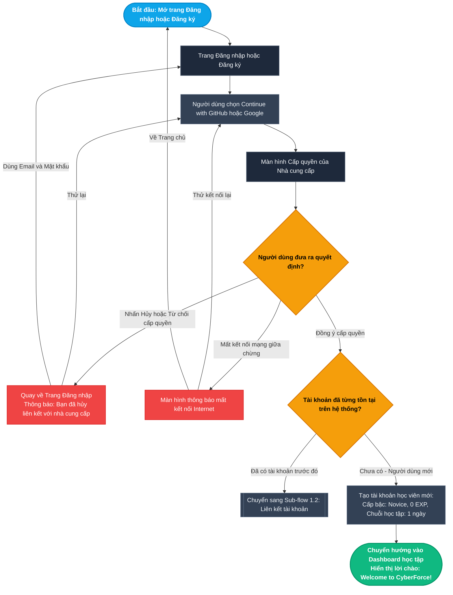
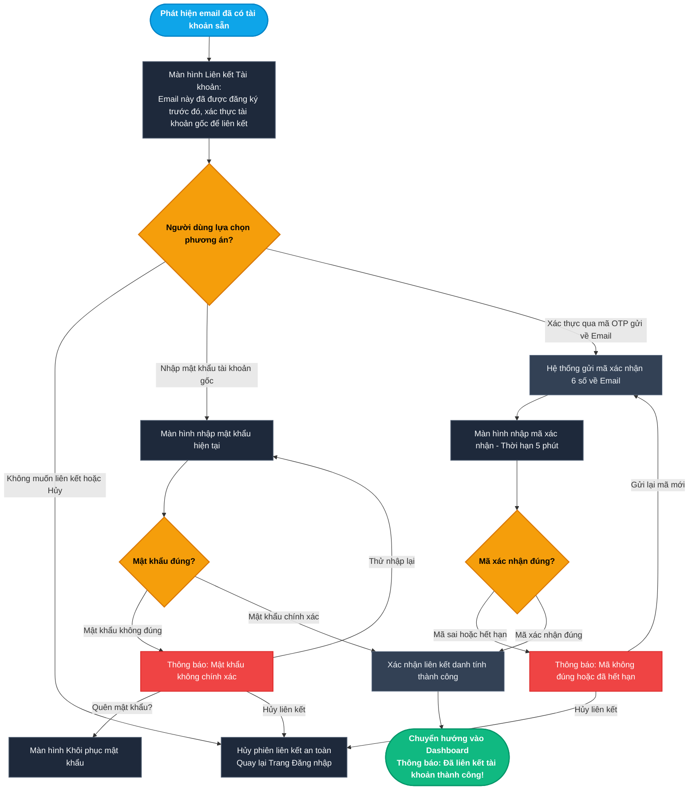
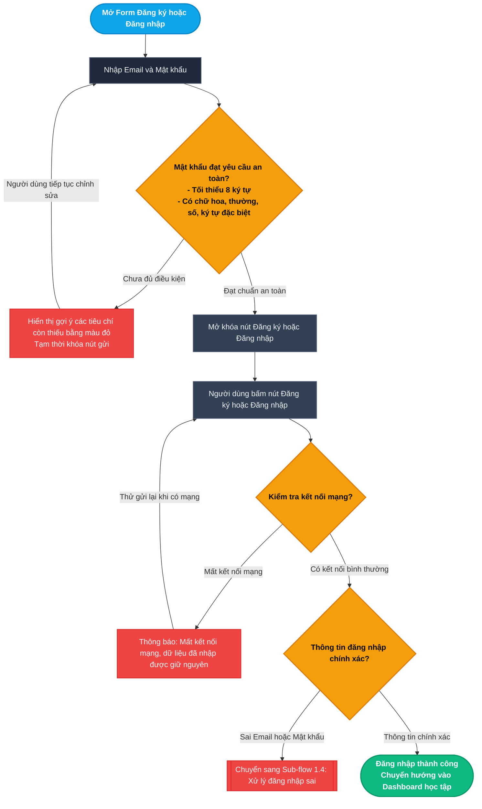
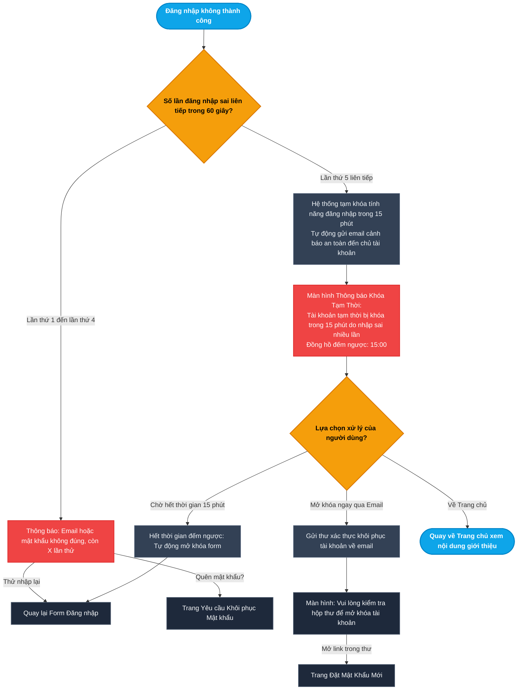
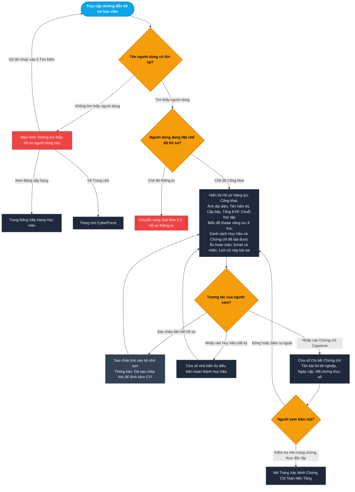
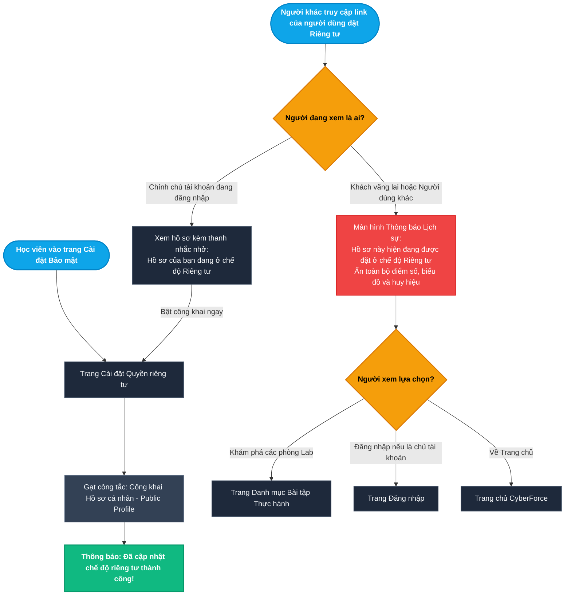
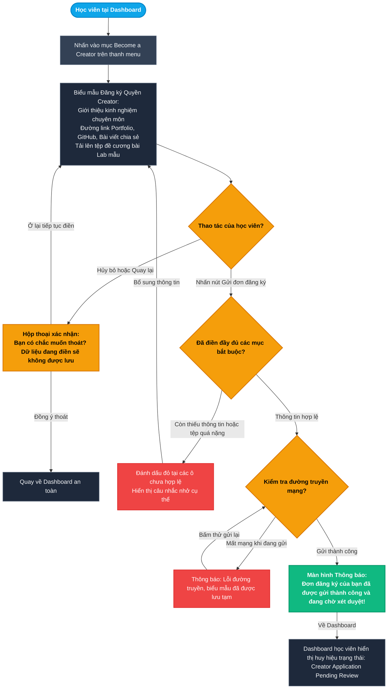
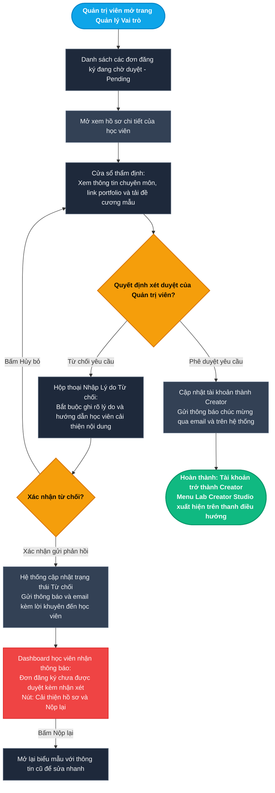
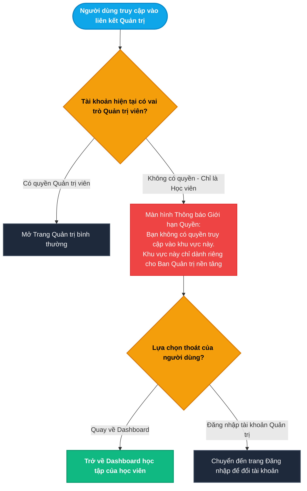

# Epic 1: User Identity, Profiles & Granular RBAC
## Tài liệu Thiết kế Kiến trúc User Flow Chi tiết (User Journey & Experience Flows)

* **Hệ thống:** CyberForce Cyber Range & Practical Security Platform
* **Tài liệu tham chiếu:** [EPIC_01_USER_IDENTITY_PROFILES_RBAC.md](file:///home/quocbao/Documents/University/ChuyenDe4/CyberForge/docs/05-epics/EPIC_01_USER_IDENTITY_PROFILES_RBAC.md)
* **Vai trò phụ trách:** Product Designer (UX Architect)
* **Phiên bản:** 3.0 (Strict Separation: User Journey Focus)

---

## 📑 MỤC LỤC TỔNG QUAN CÁC TIỂU LUỒNG (USER FLOWS)

Toàn bộ trải nghiệm người dùng trong Epic 1 được thiết kế xoay quanh hành vi, cảm nhận và tương tác của người dùng:

- **MODULE 1: ĐĂNG KÝ, ĐĂNG NHẬP & BẢO VỆ TÀI KHOẢN (AUTHENTICATION & ACCOUNT SAFETY)**
  - [Sub-flow 1.1: Đăng ký & Đăng nhập 1-Click bằng GitHub / Google (US-01.01)](#sub-flow-11-đăng-ký--đăng-nhập-1-click-bằng-github--google-us-0101)
  - [Sub-flow 1.2: Xử lý Trùng Email & Liên kết Tài khoản - Account Linking (US-01.01)](#sub-flow-12-xử-lý-trùng-email--liên-kết-tài-khoản---account-linking-us-0101)
  - [Sub-flow 1.3: Đăng ký & Đăng nhập bằng Email/Mật khẩu truyền thống (US-01.02)](#sub-flow-13-đăng-ký--đăng-nhập-bằng-emailmật-khẩu-truyền-thống-us-0102)
  - [Sub-flow 1.4: Bảo vệ Tài khoản khi Đăng nhập Sai nhiều lần & Khóa Tạm thời (US-01.02)](#sub-flow-14-bảo-vệ-tài-khoản-khi-đăng-nhập-sai-nhiều-lần--khóa-tạm-thời-us-0102)
- **MODULE 2: HỒ SƠ NĂNG LỰC & QUYỀN RIÊNG TƯ (PROFILES & PRIVACY)**
  - [Sub-flow 2.1: Khám phá Hồ sơ Năng lực Công khai & Kiểm tra Chứng chỉ số (US-01.03)](#sub-flow-21-khám-phá-hồ-sơ-năng-lực-công-khai--kiểm-tra-chứng-chỉ-số-us-0103)
  - [Sub-flow 2.2: Quản lý Thiết lập Quyền riêng tư Hồ sơ (US-01.03)](#sub-flow-22-quản-lý-thiết-lập-quyền-riêng-tư-hồ-sơ-us-0103)
- **MODULE 3: PHÂN QUYỀN VAI TRÒ & XÉT DUYỆT CREATOR (ROLES & CREATOR WORKFLOW)**
  - [Sub-flow 3.1: Học viên Nộp đơn Đăng ký "Become a Creator" (US-01.04)](#sub-flow-31-học-viên-nộp-đơn-đăng-ký-become-a-creator-us-0104)
  - [Sub-flow 3.2: Quản trị viên Xét duyệt Đơn Quyền Creator (US-01.04)](#sub-flow-32-quản-trị-viên-xét-duyệt-đơn-quyền-creator-us-0104)
  - [Sub-flow 3.3: Phản hồi Trải nghiệm khi Truy cập Khu vực Bị giới hạn Quyền (US-01.04)](#sub-flow-33-phản-hồi-trải-nghiệm-khi-truy-cập-khu-vực-bị-giới-hạn-quyền-us-0104)

---

## I. NGUYÊN TẮC THIẾT KẾ TRẢI NGHIỆM (USER EXPERIENCE PRINCIPLES)

1. **Góc nhìn thuần túy Người dùng (User-First Perspective):**
   - Tài liệu mô tả: Người dùng thấy gì? Thao tác gì? Đưa ra lựa chọn nào? Nhận phản hồi gì? Đến màn hình nào tiếp theo?
   - Tuyệt đối không chứa chi tiết cài đặt kỹ thuật (Database, SQL, API endpoints, HTTP status codes, Token, Cookies, Hashing algorithms).
2. **Cơ chế "No Dead End" (Không màn hình bế tắc):**
   - Bất kỳ màn hình lỗi, cảnh báo hay trạng thái chờ nào cũng có nút thoát hiểm: *Thử lại, Đổi phương thức, Khôi phục, hoặc Quay về trang an toàn (Dashboard/Trang chủ)*.
3. **Bảo toàn Dữ liệu người dùng (Data Preservation):**
   - Khi mất mạng hoặc nhập thiếu thông tin, biểu mẫu không bị xóa trắng mà luôn giữ lại các giá trị đã nhập để người dùng không phải làm lại từ đầu.

---

## II. CHI TIẾT CÁC TIỂU LUỒNG USER FLOW (MERMAID FLOWCHARTS & MATRICES)

---

### Sub-flow 1.1: Đăng ký & Đăng nhập 1-Click bằng GitHub / Google (US-01.01)

Mô tả trải nghiệm của người dùng khi chọn phương thức đăng ký/đăng nhập nhanh thông qua tài khoản mạng xã hội.

#### Sơ đồ Flowchart (Mermaid)

#### Bảng State Transition Matrix (Sub-flow 1.1)

| Bước | Màn hình / Trạng thái | Hành động người dùng | Điều kiện kiểm tra | Màn hình tiếp theo | Cơ chế thoát hiểm (No Dead End) |
| :--- | :--- | :--- | :--- | :--- | :--- |
| **1.1.1** | Màn hình Đăng nhập / Đăng ký | Bấm nút "Continue with GitHub / Google" | Đã chọn nút hợp lệ | Màn hình cấp quyền của Google/GitHub | Có nút quay lại hoặc đóng cửa sổ xác thực |
| **1.1.2** | Màn hình cấp quyền Provider | Bấm "Hủy bỏ" hoặc từ chối cấp quyền | Người dùng không muốn chia sẻ thông tin | Quay về màn hình Đăng nhập với thông báo hủy | Nút "Thử lại" hoặc chọn phương thức nhập Email/Mật khẩu |
| **1.1.3** | Màn hình kết nối Provider | Mất tín hiệu mạng khi đang xác thực | Đường truyền Internet bị ngắt | Màn hình thông báo lỗi kết nối mạng | Nút "Thử lại kết nối" hoặc "Quay về Trang chủ" |
| **1.1.4** | Đang xử lý đăng nhập | Hoàn tất cấp quyền từ nhà cung cấp | Email chưa từng được đăng ký trước đây | Tạo hồ sơ học viên mới và đưa thẳng vào Dashboard | Vào học ngay lập tức, hiển thị lời chào mừng |
| **1.1.5** | Đang xử lý đăng nhập | Hoàn tất cấp quyền từ nhà cung cấp | Email đã từng được tạo qua phương thức khác | Màn hình hỏi liên kết tài khoản | Chuyển tiếp sang Sub-flow 1.2 |

---

### Sub-flow 1.2: Xử lý Trùng Email & Liên kết Tài khoản - Account Linking (US-01.01)

Bảo vệ người dùng khỏi nguy cơ bị chiếm quyền tài khoản khi đăng nhập bằng tài khoản mạng xã hội có email trùng với tài khoản đã có sẵn.

#### Sơ đồ Flowchart (Mermaid)

#### Bảng State Transition Matrix (Sub-flow 1.2)

| Bước | Màn hình / Trạng thái | Hành động người dùng | Điều kiện kiểm tra | Màn hình tiếp theo | Cơ chế thoát hiểm (No Dead End) |
| :--- | :--- | :--- | :--- | :--- | :--- |
| **1.2.1** | Màn hình Liên kết Tài khoản | Nhấn nút "Hủy liên kết" hoặc dấu X | Người dùng không muốn liên kết | Quay lại trang Đăng nhập | Không tạo dữ liệu rác, tài khoản cũ an toàn |
| **1.2.2** | Màn hình Liên kết Tài khoản | Chọn xác thực bằng Mật khẩu và nhập dữ liệu | Mật khẩu không trùng khớp | Thông báo lỗi đỏ dưới ô mật khẩu | Nút "Quên mật khẩu?" hoặc nút "Đổi sang nhận mã qua Email" |
| **1.2.3** | Màn hình Liên kết Tài khoản | Chọn nhận mã OTP qua Email | Đã bấm nút gửi mã | Màn hình nhập mã xác nhận | Nút "Gửi lại mã" sau 60 giây và nút quay lại |
| **1.2.4** | Màn hình nhập mã xác nhận | Nhập mã sai hoặc mã đã hết hạn | Mã không hợp lệ | Thông báo mã không đúng | Nút bấm "Gửi lại mã mới" |
| **1.2.5** | Màn hình nhập Mật khẩu / Mã OTP | Nhập chính xác Mật khẩu hoặc Mã xác nhận | Thông tin xác minh chuẩn xác | Đưa người dùng vào Dashboard học tập | Hiển thị thông báo liên kết thành công |

---

### Sub-flow 1.3: Đăng ký & Đăng nhập bằng Email/Mật khẩu truyền thống (US-01.02)

Quy trình nhập biểu mẫu truyền thống, hỗ trợ kiểm tra độ mạnh mật khẩu trực quan và tự động giữ lại thông tin khi gặp sự cố mạng.

#### Sơ đồ Flowchart (Mermaid)

#### Bảng State Transition Matrix (Sub-flow 1.3)

| Bước | Màn hình / Trạng thái | Hành động người dùng | Điều kiện kiểm tra | Màn hình tiếp theo | Cơ chế thoát hiểm (No Dead End) |
| :--- | :--- | :--- | :--- | :--- | :--- |
| **1.3.1** | Form Đăng ký / Đăng nhập | Gõ mật khẩu vào ô nhập liệu | Mật khẩu chưa đủ 8 ký tự hoặc thiếu ký tự đặc biệt | Bảng checklist hướng dẫn hiển thị màu đỏ; nút bấm bị khóa | Người dùng tiếp tục gõ trực tiếp trên màn hình, không bị mất dữ liệu |
| **1.3.2** | Form Đăng ký / Đăng nhập | Nhấn nút gửi biểu mẫu | Bị rớt mạng đột ngột | Thông báo mất kết nối, nút chuyển thành "Thử gửi lại" | Giữ nguyên toàn bộ nội dung đã nhập trong form |
| **1.3.3** | Form Đăng nhập | Nhấn nút gửi biểu mẫu | Email hoặc mật khẩu không khớp | Chuyển sang tiểu luồng cảnh báo số lần thử sai | Hiển thị số lần còn lại và link khôi phục |
| **1.3.4** | Form Đăng nhập | Nhấn nút gửi biểu mẫu | Thông tin đăng nhập hoàn toàn chính xác | Màn hình Dashboard học tập | Đăng nhập thành công, bắt đầu học |

---

### Sub-flow 1.4: Bảo vệ Tài khoản khi Đăng nhập Sai nhiều lần & Khóa Tạm thời (US-01.02)

Bảo vệ tài khoản khi có dấu hiệu đoán mò mật khẩu, thông báo rõ ràng thời gian chờ và cung cấp cách mở khóa khẩn cấp qua Email.

#### Sơ đồ Flowchart (Mermaid)

#### Bảng State Transition Matrix (Sub-flow 1.4)

| Bước | Màn hình / Trạng thái | Hành động người dùng | Điều kiện kiểm tra | Màn hình tiếp theo | Cơ chế thoát hiểm (No Dead End) |
| :--- | :--- | :--- | :--- | :--- | :--- |
| **1.4.1** | Màn hình Đăng nhập | Nhập sai thông tin lần 1 đến 4 | Số lần thất bại chưa vượt ngưỡng 5 lần | Cảnh báo số lần thử còn lại | Nút "Quên mật khẩu?" giúp tránh việc bị khóa |
| **1.4.2** | Màn hình Đăng nhập | Nhập sai thông tin lần thứ 5 | Vừa đạt đúng 5 lần sai liên tiếp | Chuyển ngay sang Màn hình Khóa Tạm Thời (15:00) | Gửi email thông báo cho chính chủ |
| **1.4.3** | Màn hình Khóa Tạm Thời | Chờ đợi bộ đếm lùi thời gian | Đồng hồ đếm ngược trở về `00:00` | Mở khóa lại Form đăng nhập bình thường | Người dùng thử lại được ngay sau khi hết giờ |
| **1.4.4** | Màn hình Khóa Tạm Thời | Nhấn "Mở khóa ngay qua Email" | Người dùng có quyền truy cập hòm thư | Màn hình thông báo đã gửi liên kết khôi phục | Đường link mở khóa lập tức và cho phép đổi mật khẩu |
| **1.4.5** | Màn hình Khóa Tạm Thời | Nhấn nút "Về Trang chủ" | Người dùng muốn thoát để làm việc khác | Trang chủ CyberForce | Người dùng không bị mắc kẹt trên màn hình lỗi |

---

### Sub-flow 2.1: Khám phá Hồ sơ Năng lực Công khai & Kiểm tra Chứng chỉ số (US-01.03)

Trải nghiệm của khách vãng lai hoặc nhà tuyển dụng khi xem trang thành tích của học viên và kiểm chứng năng lực thực tế.

#### Sơ đồ Flowchart (Mermaid)

#### Bảng State Transition Matrix (Sub-flow 2.1)

| Bước | Màn hình / Trạng thái | Hành động người dùng | Điều kiện kiểm tra | Màn hình tiếp theo | Cơ chế thoát hiểm (No Dead End) |
| :--- | :--- | :--- | :--- | :--- | :--- |
| **2.1.1** | Đường dẫn `/user/[username]` | Truy cập link hồ sơ từ CV | Tên người dùng không có trên hệ thống | Màn hình thông báo không tìm thấy hồ sơ | Ô tìm kiếm học viên khác, nút xem Bảng xếp hạng, nút về Trang chủ |
| **2.1.2** | Đường dẫn `/user/[username]` | Truy cập link hồ sơ từ CV | Người dùng có tồn tại và đang bật chế độ Công khai | Màn hình Hồ sơ Năng lực hiển thị đầy đủ biểu đồ 8 trục | Tải nhanh, bảo mật các thông tin cá nhân |
| **2.1.3** | Màn hình Hồ sơ Công khai | Nhấn nút "Sao chép liên kết hồ sơ" | Trang đã nạp xong | Thông báo nhỏ: "Đã sao chép link để đính kèm CV" | Tiếp tục xem trang bình thường |
| **2.1.4** | Màn hình Hồ sơ Công khai | Bấm vào một Chứng chỉ Capstone | Người xem muốn kiểm chứng năng lực | Cửa sổ hiển thị thông tin và mã chứng thực số | Có nút đóng và nút kiểm tra độc lập |
| **2.1.5** | Cửa sổ Chứng chỉ Capstone | Bấm "Kiểm tra trên trang chứng thực độc lập" | Muốn xem trang thẩm định | Mở trang kiểm định chứng chỉ | Người tuyển dụng đối soát kết quả minh bạch |

---

### Sub-flow 2.2: Quản lý Thiết lập Quyền riêng tư Hồ sơ (US-01.03)

Học viên chủ động bảo vệ quyền riêng tư cá nhân và trải nghiệm lịch sự khi người khác truy cập hồ sơ đang bị ẩn.

#### Sơ đồ Flowchart (Mermaid)

#### Bảng State Transition Matrix (Sub-flow 2.2)

| Bước | Màn hình / Trạng thái | Hành động người dùng | Điều kiện kiểm tra | Màn hình tiếp theo | Cơ chế thoát hiểm (No Dead End) |
| :--- | :--- | :--- | :--- | :--- | :--- |
| **2.2.1** | Màn hình Cài đặt Bảo mật | Gạt nút Bật/Tắt chế độ công khai | Học viên muốn thay đổi quyền hiển thị | Thông báo cập nhật thành công | Có thể gạt đổi lại bất kỳ lúc nào |
| **2.2.2** | Link hồ sơ đang ở chế độ Riêng tư | Khách ngoài truy cập vào | Người dùng đang cài đặt chế độ Riêng tư | Màn hình thông báo hồ sơ đang ở chế độ riêng tư | Nút "Khám phá phòng Lab", nút "Đăng nhập", nút "Về Trang chủ" |
| **2.2.3** | Link hồ sơ đang ở chế độ Riêng tư | Chính chủ tài khoản xem hồ sơ của mình | Đang đăng nhập đúng tài khoản đó | Hiển thị hồ sơ kèm thanh nhắc nhở đang ẩn | Nút chuyển nhanh đến cài đặt để bật công khai lại nếu muốn |

---

### Sub-flow 3.1: Học viên Nộp đơn Đăng ký "Become a Creator" (US-01.04)

Quy trình nộp hồ sơ xin cấp quyền tác giả bài lab, có xác nhận khi thoát để tránh mất dữ liệu và hiển thị trạng thái chờ duyệt.

#### Sơ đồ Flowchart (Mermaid)

#### Bảng State Transition Matrix (Sub-flow 3.1)

| Bước | Màn hình / Trạng thái | Hành động người dùng | Điều kiện kiểm tra | Màn hình tiếp theo | Cơ chế thoát hiểm (No Dead End) |
| :--- | :--- | :--- | :--- | :--- | :--- |
| **3.1.1** | Dashboard học viên | Bấm chọn "Become a Creator" | Tài khoản đang có vai trò học viên | Biểu mẫu nộp đơn xin cấp quyền Creator | Có nút Hủy để quay về Dashboard |
| **3.1.2** | Biểu mẫu Creator | Bấm "Hủy bỏ" khi đang điền dở | Đã có thông tin được nhập vào form | Hộp thoại xác nhận có chắc chắn muốn hủy | Cho phép chọn "Ở lại điền tiếp" hoặc "Thoát về Dashboard" |
| **3.1.3** | Biểu mẫu Creator | Bấm nút "Gửi đơn đăng ký" | Thiếu tệp đề cương mẫu hoặc bỏ trống link | Đánh dấu đỏ các mục còn thiếu | Giữ nguyên các nội dung khác đã điền |
| **3.1.4** | Biểu mẫu Creator | Bấm nút "Gửi đơn đăng ký" | Mất kết nối trong lúc tải tệp lên | Thông báo lỗi mạng và giữ lại bản nháp | Nút "Thử gửi lại" khi có mạng |
| **3.1.5** | Biểu mẫu Creator | Bấm nút "Gửi đơn đăng ký" | Đầy đủ thông tin và gửi thành công | Màn hình thông báo đơn đã được tiếp nhận | Nút "Về Dashboard"; Dashboard có bảng theo dõi tiến độ |

---

### Sub-flow 3.2: Quản trị viên Xét duyệt Đơn Quyền Creator (US-01.04)

Quy trình quản trị viên thẩm định hồ sơ bài giảng, phê duyệt hoặc từ chối kèm lời khuyên cải thiện cho học viên nộp lại.

#### Sơ đồ Flowchart (Mermaid)

#### Bảng State Transition Matrix (Sub-flow 3.2)

| Bước | Màn hình / Trạng thái | Hành động người dùng | Điều kiện kiểm tra | Màn hình tiếp theo | Cơ chế thoát hiểm (No Dead End) |
| :--- | :--- | :--- | :--- | :--- | :--- |
| **3.2.1** | Màn hình Quản lý Đơn duyệt | Bấm mở một đơn đăng ký | Đơn đang ở trạng thái chờ duyệt | Cửa sổ chi tiết bài nộp và thông tin học viên | Nút đóng để quay lại danh sách |
| **3.2.2** | Cửa sổ chi tiết bài nộp | Quản trị viên nhấn nút "Reject" | Hồ sơ chưa đạt yêu cầu | Hộp thoại yêu cầu nhập lý do từ chối | Nút "Hủy bỏ" nếu lỡ bấm nhầm |
| **3.2.3** | Hộp thoại lý do từ chối | Nhập lời nhận xét và bấm "Xác nhận" | Đã có nội dung hướng dẫn sửa | Cập nhật trạng thái từ chối và gửi tin nhắn cho học viên | Đơn được chuyển vào mục đã xử lý |
| **3.2.4** | Dashboard học viên bị từ chối | Học viên đọc nhận xét của Admin | Đơn bị từ chối | Hiển thị lời góp ý và nút "Cải thiện hồ sơ & Nộp lại" | Nút bấm mở lại form có sẵn dữ liệu cũ, không phải gõ lại |
| **3.2.5** | Cửa sổ chi tiết bài nộp | Quản trị viên nhấn nút "Approve" | Hồ sơ đạt chất lượng | Nâng quyền Creator, gửi email chúc mừng | Học viên thấy menu Studio xuất hiện để bắt đầu tạo lab |

---

### Sub-flow 3.3: Phản hồi Trải nghiệm khi Truy cập Khu vực Bị giới hạn Quyền (US-01.04)

Trải nghiệm thân thiện khi học viên vô tình hoặc cố ý truy cập vào các đường dẫn hoặc tính năng dành riêng cho Quản trị viên.

#### Sơ đồ Flowchart (Mermaid)

#### Bảng State Transition Matrix (Sub-flow 3.3)

| Bước | Màn hình / Trạng thái | Hành động người dùng | Điều kiện kiểm tra | Màn hình tiếp theo | Cơ chế thoát hiểm (No Dead End) |
| :--- | :--- | :--- | :--- | :--- | :--- |
| **3.3.1** | Thanh địa chỉ trình duyệt | Truy cập đường dẫn quản trị | Đang đăng nhập tài khoản học viên bình thường | Màn hình thông báo giới hạn quyền truy cập | Có thông báo rõ ràng, không làm đơ ứng dụng |
| **3.3.2** | Màn hình Giới hạn Quyền | Nhấn nút "Quay về Dashboard" | Người dùng muốn quay về việc học tập | Trở về Dashboard học tập | Đưa người dùng về vùng an toàn ngay lập tức |
| **3.3.3** | Màn hình Giới hạn Quyền | Nhấn nút "Đăng nhập tài khoản khác" | Người dùng sở hữu tài khoản Admin khác | Chuyển về màn hình Đăng nhập | Cho phép đổi tài khoản để truy cập quyền quản trị |

