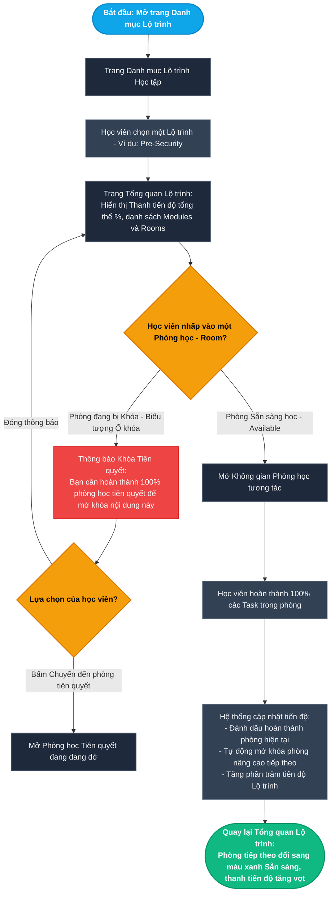
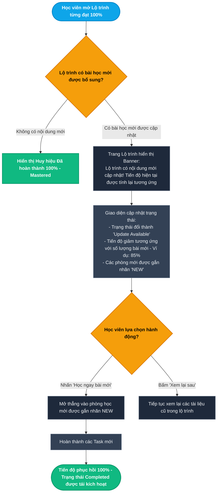
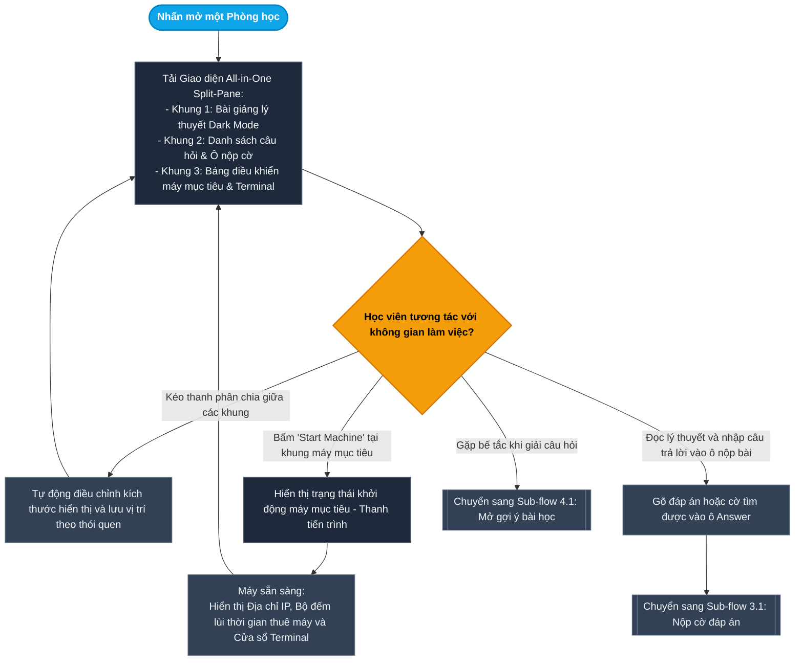
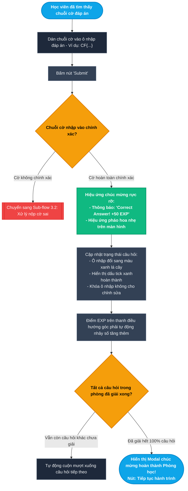
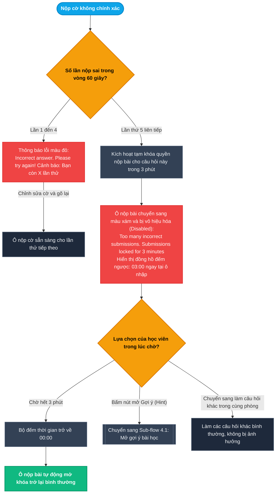
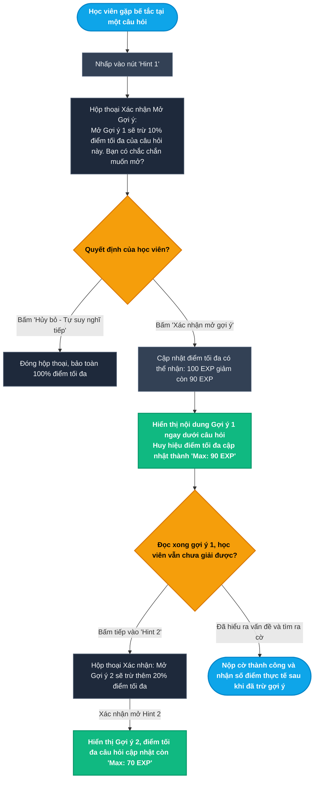
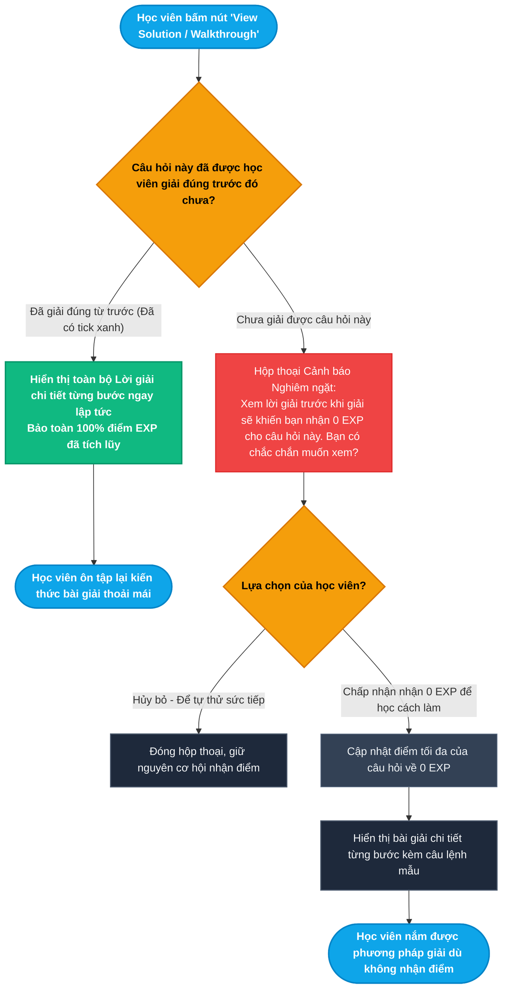

# Epic 2: Structured Learning Paths & Interactive Rooms
## Tài liệu Thiết kế Kiến trúc User Flow Chi tiết (Modular UX Architecture & State Transitions)

* **Hệ thống:** CyberForce Cyber Range & Practical Security Platform
* **Tài liệu tham chiếu:** [EPIC_02_LEARNING_PATHS_INTERACTIVE_ROOMS.md](file:///home/quocbao/Documents/University/ChuyenDe4/CyberForge/docs/05-epics/EPIC_02_LEARNING_PATHS_INTERACTIVE_ROOMS.md)
* **Vai trò phụ trách:** Product Designer (UX Architect)
* **Phiên bản:** 1.0 (Strict Separation: User Journey Focus)

---

## 📑 MỤC LỤC TỔNG QUAN CÁC TIỂU LUỒNG (USER FLOWS)

Toàn bộ trải nghiệm người dùng trong Epic 2 được phân tách thành **7 tiểu luồng chi tiết, trực quan và không có điểm nghẽn**:

- **MODULE 1: LỘ TRÌNH HỌC TẬP & TIẾN ĐỘ (LEARNING PATHS & PROGRESS)**
  - [Sub-flow 1.1: Khám phá Lộ trình & Mở khóa Phòng học Tiên quyết (US-02.01)](#sub-flow-11-khám-phá-lộ-trình--mở-khóa-phòng-học-tiên-quyết-us-0201)
  - [Sub-flow 1.2: Trải nghiệm Cập nhật Nội dung Mới trên Lộ trình đã Hoàn thành (US-02.01)](#sub-flow-12-trải-nghiệm-cập-nhật-nội-dung-mới-trên-lộ-trình-đã-hoàn-thành-us-0201)
- **MODULE 2: KHÔNG GIAN THỰC HÀNH CHIA MÀN HÌNH (SPLIT-PANE WORKSPACE)**
  - [Sub-flow 2.1: Tương tác Không gian Phòng học Split-Pane Đa nhiệm (US-02.02)](#sub-flow-21-tương-tác-không-gian-phòng-học-split-pane-đa-nhiệm-us-0202)
  - [Sub-flow 2.2: Xử lý Mất kết nối Mạng khi Đang Làm bài (US-02.02)](#sub-flow-22-xử-lý-mất-kết-nối-mạng-khi-đang-làm-bài-us-0202)
- **MODULE 3: NỘP CỜ & ĐÁNH GIÁ ĐÁP ÁN (FLAG SUBMISSION & SCORING)**
  - [Sub-flow 3.1: Nộp Cờ Đáp án & Nhận Thưởng EXP Tức thì (US-02.03)](#sub-flow-31-nộp-cờ-đáp-án--nhận-thưởng-exp-tức-thì-us-0203)
  - [Sub-flow 3.2: Xử lý Nộp Sai Nhiều Lần & Tạm khóa Nộp bài 3 Phút (US-02.03)](#sub-flow-32-xử-lý-nộp-sai-nhiều-lần--tạm-khóa-nộp-bài-3-phút-us-0203)
- **MODULE 4: HỆ THỐNG GỢI Ý & LỜI GIẢI CHI TIẾT (PROGRESSIVE HINTS & WALKTHROUGH)**
  - [Sub-flow 4.1: Mở Gợi ý Bậc thang & Trừ điểm Minh bạch (US-02.04)](#sub-flow-41-mở-gợi-ý-bậc-thang--trừ-điểm-minh-bạch-us-0204)
  - [Sub-flow 4.2: Xem Lời giải Chi tiết Walkthrough Trước & Sau khi Giải (US-02.04)](#sub-flow-42-xem-lời-giải-chi-tiết-walkthrough-trước--sau-khi-giải-us-0204)

---

## I. NGUYÊN TẮC THIẾT KẾ TRẢI NGHIỆM (USER EXPERIENCE PRINCIPLES)

1. **Góc nhìn thuần túy Người dùng (User-First Journey):**
   - Tập trung vào: Người dùng nhìn thấy gì? Thao tác gì? Ra quyết định gì? Nhận phản hồi thị giác nào? Đến màn hình nào tiếp theo?
   - Tuyệt đối không đưa các thuật ngữ cài đặt kỹ thuật (Database queries, WebSocket internals, REST endpoints, HMAC hashing, LocalStorage details).
2. **Nguyên tắc "No Dead End" (Không màn hình bế tắc):**
   - Mọi trạng thái khóa phòng (Locked), khóa nộp bài (3-minute Timeout), lỗi mất mạng (Offline state) đều phải có lối thoát hiểm rõ ràng: *Quay lại bài tiên quyết, Xem gợi ý, Đợi bộ đếm giờ hoặc Trở về Tổng quan Lộ trình*.
3. **Phản hồi Tức thì & Minh bạch Điểm số (Instant & Transparent Feedback):**
   - Mọi hành vi nộp bài đúng/sai, mở gợi ý trừ điểm đều được cập nhật thời gian thực vào điểm số và thanh tiến độ để người học luôn kiểm soát được thành tích của mình.

---

## II. CHI TIẾT CÁC TIỂU LUỒNG USER FLOW (MERMAID FLOWCHARTS & MATRICES)

---

### Sub-flow 1.1: Khám phá Lộ trình & Mở khóa Phòng học Tiên quyết (US-02.01)

Mô tả hành trình học viên duyệt danh mục lộ trình nghề nghiệp, kiểm tra tiến độ và cơ chế tự động mở khóa các phòng học nâng cao khi hoàn thành bài tiên quyết.

#### Sơ đồ Flowchart (Mermaid)

#### Bảng State Transition Matrix (Sub-flow 1.1)

| Bước | Màn hình / Trạng thái | Hành động người dùng | Điều kiện kiểm tra | Màn hình tiếp theo | Cơ chế thoát hiểm (No Dead End) |
| :--- | :--- | :--- | :--- | :--- | :--- |
| **1.1.1** | Trang Danh mục Lộ trình | Nhấp chọn một lộ trình | Lộ trình đang hoạt động | Trang Tổng quan Lộ trình hiển thị tỷ lệ % tiến độ | Nút quay lại danh mục |
| **1.1.2** | Trang Tổng quan Lộ trình | Nhấp vào phòng học có biểu tượng Ổ khóa | Chưa hoàn thành 100% phòng học tiên quyết | Hộp thoại thông báo phòng bị khóa kèm tên bài cần học trước | Nút "Đi đến phòng tiên quyết" và nút "Đóng" |
| **1.1.3** | Hộp thoại phòng bị khóa | Nhấp "Đi đến phòng tiên quyết" | Phòng tiên quyết đang mở | Chuyển ngay đến phòng học cần làm trước | Học viên tiếp tục học mà không cần tìm kiếm thủ công |
| **1.1.4** | Không gian Phòng học | Giải quyết xong câu hỏi cuối cùng của phòng | Đạt 100% nhiệm vụ của bài học | Thông báo hoàn thành phòng học | Nút "Tiếp tục sang phòng tiếp theo" hoặc "Về Lộ trình" |
| **1.1.5** | Trang Tổng quan Lộ trình | Quay lại sau khi hoàn thành phòng tiên quyết | Phòng tiên quyết đã đạt 100% | Phòng kế tiếp mở khóa (Available), thanh tiến độ Lộ trình nhảy số tăng | Người học sẵn sàng bấm vào phòng tiếp theo |

---

### Sub-flow 1.2: Trải nghiệm Cập nhật Nội dung Mới trên Lộ trình đã Hoàn thành (US-02.01)

Xử lý trải nghiệm học viên khi một Lộ trình họ từng đạt 100% được giảng viên bổ sung thêm các bài thực hành mới.

#### Sơ đồ Flowchart (Mermaid)

#### Bảng State Transition Matrix (Sub-flow 1.2)

| Bước | Màn hình / Trạng thái | Hành động người dùng | Điều kiện kiểm tra | Màn hình tiếp theo | Cơ chế thoát hiểm (No Dead End) |
| :--- | :--- | :--- | :--- | :--- | :--- |
| **1.2.1** | Trang Tổng quan Lộ trình | Mở lộ trình từng hoàn tất | Lộ trình vừa được thêm 2 phòng mới | Hiển thị Banner thông báo nội dung mới kèm tiến độ mới (ví dụ 85%) | Banner có nút "Học ngay bài mới" và nút "Đóng" |
| **1.2.2** | Danh sách phòng học | Cuộn xem danh sách phòng | Phòng vừa mới xuất hiện | Thấy các phòng mới có nhãn nhấp nháy `NEW` màu cam | Có thể bấm vào học ngay lập tức |
| **1.2.3** | Banner thông báo | Nhấn "Học ngay bài mới" | Đã nhấp vào nút kêu gọi hành động | Điều hướng trực tiếp vào phòng học mới | Tiết kiệm thời gian tìm kiếm bài mới |
| **1.2.4** | Phòng học mới | Hoàn thành tất cả các nhiệm vụ mới | Giải xong toàn bộ task bổ sung | Màn hình chúc mừng khôi phục mốc 100% Mastered | Nhận thêm EXP và cập nhật lại hồ sơ năng lực |

---

### Sub-flow 2.1: Tương tác Không gian Phòng học Split-Pane Đa nhiệm (US-02.02)

Trải nghiệm làm việc trực tiếp trên giao diện chia 3 cột: Đọc tài liệu lý thuyết, gõ lệnh trên máy ảo/terminal và trả lời câu hỏi nộp bài.

#### Sơ đồ Flowchart (Mermaid)

#### Bảng State Transition Matrix (Sub-flow 2.1)

| Bước | Màn hình / Trạng thái | Hành động người dùng | Điều kiện kiểm tra | Màn hình tiếp theo | Cơ chế thoát hiểm (No Dead End) |
| :--- | :--- | :--- | :--- | :--- | :--- |
| **2.1.1** | Trang phòng học | Mở phòng học từ Lộ trình | Phòng ở trạng thái Available | Giao diện Split-Pane 3 vùng hiển thị mượt mà | Thanh điều hướng trên cùng cho phép quay lại Lộ trình |
| **2.1.2** | Giao diện Split-Pane | Dùng chuột kéo dãn biên giới giữa các khung | Muốn mở rộng khung đọc tài liệu hoặc terminal | Kích thước khung co giãn tức thì và lưu lại cấu hình | Có nút "Đặt lại bố cục mặc định" (Reset Layout) |
| **2.1.3** | Khung Máy mục tiêu | Bấm nút "Start Machine" | Máy đang ở trạng thái tắt | Hiển thị vòng xoay chờ máy bật (khoảng 30 giây) | Nút chuyển thành "Hủy khởi động" nếu không muốn chờ |
| **2.1.4** | Khung Máy mục tiêu | Máy đã khởi động xong | Máy đã cấp phát IP thành công | Hiển thị IP, đếm ngược thời gian và nút "Gia hạn thêm giờ" | Nút "Terminate Machine" cho phép tắt máy bất kỳ lúc nào |
| **2.1.5** | Khung Câu hỏi | Nhập đáp án vào ô nộp cờ | Người học đã tìm ra cờ thực hành | Kích hoạt nút "Submit" màu xanh nổi bật | Có nút mở Hint nếu chưa tìm được đáp án |

---

### Sub-flow 2.2: Xử lý Mất kết nối Mạng khi Đang Làm bài (US-02.02)

Bảo toàn toàn bộ câu trả lời của học viên trong lúc đang gõ phím nếu gặp sự cố rớt mạng đột ngột và tự động phục hồi khi có mạng trở lại.

#### Sơ đồ Flowchart (Mermaid)

```mermaid
flowchart TD
    classDef startEnd fill:#0ea5e9,stroke:#0284c7,stroke-width:2px,color:#ffffff,font-weight:bold;
    classDef page fill:#1e293b,stroke:#475569,stroke-width:1.5px,color:#f8fafc;
    classDef decision fill:#f59e0b,stroke:#d97706,stroke-width:2px,color:#000000,font-weight:bold;
    classDef errorState fill:#ef4444,stroke:#dc2626,stroke-width:1.5px,color:#ffffff;
    classDef successState fill:#10b981,stroke:#059669,stroke-width:2px,color:#ffffff,font-weight:bold;
    classDef process fill:#334155,stroke:#64748b,stroke-width:1px,color:#f1f5f9;

    START_SOLVING(["Học viên đang soạn câu trả lời trong phòng học"]):::startEnd --> D_NET_STATUS{"Trạng thái đường truyền Internet?"}:::decision

    %% Disconnected
    D_NET_STATUS -- "Mất kết nối mạng đột ngột" --> P_OFFLINE_BAR["Hiển thị Thanh cảnh báo màu vàng phía trên màn hình:<br>Mất kết nối mạng. Đang ở chế độ ngoại tuyến, câu trả lời của bạn được lưu an toàn"]:::errorState

    P_OFFLINE_BAR --> ACT_PRESERVE_TEXT["Tự động giữ nguyên nội dung đã gõ trong ô nhập liệu"]:::process
    ACT_PRESERVE_TEXT --> D_OFFLINE_ATTEMPT{"Học viên bấm nút 'Submit' trong lúc mất mạng?"}:::decision

    D_OFFLINE_ATTEMPT -- "Bấm Submit khi chưa có mạng" --> P_OFFLINE_TOAST["Thông báo: Không thể gửi đáp án lúc này. Hệ thống sẽ tự gửi lại khi có mạng"]:::errorState
    P_OFFLINE_TOAST --> P_WAIT_RECONNECT["Đang chờ tín hiệu Internet..."]:::page

    %% Reconnected
    P_WAIT_RECONNECT --> D_RESTORE_NET{"Có tín hiệu mạng trở lại?"}:::decision
    D_RESTORE_NET -- "Đã kết nối lại thành công" --> P_ONLINE_ALERT["Thanh cảnh báo chuyển sang màu xanh:<br>Đã khôi phục kết nối! Bạn có thể tiếp tục nộp bài"]:::successState

    P_ONLINE_ALERT --> ACT_SUBMIT_READY["Ô nộp bài mở khóa, dữ liệu được giữ nguyên 100%"]:::process
    ACT_SUBMIT_READY --> OUT_BACK_TO_WORK(["Học viên bấm Submit để gửi đáp án bình thường"]):::startEnd
```

#### Bảng State Transition Matrix (Sub-flow 2.2)

| Bước | Màn hình / Trạng thái | Hành động người dùng | Điều kiện kiểm tra | Màn hình tiếp theo | Cơ chế thoát hiểm (No Dead End) |
| :--- | :--- | :--- | :--- | :--- | :--- |
| **2.2.1** | Phòng học tương tác | Đang gõ văn bản vào ô đáp án | Rớt mạng Internet đột ngột | Xuất hiện thanh vàng cảnh báo "Mất kết nối mạng. Chế độ lưu tạm kích hoạt" | Nội dung ô gõ phím được giữ nguyên vẹn |
| **2.2.2** | Thanh cảnh báo mất mạng | Bấm nút Submit thử | Chưa có mạng | Nhắc nhở: "Chưa có mạng, câu trả lời đã được lưu lại" | Nút bấm chuyển sang biểu tượng chờ kết nối |
| **2.2.3** | Màn hình chờ kết nối | Đợi đường truyền phục hồi | Mạng Internet có trở lại | Thanh cảnh báo chuyển sang màu xanh báo "Đã kết nối lại" | Tự động biến mất sau 3 giây để người dùng tập trung làm bài |
| **2.2.4** | Phòng học đã có mạng | Bấm nút Submit | Mạng ổn định | Gửi câu trả lời để hệ thống chấm điểm tức thì | Không bị mất công gõ lại đáp án |

---

### Sub-flow 3.1: Nộp Cờ Đáp án & Nhận Thưởng EXP Tức thì (US-02.03)

Quy trình nộp cờ bài tập (cờ tĩnh, cờ theo mẫu hoặc cờ động cá nhân hóa) và hiệu ứng thị giác chúc mừng khi trả lời đúng.

#### Sơ đồ Flowchart (Mermaid)

#### Bảng State Transition Matrix (Sub-flow 3.1)

| Bước | Màn hình / Trạng thái | Hành động người dùng | Điều kiện kiểm tra | Màn hình tiếp theo | Cơ chế thoát hiểm (No Dead End) |
| :--- | :--- | :--- | :--- | :--- | :--- |
| **3.1.1** | Khung câu hỏi | Dán cờ và bấm nút "Submit" | Cờ không đúng định dạng hoặc sai ký tự | Chuyển sang xử lý nộp sai | Báo lỗi và cho phép nhập lại |
| **3.1.2** | Khung câu hỏi | Dán cờ và bấm nút "Submit" | Cờ trùng khớp hoàn toàn với đáp án | Hiển thị thông báo "Correct Answer! +50 EXP" | Ô nhập đổi sang màu xanh hoàn thành |
| **3.1.3** | Khung câu hỏi đã giải đúng | Quan sát thanh trạng thái | Câu hỏi đã được tính điểm | Điểm EXP trên thanh điều hướng nhảy số tăng ngay lập tức | Ô nhập bị khóa để tránh gửi trùng lặp |
| **3.1.4** | Khung câu hỏi đã giải đúng | Còn các câu hỏi tiếp theo trong Task | Vẫn còn câu hỏi chưa có tick xanh | Màn hình tự động cuộn xuống câu hỏi kế tiếp | Người học tiếp tục mạch làm bài liên tục |
| **3.1.5** | Toàn bộ câu hỏi đã giải xong | Câu hỏi cuối cùng được giải | Toàn bộ câu hỏi trong phòng đạt 100% | Màn hình chúc mừng hoàn thành bài Lab | Nút chuyển đến phòng kế tiếp hoặc quay lại Lộ trình |

---

### Sub-flow 3.2: Xử lý Nộp Sai Nhiều Lần & Tạm khóa Nộp bài 3 Phút (US-02.03)

Cơ chế bảo vệ tính công bằng, chống tấn công đoán mò cờ (brute-force), thông báo rõ ràng số lần thử và bộ đếm ngược tại chỗ.

#### Sơ đồ Flowchart (Mermaid)

#### Bảng State Transition Matrix (Sub-flow 3.2)

| Bước | Màn hình / Trạng thái | Hành động người dùng | Điều kiện kiểm tra | Màn hình tiếp theo | Cơ chế thoát hiểm (No Dead End) |
| :--- | :--- | :--- | :--- | :--- | :--- |
| **3.2.1** | Khung câu hỏi | Nộp sai cờ lần 1 đến 4 | Số lần sai $< 5$ trong 60 giây | Thông báo "Incorrect answer" kèm số lần thử còn lại | Ô nhập tự bôi đen văn bản để người dùng sửa nhanh |
| **3.2.2** | Khung câu hỏi | Nộp sai cờ lần thứ 5 liên tiếp | Đạt đúng 5 lần sai trong 60 giây | Ô nhập bị khóa xám kèm đồng hồ đếm ngược `03:00` | Thông báo giải thích rõ ràng lý do bị khóa |
| **3.2.3** | Ô nộp bài đang bị khóa | Ngồi chờ hết thời gian | Đồng hồ đếm ngược từ `03:00` về `00:00` | Ô nhập tự động mở khóa sáng trở lại | Người học tiếp tục nộp bài mà không cần reload trang |
| **3.2.4** | Ô nộp bài đang bị khóa | Bấm nút "Hint" để tìm sự trợ giúp | Nút Hint vẫn hoạt động bình thường | Mở hộp thoại gợi ý giải bài | Người học có manh mối mới thay vì đoán mò |
| **3.2.5** | Ô nộp bài đang bị khóa | Cuộn sang câu hỏi khác trong bài | Câu hỏi khác không bị vi phạm | Làm bài tại các câu hỏi khác bình thường | Không làm tắc nghẽn toàn bộ bài học |

---

### Sub-flow 4.1: Mở Gợi ý Bậc thang & Trừ điểm Minh bạch (US-02.04)

Cung cấp sự trợ giúp qua từng bậc gợi ý, bắt buộc xác nhận trừ điểm minh bạch trước khi hiển thị nội dung gợi mở.

#### Sơ đồ Flowchart (Mermaid)

#### Bảng State Transition Matrix (Sub-flow 4.1)

| Bước | Màn hình / Trạng thái | Hành động người dùng | Điều kiện kiểm tra | Màn hình tiếp theo | Cơ chế thoát hiểm (No Dead End) |
| :--- | :--- | :--- | :--- | :--- | :--- |
| **4.1.1** | Khung câu hỏi | Bấm nút "Hint 1" | Câu hỏi chưa mở gợi ý 1 | Hộp thoại xác nhận trừ 10% điểm tối đa | Nút "Hủy bỏ" cho phép suy nghĩ thêm |
| **4.1.2** | Hộp thoại xác nhận Hint 1 | Bấm "Hủy bỏ" | Người học muốn tự giải tiếp | Đóng hộp thoại, bảo toàn trọn vẹn điểm số | Tiếp tục làm bài không bị trừ điểm |
| **4.1.3** | Hộp thoại xác nhận Hint 1 | Bấm "Xác nhận mở gợi ý" | Đồng ý với mức trừ điểm | Hộp gợi ý 1 mở ra, nhãn điểm tối đa đổi thành 90 EXP | Nội dung gợi ý hiển thị rõ ràng bên dưới |
| **4.1.4** | Khung câu hỏi | Bấm tiếp vào nút "Hint 2" | Đã mở gợi ý 1 | Hộp thoại xác nhận trừ thêm 20% điểm tối đa | Có lựa chọn Hủy hoặc Xác nhận |
| **4.1.5** | Khung câu hỏi | Nộp đúng cờ sau khi mở cả 2 gợi ý | Cờ nhập vào chuẩn xác | Nhận được 70 EXP (100 - 10 - 20) | Hoàn thành câu hỏi với số điểm minh bạch |

---

### Sub-flow 4.2: Xem Lời giải Chi tiết Walkthrough Trước & Sau khi Giải (US-02.04)

Quy trình xem bài giải từng bước: Đánh đổi điểm số về 0 EXP nếu xem trước khi giải, hoặc xem hoàn toàn miễn phí nếu xem lại sau khi đã giải thành công.

#### Sơ đồ Flowchart (Mermaid)

#### Bảng State Transition Matrix (Sub-flow 4.2)

| Bước | Màn hình / Trạng thái | Hành động người dùng | Điều kiện kiểm tra | Màn hình tiếp theo | Cơ chế thoát hiểm (No Dead End) |
| :--- | :--- | :--- | :--- | :--- | :--- |
| **4.2.1** | Khung câu hỏi | Bấm nút "View Full Walkthrough" | Câu hỏi đã được giải đúng trước đó | Bài giải mở ra lập tức, không có cảnh báo trừ điểm | Nút cuộn hoặc đóng khung bài giải |
| **4.2.2** | Khung câu hỏi | Bấm nút "View Full Walkthrough" | Câu hỏi chưa từng giải thành công | Hộp thoại cảnh báo lớn: Nhận 0 EXP nếu xem trước | Nút "Hủy bỏ" nổi bật để khuyên người học tự làm |
| **4.2.3** | Hộp thoại cảnh báo 0 EXP | Bấm "Hủy bỏ" | Người học không muốn mất điểm | Đóng hộp thoại, quay lại làm bài | Cơ hội nhận trọn vẹn điểm số được bảo toàn |
| **4.2.4** | Hộp thoại cảnh báo 0 EXP | Bấm "Tôi chấp nhận 0 EXP để xem cách làm" | Người học thực sự bế tắc và muốn học cách giải | Toàn bộ các bước tấn công mẫu và cờ mẫu hiển thị | Nút đóng bài giải để làm các câu hỏi khác |

