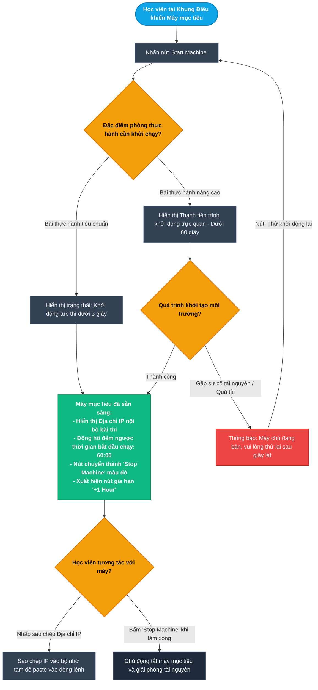
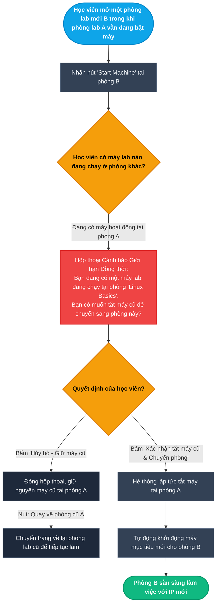
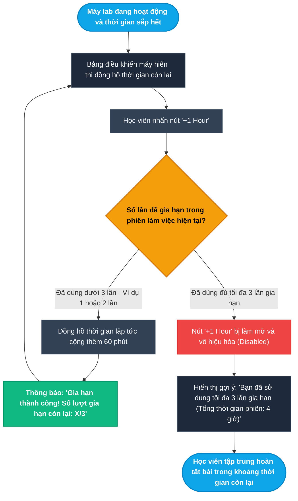
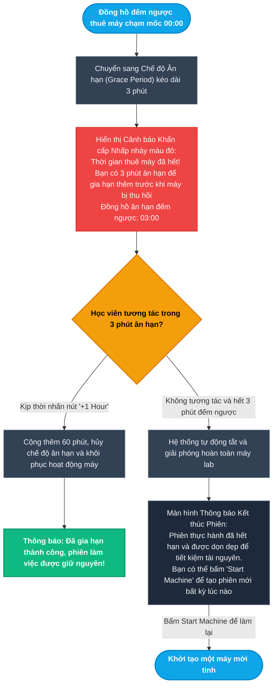
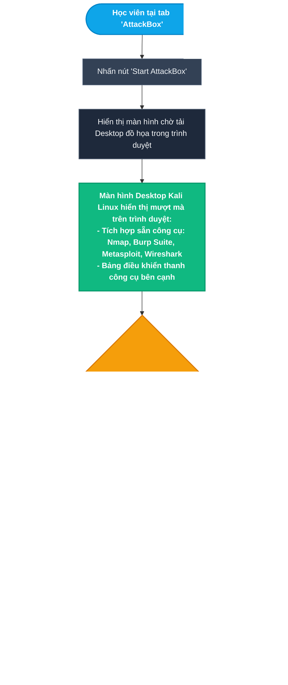
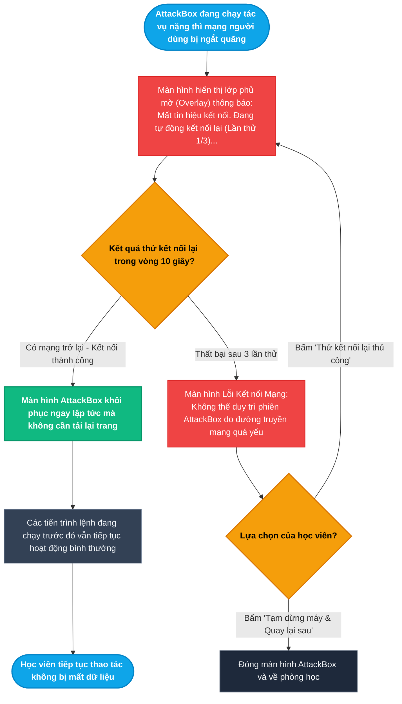
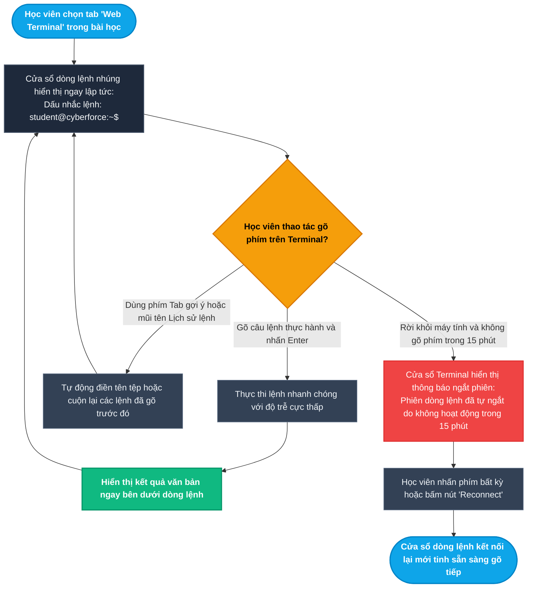
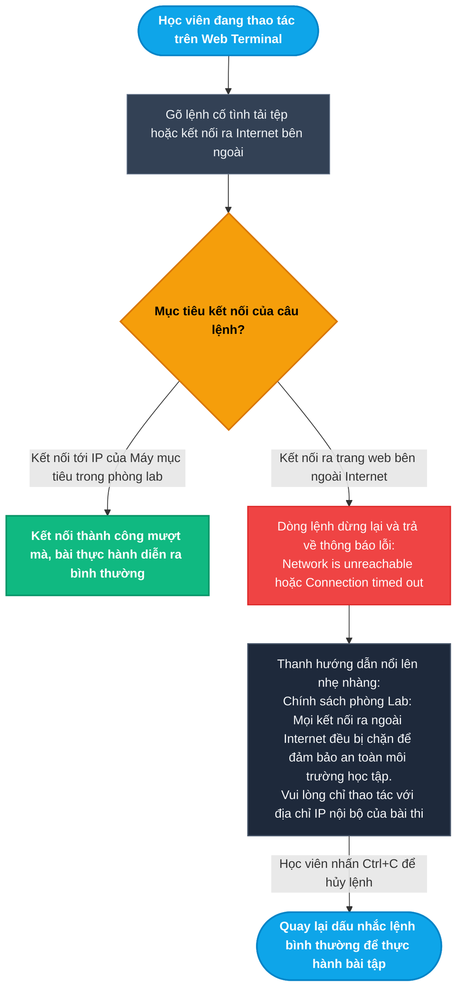

# Epic 3: Zero-Setup Cloud Lab & In-Browser Practice
## Tài liệu Thiết kế Kiến trúc User Flow Chi tiết (Modular UX Architecture & State Transitions)

* **Hệ thống:** CyberForce Cyber Range & Practical Security Platform
* **Tài liệu tham chiếu:** [EPIC_03_ZERO_SETUP_CLOUD_LAB.md](file:///home/quocbao/Documents/University/ChuyenDe4/CyberForge/docs/05-epics/EPIC_03_ZERO_SETUP_CLOUD_LAB.md)
* **Vai trò phụ trách:** Product Designer (UX Architect)
* **Phiên bản:** 1.0 (Strict Separation: User Journey Focus)

---

## 📑 MỤC LỤC TỔNG QUAN CÁC TIỂU LUỒNG (USER FLOWS)

Toàn bộ trải nghiệm người dùng với hạ tầng phòng lab đám mây được chia thành **8 tiểu luồng chi tiết, trực quan và không có điểm nghẽn**:

- **MODULE 1: KHỞI CHẠY MÁY MỤC TIÊU & KIỂM SOÁT ĐỒNG THỜI (TARGET MACHINE & CONCURRENCY)**
  - [Sub-flow 1.1: Khởi chạy Máy mục tiêu 1-Click (US-03.01)](#sub-flow-11-khởi-chạy-máy-mục-tiêu-1-click-us-0301)
  - [Sub-flow 1.2: Xử lý Xung đột Giới hạn Đồng thời khi Đổi Phòng Lab (US-03.01)](#sub-flow-12-xử-lý-xung-đột-giới-hạn-đồng-thời-khi-đổi-phòng-lab-us-0301)
- **MODULE 2: QUẢN LÝ THỜI HẠN THUÊ MÁY & DỌN DẸP TỰ ĐỘNG (LEASE MANAGEMENT & AUTO-REAP)**
  - [Sub-flow 2.1: Chủ động Gia hạn Thời gian Làm bài (+1 Hour) (US-03.02)](#sub-flow-21-chủ-động-gia-hạn-thời-gian-làm-bài-1-hour-us-0302)
  - [Sub-flow 2.2: Trải nghiệm Thời gian Ân hạn 3 Phút & Tự động Thu hồi (US-03.02)](#sub-flow-22-trải-nghiệm-thời-gian-ân-hạn-3-phút--tự-động-thu-hồi-us-0302)
- **MODULE 3: MÁY TRẠM ATTACKBOX TRÊN TRÌNH DUYỆT (IN-BROWSER ATTACKBOX WORKSPACE)**
  - [Sub-flow 3.1: Khởi chạy AttackBox & Tương tác Clipboard Hai Chiều (US-03.03)](#sub-flow-31-khởi-chạy-attackbox--tương-tác-clipboard-hai-chiều-us-0303)
  - [Sub-flow 3.2: Tự động Khôi phục Kết nối AttackBox khi Mạng Chập chờn (US-03.03)](#sub-flow-32-tự-động-khôi-phục-kết-nối-attackbox-khi-mạng-chập-chờn-us-0303)
- **MODULE 4: CỬA SỔ DÒNG LỆNH WEB TERMINAL SIÊU NHẸ (IN-BROWSER WEB TERMINAL)**
  - [Sub-flow 4.1: Tương tác Thực hành Lệnh & Tự ngắt Phiên khi Không hoạt động (US-03.04)](#sub-flow-41-tương-tác-thực-hành-lệnh--tự-ngắt-phiên-khi-không-hoạt-động-us-0304)
  - [Sub-flow 4.2: Phản hồi Trải nghiệm khi Gõ Lệnh Kết nối ra Internet (US-03.04)](#sub-flow-42-phản-hồi-trải-nghiệm-khi-gõ-lệnh-kết-nối-ra-internet-us-0304)

---

## I. NGUYÊN TẮC THIẾT KẾ TRẢI NGHIỆM (USER EXPERIENCE PRINCIPLES)

1. **Góc nhìn thuần túy Người dùng (User-First Focus):**
   - Tập trung hoàn toàn vào: Người dùng thao tác gì? Nhìn thấy gì trên bảng điều khiển máy ảo? Đưa ra quyết định nào khi gặp cảnh báo? Trải nghiệm cảm giác mượt mà khi gõ phím và tương tác chuột.
   - Loại bỏ 100% các chi tiết hạ tầng ngầm: *Lệnh Docker CLI, tiến trình daemon, cấu hình RFC 6598 NAT, kết nối WebSocket thô, thông số cgroups kernel*.
2. **Nguyên tắc "No Dead End" (Không màn hình bế tắc):**
   - Khi máy lab hết giờ, mất kết nối hoặc đạt giới hạn số lượng, giao diện luôn cung cấp nút bấm hành động tiếp theo: *Khởi động lại, Gia hạn thêm, Hủy máy cũ để chuyển phòng, hoặc Quay về bài học*.
3. **Bảo vệ Trạng thái Công việc (State Preservation):**
   - Kết nối mạng gián đoạn ngắn không được làm mất tiến trình đang quét cổng hay văn bản đang soạn thảo trên máy trạm.

---

## II. CHI TIẾT CÁC TIỂU LUỒNG USER FLOW (MERMAID FLOWCHARTS & MATRICES)

---

### Sub-flow 1.1: Khởi chạy Máy mục tiêu 1-Click (US-03.01)

Mô tả thao tác kích hoạt máy mục tiêu thực hành, phản hồi trạng thái chờ và hiển thị thông tin máy sẵn sàng.

#### Sơ đồ Flowchart (Mermaid)

#### Bảng State Transition Matrix (Sub-flow 1.1)

| Bước | Màn hình / Trạng thái | Hành động người dùng | Điều kiện kiểm tra | Màn hình tiếp theo | Cơ chế thoát hiểm (No Dead End) |
| :--- | :--- | :--- | :--- | :--- | :--- |
| **1.1.1** | Khung Máy mục tiêu | Nhấn nút "Start Machine" | Chưa có máy nào đang hoạt động | Hiển thị trạng thái khởi động | Có nút hủy nếu đổi ý |
| **1.1.2** | Trạng thái khởi động | Chờ cấp phát máy | Bài thực hành tiêu chuẩn | Màn hình máy sẵn sàng sau 2-3 giây | Tự động cập nhật không cần reload trang |
| **1.1.3** | Trạng thái khởi động | Chờ cấp phát máy | Bài thực hành nâng cao | Thanh tiến trình đếm % hoàn tất | Có thông báo thời gian ước tính rõ ràng |
| **1.1.4** | Trạng thái khởi động | Quá tải tài nguyên máy chủ | Hết slot tạm thời | Thông báo "Hệ thống đang bận" | Nút "Thử khởi động lại" để bấm lại ngay |
| **1.1.5** | Máy mục tiêu đang hoạt động | Nhấp vào địa chỉ IP | Máy đang chạy bình thường | Sao chép IP vào clipboard kèm thông báo nhanh | Tiếp tục làm bài thuận tiện |
| **1.1.6** | Máy mục tiêu đang hoạt động | Nhấn nút "Stop Machine" | Đã làm xong bài tập | Hộp thoại xác nhận tắt máy | Nút "Xác nhận tắt" hoặc "Hủy giữ máy lại" |

---

### Sub-flow 1.2: Xử lý Xung đột Giới hạn Đồng thời khi Đổi Phòng Lab (US-03.01)

Kiểm soát quy tắc mỗi tài khoản chỉ chạy tối đa 01 máy mục tiêu tại một thời điểm, cung cấp lựa chọn hủy máy cũ để chuyển phòng nhanh chóng.

#### Sơ đồ Flowchart (Mermaid)

#### Bảng State Transition Matrix (Sub-flow 1.2)

| Bước | Màn hình / Trạng thái | Hành động người dùng | Điều kiện kiểm tra | Màn hình tiếp theo | Cơ chế thoát hiểm (No Dead End) |
| :--- | :--- | :--- | :--- | :--- | :--- |
| **1.2.1** | Phòng lab mới | Bấm "Start Machine" | Vẫn còn máy cũ đang chạy ở phòng khác | Hộp thoại thông báo xung đột kèm tên phòng lab cũ | Người dùng biết rõ máy cũ đang ở bài học nào |
| **1.2.2** | Hộp thoại xung đột máy | Bấm "Hủy bỏ" | Muốn giữ lại bài làm ở phòng cũ | Đóng hộp thoại, không bật máy mới | Có nút "Đi đến phòng cũ" để quay lại ngay |
| **1.2.3** | Hộp thoại xung đột máy | Bấm "Xác nhận tắt máy cũ & Chuyển phòng" | Đồng ý dừng phòng cũ | Tắt máy cũ và kích hoạt khởi động máy mới | Tự động chuyển đổi mượt mà không cần tự quay lại phòng cũ để tắt |
| **1.2.4** | Phòng lab mới | Đợi khởi tạo hoàn tất | Máy mới sẵn sàng | Hiển thị bảng điều khiển máy mới của phòng hiện tại | Học viên bắt đầu bài học mới ngay lập tức |

---

### Sub-flow 2.1: Chủ động Gia hạn Thời gian Làm bài (+1 Hour) (US-03.02)

Học viên chủ động kéo dài thời gian thuê máy khi bài tập chưa giải xong, tối đa 3 lần gia hạn cho một phiên liên tục.

#### Sơ đồ Flowchart (Mermaid)

#### Bảng State Transition Matrix (Sub-flow 2.1)

| Bước | Màn hình / Trạng thái | Hành động người dùng | Điều kiện kiểm tra | Màn hình tiếp theo | Cơ chế thoát hiểm (No Dead End) |
| :--- | :--- | :--- | :--- | :--- | :--- |
| **2.1.1** | Bảng điều khiển máy | Bấm nút "+1 Hour" | Đã gia hạn ít hơn 3 lần | Đồng hồ đếm ngược nhảy tăng thêm 60 phút | Hiển thị rõ số lượt gia hạn còn lại (ví dụ 1/3) |
| **2.1.2** | Bảng điều khiển máy | Bấm nút "+1 Hour" | Đã dùng đủ 3 lần gia hạn | Nút bấm bị khóa và hiển thị thông báo đã đạt mốc tối đa | Người học biết trước để hoàn thiện bài hoặc chuẩn bị lưu kết quả |
| **2.1.3** | Bảng điều khiển máy | Tiếp tục thực hành | Phiên vẫn còn thời gian | Mọi tác vụ trên máy vẫn diễn ra liên tục | Không bị gián đoạn hay ngắt kết nối mạng |

---

### Sub-flow 2.2: Trải nghiệm Thời gian Ân hạn 3 Phút & Tự động Thu hồi (US-03.02)

Xử lý trải nghiệm khi đồng hồ về `00:00`, kích hoạt thời gian ân hạn 3 phút kèm cảnh báo nổi bật để học viên kịp cứu vãn phiên làm việc trước khi bị dọn dẹp.

#### Sơ đồ Flowchart (Mermaid)

#### Bảng State Transition Matrix (Sub-flow 2.2)

| Bước | Màn hình / Trạng thái | Hành động người dùng | Điều kiện kiểm tra | Màn hình tiếp theo | Cơ chế thoát hiểm (No Dead End) |
| :--- | :--- | :--- | :--- | :--- | :--- |
| **2.2.1** | Bảng điều khiển máy | Đồng hồ đếm giờ về `00:00` | Phiên hết thời gian chính thức | Kích hoạt màn hình ân hạn nhấp nháy đỏ với bộ đếm `03:00` | Có âm thanh cảnh báo nhẹ để nhắc học viên |
| **2.2.2** | Màn hình ân hạn 3 phút | Bấm nút "+1 Hour" trước khi hết giờ | Vẫn còn lượt gia hạn khả dụng | Thoát khỏi trạng thái ân hạn, trở về trạng thái máy chạy bình thường | Tiến trình đang làm dở trên máy được giữ nguyên |
| **2.2.3** | Màn hình ân hạn 3 phút | Đồng hồ ân hạn chạy hết về `00:00` | Học viên không có thao tác gia hạn | Màn hình thông báo máy đã được dọn dẹp | Nút "Start Machine" xuất hiện trở lại |
| **2.2.4** | Màn hình kết thúc phiên | Nhấn "Start Machine" mới | Muốn tiếp tục học bài này | Khởi tạo lại một máy mới ban đầu | Người học bắt đầu lại mà không bị lỗi giao diện |

---

### Sub-flow 3.1: Khởi chạy AttackBox & Tương tác Clipboard Hai Chiều (US-03.03)

Học viên sử dụng máy trạm tấn công chuyên dụng (Kali Linux) chạy trực tiếp trên tab trình duyệt và trao đổi văn bản/câu lệnh qua khay nhớ tạm hai chiều.

#### Sơ đồ Flowchart (Mermaid)

#### Bảng State Transition Matrix (Sub-flow 3.1)

| Bước | Màn hình / Trạng thái | Hành động người dùng | Điều kiện kiểm tra | Màn hình tiếp theo | Cơ chế thoát hiểm (No Dead End) |
| :--- | :--- | :--- | :--- | :--- | :--- |
| **3.1.1** | Tab AttackBox | Bấm "Start AttackBox" | Chưa có máy trạm nào đang bật | Màn hình chờ kết nối đồ họa | Có thanh tiến trình rõ ràng |
| **3.1.2** | Màn hình AttackBox | Desktop Kali Linux đã tải xong | Đường truyền mạng ổn định | Màn hình làm việc đồ họa đầy đủ menu ứng dụng | Có nút thu phóng toàn màn hình (Fullscreen) |
| **3.1.3** | Desktop AttackBox | Nhấn mở Terminal và gõ lệnh | Thao tác bằng bàn phím | Lệnh phản hồi nhanh nhạy không bị trễ | Có thanh công cụ hỗ trợ các phím đặc biệt (Ctrl, Alt, Tab) |
| **3.1.4** | Giáo trình ngoài máy thật | Copy chuỗi lệnh mẫu và dán vào AttackBox | Khay nhớ tạm hai chiều đang mở | Dòng lệnh xuất hiện đầy đủ trong terminal ảo | Không cần phải gõ lại từng ký tự thủ công |
| **3.1.5** | Desktop AttackBox | Copy cờ và dán ra ô nộp bài | Chuỗi ký tự cờ chuẩn xác | Cờ được điền vào ô nộp bài ngoài giao diện chính | Nút Submit kích hoạt sẵn sàng chấm điểm |

---

### Sub-flow 3.2: Tự động Khôi phục Kết nối AttackBox khi Mạng Chập chờn (US-03.03)

Bảo đảm tính liên tục của bài thực hành, tự động thử kết nối lại khi mạng gián đoạn ngắn mà không làm mất tiến trình đang chạy trên máy ảo.

#### Sơ đồ Flowchart (Mermaid)

#### Bảng State Transition Matrix (Sub-flow 3.2)

| Bước | Màn hình / Trạng thái | Hành động người dùng | Điều kiện kiểm tra | Màn hình tiếp theo | Cơ chế thoát hiểm (No Dead End) |
| :--- | :--- | :--- | :--- | :--- | :--- |
| **3.2.1** | Màn hình AttackBox | Đang chạy quét mạng thì bị mất tín hiệu Internet | Mất mạng trong khoảng dưới 10 giây | Hiển thị lớp phủ thông báo "Đang kết nối lại..." | Tiến trình quét trên máy ảo ngầm vẫn tiếp tục chạy |
| **3.2.2** | Lớp phủ kết nối lại | Chờ đợi hệ thống tự xử lý | Mạng phục hồi trở lại | Lớp phủ biến mất, màn hình desktop hiện lại ngay | Không phải reload toàn bộ website |
| **3.2.3** | Lớp phủ kết nối lại | Mạng bị mất liên tục quá lâu | Thất bại cả 3 lần tự thử lại | Màn hình thông báo mất kết nối kèm giải thích | Nút "Thử lại thủ công" và nút "Quay về phòng học" |
| **3.2.4** | Màn hình mất kết nối | Bấm "Thử lại thủ công" | Mạng người dùng đã bật lại | Thử kết nối lại với phiên máy trạm cũ | Phiên máy trạm vẫn được giữ lại chưa bị tắt |

---

### Sub-flow 4.1: Tương tác Thực hành Lệnh & Tự ngắt Phiên khi Không hoạt động (US-03.04)

Sử dụng cửa sổ dòng lệnh nhúng nhẹ nhàng trên trình duyệt cho các bài học căn bản, tự động ngắt kết nối an toàn nếu học viên bỏ quên máy quá 15 phút.

#### Sơ đồ Flowchart (Mermaid)

#### Bảng State Transition Matrix (Sub-flow 4.1)

| Bước | Màn hình / Trạng thái | Hành động người dùng | Điều kiện kiểm tra | Màn hình tiếp theo | Cơ chế thoát hiểm (No Dead End) |
| :--- | :--- | :--- | :--- | :--- | :--- |
| **4.1.1** | Tab Web Terminal | Nhấp mở tab Terminal | Mở tab bài học dòng lệnh | Cửa sổ dòng lệnh màu đen hiển thị prompt `student@cyberforce:~$ ` | Tải cực nhanh, tiết kiệm băng thông |
| **4.1.2** | Cửa sổ dòng lệnh | Gõ lệnh Linux cơ bản và bấm Enter | Lệnh hợp lệ trong hệ thống | Kết quả hiển thị tức thì dưới dòng lệnh | Hỗ trợ đầy đủ phím mũi tên lên/xuống xem lịch sử |
| **4.1.3** | Cửa sổ dòng lệnh | Bấm phím Tab khi đang gõ dở tên file | Có tên file phù hợp trong thư mục | Tự động hoàn thành tên file (Auto-complete) | Trải nghiệm giống hệt terminal thực tế |
| **4.1.4** | Cửa sổ dòng lệnh | Để nguyên màn hình không gõ phím suốt 15 phút | Không phát sinh thao tác phím | Dòng chữ thông báo phiên tạm ngắt kết nối do không hoạt động | Nút "Reconnect" hoặc bấm phím bất kỳ để mở lại |
| **4.1.5** | Màn hình ngắt do bỏ quên | Bấm nút "Reconnect" | Muốn học tiếp bài | Terminal kết nối lại phiên làm việc mới | Người học tiếp tục thao tác bình thường |

---

### Sub-flow 4.2: Phản hồi Trải nghiệm khi Gõ Lệnh Kết nối ra Internet (US-03.04)

Bảo đảm an toàn môi trường thực hành thông qua chính sách cách ly không cho phép kết nối ra Internet ngoài (Zero Egress), phản hồi lỗi thân thiện giúp học viên hiểu rõ phạm vi bài lab.

#### Sơ đồ Flowchart (Mermaid)

#### Bảng State Transition Matrix (Sub-flow 4.2)

| Bước | Màn hình / Trạng thái | Hành động người dùng | Điều kiện kiểm tra | Màn hình tiếp theo | Cơ chế thoát hiểm (No Dead End) |
| :--- | :--- | :--- | :--- | :--- | :--- |
| **4.2.1** | Cửa sổ Web Terminal | Gõ lệnh kết nối đến IP máy mục tiêu trong bài | Địa chỉ IP nội bộ được cấp phép | Lệnh kết nối thành công, nhận phản hồi bình thường | Học viên tiến hành quét hoặc khai thác đúng mục tiêu |
| **4.2.2** | Cửa sổ Web Terminal | Gõ lệnh tải dữ liệu từ web ngoài Internet | Kết nối hướng ra ngoài mạng internet công cộng | Dòng lệnh trả về lỗi "Network is unreachable" | Có thanh gợi ý giải thích chính sách phòng Lab |
| **4.2.3** | Cửa sổ có lệnh bị chặn | Nhấn tổ hợp phím `Ctrl + C` | Hủy tiến trình kết nối đang bị treo | Trở lại dấu nhắc lệnh `student@cyberforce:~$ ` | Không làm đơ cửa sổ terminal, tiếp tục gõ lệnh khác |

