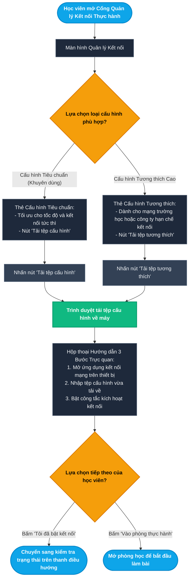
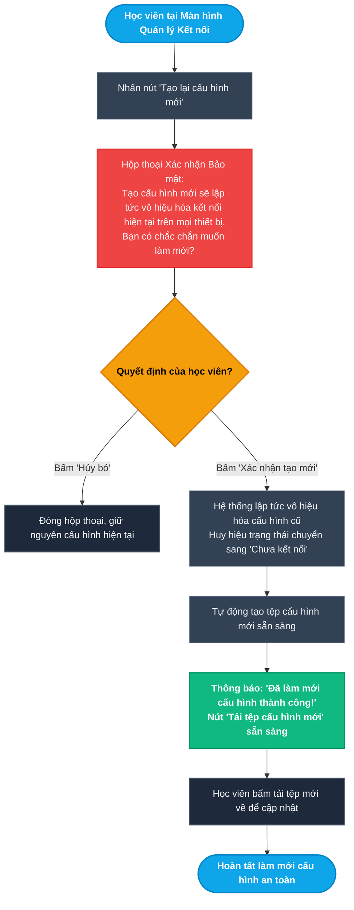
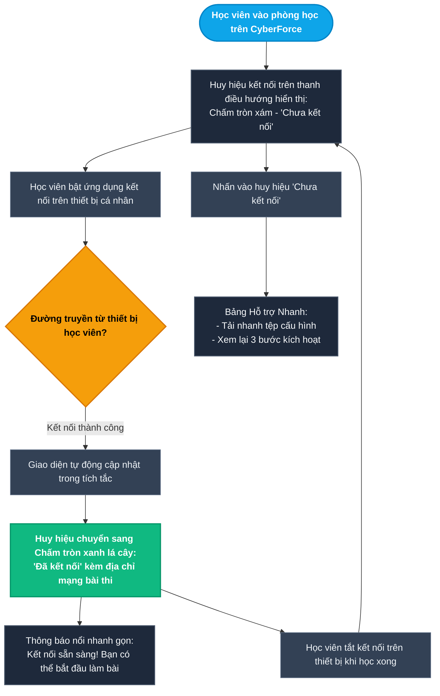
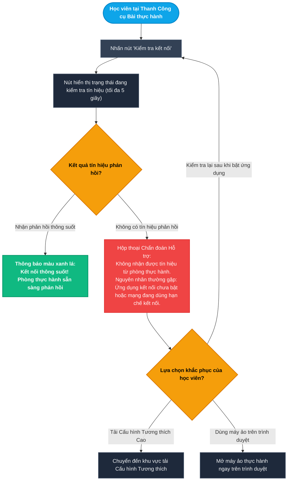
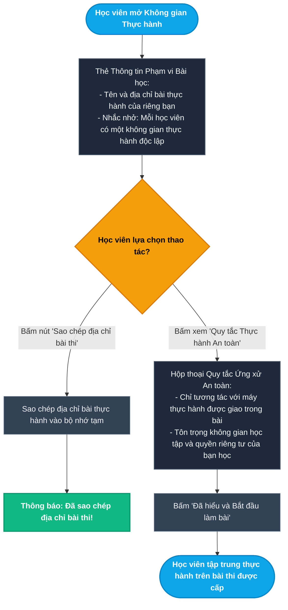
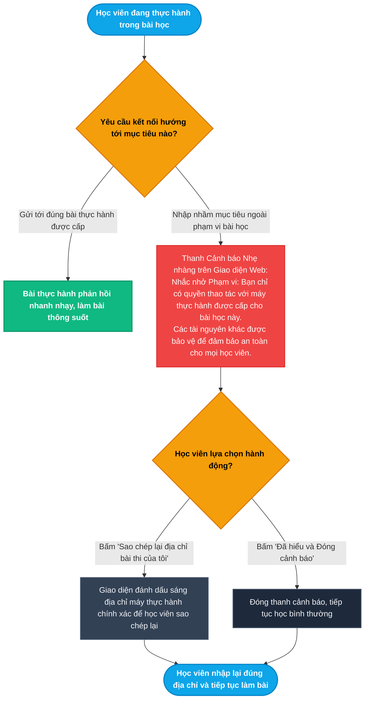

# Epic 4: Secure VPN Access Gateway
## Tài liệu Thiết kế Kiến trúc User Flow Chi tiết (User Journey & Experience Flows)

* **Hệ thống:** CyberForce Cyber Range & Practical Security Platform
* **Tài liệu tham chiếu:** [EPIC_04_SECURE_VPN_ACCESS_GATEWAY.md](file:///home/quocbao/Documents/University/ChuyenDe4/CyberForge/docs/05-epics/EPIC_04_SECURE_VPN_ACCESS_GATEWAY.md)
* **Vai trò phụ trách:** Product Designer (UX Architect)
* **Phiên bản:** 3.0 (Pure User Journey: Zero Technical / Implementation Details)

---

## 📑 MỤC LỤC TỔNG QUAN CÁC TIỂU LUỒNG (USER FLOWS)

Toàn bộ trải nghiệm người dùng khi kết nối mạng riêng để thực hành bài lab được thiết kế xoay quanh hành vi, cảm nhận và tương tác trực quan trên giao diện CyberForce:

- **MODULE 1: TẢI CẤU HÌNH & QUẢN LÝ KẾT NỐI (VPN SETUP & PROFILE MANAGEMENT)**
  - [Sub-flow 1.1: Tải Tệp Cấu hình Kết nối Cá nhân hóa & Xem Hướng dẫn Thiết lập (US-04.01)](#sub-flow-11-tải-tệp-cấu-hình-kết-nối-cá-nhân-hóa--xem-hướng-dẫn-thiết-lập-us-0401)
  - [Sub-flow 1.2: Khởi tạo lại Cấu hình Khi Nghi ngờ Lộ thông tin (US-04.01)](#sub-flow-12-khởi-tạo-lại-cấu-hình-khi-nghi-ngờ-lộ-thông-tin-us-0401)
- **MODULE 2: GIÁM SÁT TRẠNG THÁI & CHẨN ĐOÁN KẾT NỐI (LIVE STATUS & DIAGNOSTICS)**
  - [Sub-flow 2.1: Theo dõi Huy hiệu Trạng thái Kết nối Trực tiếp trên Thanh Điều hướng (US-04.02)](#sub-flow-21-theo-dõi-huy-hiệu-trạng-thái-kết-nối-trực-tiếp-trên-thanh-điều-hướng-us-0402)
  - [Sub-flow 2.2: Chẩn đoán Đường truyền với Tiện ích "Kiểm tra Kết nối" (US-04.02)](#sub-flow-22-chẩn-đoán-đường-truyền-với-tiện-ích-kiểm-tra-kết-nối-us-0402)
- **MODULE 3: AN TOÀN MÔI TRƯỜNG THỰC HÀNH & CẢNH BÁO PHẠM VI (SAFETY GUIDELINES & SCOPE ALERTS)**
  - [Sub-flow 3.1: Tiếp nhận Thông tin Phạm vi & Quy tắc Thực hành An toàn (US-04.03)](#sub-flow-31-tiếp-nhận-thông-tin-phạm-vi--quy-tắc-thực-hành-an-toàn-us-0403)
  - [Sub-flow 3.2: Phản hồi Giao diện khi Phát hiện Yêu cầu Ngoài Phạm vi Bài học (US-04.03)](#sub-flow-32-phản-hồi-giao-diện-khi-phát-hiện-yêu-cầu-ngoài-phạm-vi-bài-học-us-0403)

---

## I. NGUYÊN TẮC THIẾT KẾ TRẢI NGHIỆM (USER EXPERIENCE PRINCIPLES)

1. **Góc nhìn thuần túy Người dùng (User-First Perspective):**
   - Tập trung hoàn toàn vào hành trình trải nghiệm của học viên trên sản phẩm CyberForce: Học viên tương tác với màn hình nào? Nhìn thấy hướng dẫn gì? Ra quyết định như thế nào khi gặp trục trặc đường truyền?
   - Loại bỏ hoàn toàn các yếu tố triển khai kỹ thuật ngầm (câu lệnh dòng lệnh máy tính, giao thức truyền tải, thuật toán mã hóa, cấu hình cổng mạng hoặc tường lửa hạ tầng).
2. **Cơ chế "No Dead End" (Không màn hình bế tắc):**
   - Mọi tình huống đường truyền chưa sẵn sàng, tải tệp bị gián đoạn hay kiểm tra kết nối thất bại đều cung cấp lối thoát rõ ràng: *Tải lại, Đổi phương thức tương thích, Xem hướng dẫn khắc phục, hoặc Chuyển sang dùng máy ảo trên trình duyệt*.
3. **Phản hồi Trạng thái Trực quan & Tức thì:**
   - Trạng thái kết nối của học viên luôn được hiển thị minh bạch trên thanh điều hướng, giúp người học an tâm nhận biết thiết bị của mình đã sẵn sàng trước khi bắt đầu giải bài tập.

---

## II. CHI TIẾT CÁC TIỂU LUỒNG USER FLOW (MERMAID FLOWCHARTS & MATRICES)

---

### Sub-flow 1.1: Tải Tệp Cấu hình Kết nối Cá nhân hóa & Xem Hướng dẫn Thiết lập (US-04.01)

Học viên nhận tệp cấu hình kết nối đã tích hợp sẵn thông tin tài khoản và xem hướng dẫn từng bước trực quan để dễ dàng kích hoạt trên thiết bị của mình.

#### Sơ đồ Flowchart (Mermaid)

#### Bảng State Transition Matrix (Sub-flow 1.1)

| Bước | Màn hình / Trạng thái | Hành động người dùng | Điều kiện kiểm tra | Màn hình tiếp theo | Cơ chế thoát hiểm (No Dead End) |
| :--- | :--- | :--- | :--- | :--- | :--- |
| **1.1.1** | Thanh menu / Phòng học | Nhấn vào biểu tượng Mạng kết nối | Đã đăng nhập tài khoản học viên | Màn hình Quản lý Kết nối | Nút "Trở về Dashboard" |
| **1.1.2** | Màn hình Quản lý Kết nối | Chọn loại Cấu hình Tiêu chuẩn | Kết nối thông thường tại nhà | Thẻ tải Cấu hình Tiêu chuẩn | Có tùy chọn Cấu hình Tương thích ngay bên cạnh |
| **1.1.3** | Thẻ cấu hình | Nhấn nút "Tải tệp cấu hình" | Đã chọn loại cấu hình | Trình duyệt tải tệp về máy tính | Có nút "Tải lại" nếu trình duyệt chặn tải |
| **1.1.4** | Màn hình Quản lý Kết nối | Chọn Cấu hình Tương thích Cao | Mạng trường học hoặc cơ quan bị hạn chế | Thẻ tải Cấu hình Tương thích | Đảm bảo người học luôn có giải pháp kết nối dự phòng |
| **1.1.5** | Hộp thoại Hướng dẫn | Đọc 3 bước thao tác | Đã tải xong tệp cấu hình | Minh họa trực quan 3 bước thao tác | Nút "Tôi đã bật kết nối" và nút "Vào phòng thực hành" |

---

### Sub-flow 1.2: Khởi tạo lại Cấu hình Khi Nghi ngờ Lộ thông tin (US-04.01)

Cho phép học viên chủ động bảo vệ tài khoản khi nghi ngờ tệp cấu hình bị người khác sử dụng, lập tức vô hiệu hóa kết nối cũ và tạo cấu hình hoàn toàn mới.

#### Sơ đồ Flowchart (Mermaid)

#### Bảng State Transition Matrix (Sub-flow 1.2)

| Bước | Màn hình / Trạng thái | Hành động người dùng | Điều kiện kiểm tra | Màn hình tiếp theo | Cơ chế thoát hiểm (No Dead End) |
| :--- | :--- | :--- | :--- | :--- | :--- |
| **1.2.1** | Màn hình Quản lý Kết nối | Nhấn nút "Tạo lại cấu hình mới" | Nghi ngờ lộ tệp cấu hình hoặc muốn đổi mới | Hộp thoại cảnh báo bảo mật | Nút "Hủy bỏ" nổi bật để tránh bấm nhầm |
| **1.2.2** | Hộp thoại cảnh báo | Nhấn nút "Hủy bỏ" | Người dùng muốn giữ cấu hình đang dùng | Đóng hộp thoại, giữ nguyên kết nối hiện tại | Tiếp tục sử dụng kết nối cũ bình thường |
| **1.2.3** | Hộp thoại cảnh báo | Nhấn nút "Xác nhận tạo mới" | Đồng ý làm mới bảo mật | Vô hiệu hóa cấu hình cũ, huy hiệu chuyển sang "Chưa kết nối" | Tránh việc tài khoản bị sử dụng trái phép |
| **1.2.4** | Màn hình Cấu hình mới | Nhấn "Tải tệp cấu hình mới" | Cấu hình mới đã sẵn sàng | Trình duyệt tải tệp cấu hình thay thế về máy | Có hướng dẫn cập nhật tệp mới trên ứng dụng |

---

### Sub-flow 2.1: Theo dõi Huy hiệu Trạng thái Kết nối Trực tiếp trên Thanh Điều hướng (US-04.02)

Huy hiệu trạng thái trên thanh điều hướng và giao diện bài học tự động cập nhật màu sắc và thông tin tức thì khi học viên bật hoặc tắt kết nối.

#### Sơ đồ Flowchart (Mermaid)

#### Bảng State Transition Matrix (Sub-flow 2.1)

| Bước | Màn hình / Trạng thái | Hành động người dùng | Điều kiện kiểm tra | Màn hình tiếp theo | Cơ chế thoát hiểm (No Dead End) |
| :--- | :--- | :--- | :--- | :--- | :--- |
| **2.1.1** | Thanh điều hướng | Mở bài học khi chưa kết nối | Chưa bật kết nối mạng thực hành | Huy hiệu hiển thị chấm xám "Chưa kết nối" | Nhấn vào huy hiệu để mở bảng hướng dẫn nhanh |
| **2.1.2** | Thiết bị cá nhân | Bật công tắc kết nối trên máy | Đã nhập tệp cấu hình | Thiết bị hoàn tất kích hoạt kết nối | Không cần thao tác thủ công gì trên trang web |
| **2.1.3** | Thanh điều hướng | Quan sát giao diện web | Kết nối được ghi nhận thành công | Huy hiệu tự đổi sang màu xanh lá "Đã kết nối" | Tự động chuyển trạng thái, không cần tải lại trang |
| **2.1.4** | Giao diện bài học | Nhận thông báo nổi | Vừa kết nối thành công | Thông báo chúc mừng sẵn sàng làm bài | Tự động biến mất sau 3 giây |
| **2.1.5** | Thanh điều hướng | Nhấn vào huy hiệu khi chưa kết nối | Cần tải cấu hình hoặc xem hướng dẫn | Bảng trượt hỗ trợ kết nối nhanh | Có nút tải tệp và xem hướng dẫn chi tiết |

---

### Sub-flow 2.2: Chẩn đoán Đường truyền với Tiện ích "Kiểm tra Kết nối" (US-04.02)

Công cụ 1-click giúp học viên xác nhận tín hiệu tới phòng thực hành đã thông suốt, chủ động phát hiện sự cố và hướng dẫn giải pháp khắc phục.

#### Sơ đồ Flowchart (Mermaid)

#### Bảng State Transition Matrix (Sub-flow 2.2)

| Bước | Màn hình / Trạng thái | Hành động người dùng | Điều kiện kiểm tra | Màn hình tiếp theo | Cơ chế thoát hiểm (No Dead End) |
| :--- | :--- | :--- | :--- | :--- | :--- |
| **2.2.1** | Thanh công cụ bài học | Nhấn nút "Kiểm tra kết nối" | Đã bật kết nối trên máy cá nhân | Nút hiển thị vòng xoay đang kiểm tra tín hiệu | Thời gian chờ tối đa 5 giây, không làm đơ giao diện |
| **2.2.2** | Trạng thái kiểm tra | Tín hiệu phản hồi bình thường | Đường truyền thông suốt | Thông báo màu xanh "Kết nối thông suốt" | Người học an tâm bắt đầu thực hành |
| **2.2.3** | Trạng thái kiểm tra | Không có tín hiệu phản hồi | Chưa bật kết nối hoặc mạng bị chặn | Hộp thoại chẩn đoán hỗ trợ với các giải pháp cụ thể | Có nút chuyển phương thức và hướng dẫn xử lý |
| **2.2.4** | Hộp thoại chẩn đoán | Chọn "Tải Cấu hình Tương thích" | Muốn đổi phương thức vượt mạng chặn | Chuyển đến phần tải Cấu hình Tương thích | Giải quyết vấn đề mà không cần gửi yêu cầu hỗ trợ |
| **2.2.5** | Hộp thoại chẩn đoán | Chọn "Dùng máy ảo trên trình duyệt" | Không muốn cài đặt cấu hình trên máy | Khởi chạy máy ảo trực tiếp trên trình duyệt | Giải pháp thay thế hoàn hảo để tiếp tục học ngay |

---

### Sub-flow 3.1: Tiếp nhận Thông tin Phạm vi & Quy tắc Thực hành An toàn (US-04.03)

Học viên nắm rõ thông tin mục tiêu được giao trong bài học và các quy tắc thực hành văn minh, bảo vệ không gian học tập chung.

#### Sơ đồ Flowchart (Mermaid)

#### Bảng State Transition Matrix (Sub-flow 3.1)

| Bước | Màn hình / Trạng thái | Hành động người dùng | Điều kiện kiểm tra | Màn hình tiếp theo | Cơ chế thoát hiểm (No Dead End) |
| :--- | :--- | :--- | :--- | :--- | :--- |
| **3.1.1** | Giao diện phòng học | Mở phòng học được giao | Bài thực hành đã sẵn sàng | Thẻ Thông tin Phạm vi hiển thị rõ mục tiêu | Có nút sao chép địa chỉ bài thi 1-click |
| **3.1.2** | Thẻ phạm vi bài học | Bấm nút "Sao chép địa chỉ bài thi" | Mục tiêu đã được cấp phát | Địa chỉ được lưu vào clipboard kèm thông báo | Giúp học viên nhập nhanh địa chỉ chính xác |
| **3.1.3** | Thẻ phạm vi bài học | Bấm liên kết "Quy tắc Thực hành An toàn" | Muốn tìm hiểu nội quy học tập | Hộp thoại giải thích quy tắc ứng xử an toàn | Nút đóng hoặc nút "Đã hiểu" để tiếp tục |
| **3.1.4** | Hộp thoại quy tắc | Nhấn "Đã hiểu và Bắt đầu làm bài" | Đã đọc thông tin quy tắc | Đóng hộp thoại, trở lại màn hình làm bài | Giúp học viên tự tin thực hành đúng phạm vi |

---

### Sub-flow 3.2: Phản hồi Giao diện khi Phát hiện Yêu cầu Ngoài Phạm vi Bài học (US-04.03)

Hệ thống bảo vệ không gian chung, tự động nhắc nhở thân thiện trên giao diện web khi phát hiện thao tác kết nối chưa đúng mục tiêu được giao.

#### Sơ đồ Flowchart (Mermaid)

#### Bảng State Transition Matrix (Sub-flow 3.2)

| Bước | Màn hình / Trạng thái | Hành động người dùng | Điều kiện kiểm tra | Màn hình tiếp theo | Cơ chế thoát hiểm (No Dead End) |
| :--- | :--- | :--- | :--- | :--- | :--- |
| **3.2.1** | Giao diện bài học | Kết nối đúng bài thực hành được giao | Địa chỉ trùng khớp bài học | Bài thực hành phản hồi nhanh và chính xác | Học viên tiếp tục giải bài tập |
| **3.2.2** | Giao diện bài học | Vô tình nhập nhầm địa chỉ ngoài phạm vi | Yêu cầu đi ra ngoài bài thi được giao | Xuất hiện thanh nhắc nhở phạm vi nhẹ nhàng | Giúp học viên nhận biết ngay lỗi gõ nhầm |
| **3.2.3** | Thanh nhắc nhở phạm vi | Nhấn "Sao chép lại địa chỉ bài thi của tôi" | Muốn lấy lại địa chỉ đúng | Đánh dấu sáng ô địa chỉ và sao chép vào bộ nhớ tạm | Sửa sai nhanh chóng, không tốn thời gian |
| **3.2.4** | Thanh nhắc nhở phạm vi | Nhấn "Đã hiểu và Đóng cảnh báo" | Đã nắm được thông tin | Đóng thanh nhắc nhở, giao diện gọn gàng trở lại | Không làm gián đoạn trải nghiệm học tập |
