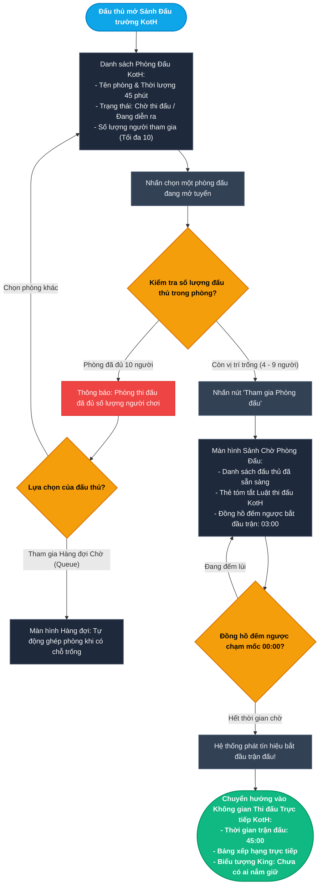
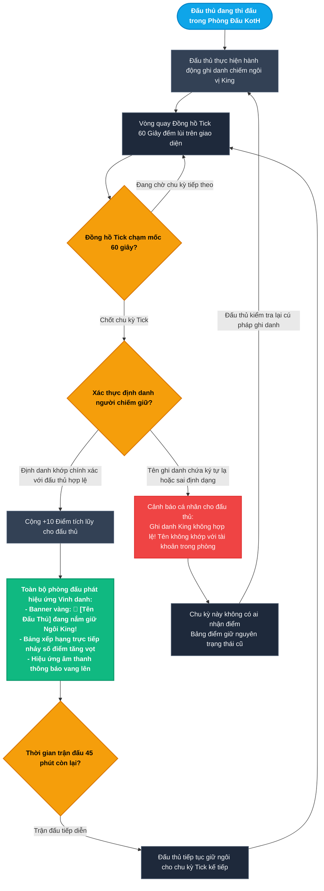
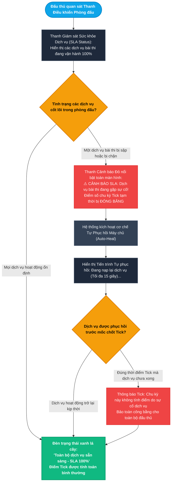
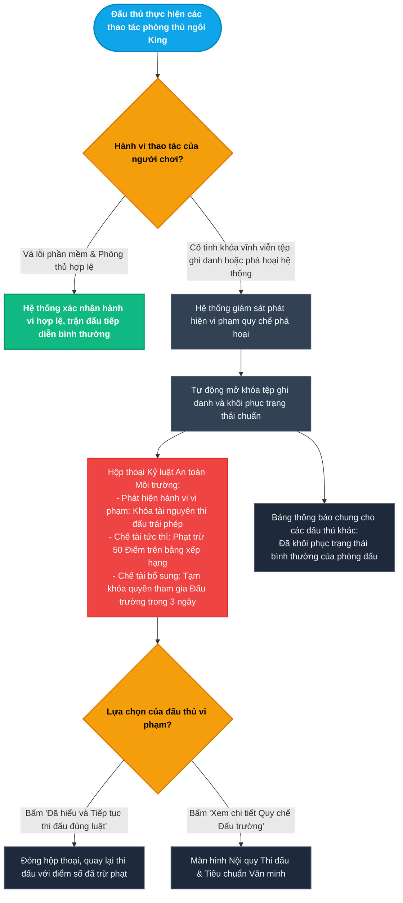
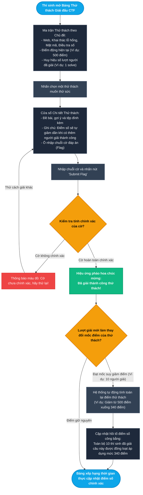
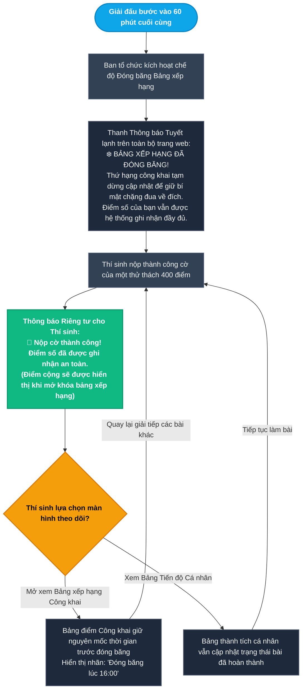
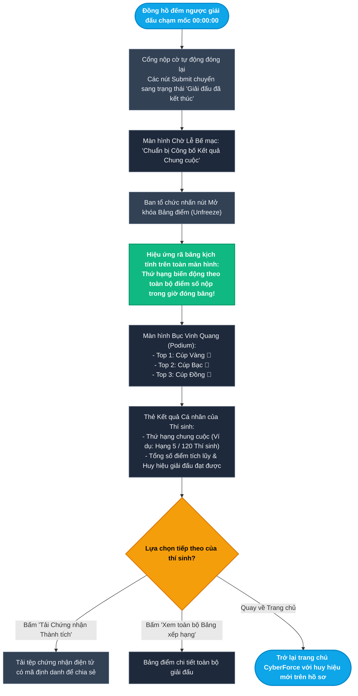

# Epic 5: CTF Competitions & Real-Time King of the Hill (KotH) Arena
## Tài liệu Thiết kế Kiến trúc User Flow Chi tiết (User Journey & Experience Flows)

* **Hệ thống:** CyberForce Cyber Range & Practical Security Platform
* **Tài liệu tham chiếu:** [EPIC_05_CTF_COMPETITIONS_KOTH_ARENA.md](file:///home/quocbao/Documents/University/ChuyenDe4/CyberForge/docs/05-epics/EPIC_05_CTF_COMPETITIONS_KOTH_ARENA.md)
* **Vai trò phụ trách:** Product Designer (UX Architect)
* **Phiên bản:** 1.0 (Strict Separation: Pure User Journey)

---

## 📑 MỤC LỤC TỔNG QUAN CÁC TIỂU LUỒNG (USER FLOWS)

Toàn bộ trải nghiệm người dùng trong đấu trường đối kháng thời gian thực KotH và giải thi đấu Jeopardy CTF được phân tách thành **7 tiểu luồng trực quan, lấy người dùng làm trung tâm**:

- **MODULE 1: ĐẤU TRƯỜNG ĐỐI KHÁNG KING OF THE HILL (KOTH LIVE ARENA)**
  - [Sub-flow 1.1: Gia nhập Phòng Đấu KotH & Đồng bộ Đếm ngược Trận đấu (US-05.01)](#sub-flow-11-gia-nhập-phòng-đấu-koth--đồng-bộ-đếm-ngược-trận-đấu-us-0501)
  - [Sub-flow 1.2: Chiếm Ngôi King & Tích Lũy Điểm Chu kỳ Tick 60 Giây (US-05.01)](#sub-flow-12-chiếm-ngôi-king--tích-lũy-điểm-chu-kỳ-tick-60-giây-us-0501)
  - [Sub-flow 1.3: Giám sát Trạng thái Dịch vụ SLA & Tự Phục hồi Phòng Đấu (US-05.02)](#sub-flow-13-giám-sát-trạng-thái-dịch-vụ-sla--tự-phục-hồi-phòng-đấu-us-0502)
  - [Sub-flow 1.4: Tiếp nhận Cảnh báo Quy chế Thi đấu & Xử lý Vi phạm Phá hoại (US-05.03)](#sub-flow-14-tiếp-nhận-cảnh-báo-quy-chế-thi-đấu--xử-lý-vi-phạm-phá-hoại-us-0503)
- **MODULE 2: THI ĐẤU JEOPARDY CTF & BẢNG XẾP HẠNG THỜI GIAN THỰC (JEOPARDY CTF & DYNAMIC SCOREBOARD)**
  - [Sub-flow 2.1: Khám phá Thử thách CTF & Trải nghiệm Điểm số Suy giảm Động - Dynamic Decay (US-05.04)](#sub-flow-21-khám-phá-thử-thách-ctf--trải-nghiệm-điểm-số-suy-giảm-động---dynamic-decay-us-0504)
  - [Sub-flow 2.2: Nộp Cờ trong Giai đoạn Đóng băng Bảng xếp hạng - Scoreboard Freeze (US-05.04)](#sub-flow-22-nộp-cờ-trong-giai-đoạn-đóng-băng-bảng-xếp-hạng---scoreboard-freeze-us-0504)
  - [Sub-flow 2.3: Công bố Bảng xếp hạng Chung cuộc & Vinh danh Trao giải (US-05.04)](#sub-flow-23-công-bố-bảng-xếp-hạng-chung-cuộc--vinh-danh-trao-giải-us-0504)

---

## I. NGUYÊN TẮC THIẾT KẾ TRẢI NGHIỆM (USER EXPERIENCE PRINCIPLES)

1. **Góc nhìn thuần túy Người dùng (User-First Perspective):**
   - Tài liệu mô tả trực quan các tương tác: Người chơi nhìn thấy gì trên bảng điều khiển thi đấu? Nhận thông báo âm thanh và hình ảnh ra sao khi chiếm giữ ngôi vị King? Đưa ra quyết định gì khi bảng xếp hạng bị đóng băng trước giờ bế mạc?
   - Loại bỏ 100% các chi tiết kỹ thuật ngầm: *Cơ chế vòng lặp đồng hồ backend, câu lệnh shell ghi đè file hệ thống, cấu hình kiểm tra cổng mạng của daemon, hoặc công thức băm dữ liệu*.
2. **Cơ chế "No Dead End" (Không màn hình bế tắc):**
   - Mọi tình huống phòng thi đã đủ người, ghi danh sai cú pháp, dịch vụ gặp sự cố hoặc nhận thông báo xử lý vi phạm đều luôn có các lối thoát hiểm rõ ràng: *Đổi phòng đấu khác, Hướng dẫn sửa cú pháp, Theo dõi thanh tiến trình tự phục hồi, hoặc Quay về sảnh giải đấu*.
3. **Cảm giác Kịch tính & Phản hồi Thời gian thực (Live Competition Feedback):**
   - Mọi biến động về thứ hạng, thay đổi chủ nhân vương miện King hoặc suy giảm điểm động đều được truyền tải qua các hiệu ứng thị giác sinh động (huy hiệu vàng, thanh tiến trình đếm lùi, hiệu ứng đóng băng tuyết) để kích thích tinh thần tranh đua lành mạnh của đấu thủ.

---

## II. CHI TIẾT CÁC TIỂU LUỒNG USER FLOW (MERMAID FLOWCHARTS & MATRICES)

---

### Sub-flow 1.1: Gia nhập Phòng Đấu KotH & Đồng bộ Đếm ngược Trận đấu (US-05.01)

Mô tả trải nghiệm của đấu thủ từ sảnh danh sách phòng chơi, kiểm tra số lượng vị trí trống, vào phòng chờ chuẩn bị và đồng bộ bước vào trận đấu 45 phút.

#### Sơ đồ Flowchart (Mermaid)

#### Bảng State Transition Matrix (Sub-flow 1.1)

| Bước | Màn hình / Trạng thái | Hành động người dùng | Điều kiện kiểm tra | Màn hình tiếp theo | Cơ chế thoát hiểm (No Dead End) |
| :--- | :--- | :--- | :--- | :--- | :--- |
| **1.1.1** | Sảnh Đấu trường KotH | Duyệt tìm phòng đấu muốn tham gia | Đã đăng nhập tài khoản người chơi | Danh sách phòng đấu hiển thị trực quan số người | Nút "Tạo phòng đấu tùy chỉnh" hoặc quay lại Trang chủ |
| **1.1.2** | Danh sách phòng đấu | Bấm chọn một phòng thi đấu | Phòng đã đầy 10/10 người | Thông báo phòng đã đủ người | Có tùy chọn "Chọn phòng khác" hoặc "Vào hàng đợi" |
| **1.1.3** | Danh sách phòng đấu | Bấm chọn một phòng thi đấu | Phòng còn chỗ trống (ví dụ: 6/10) | Màn hình Sảnh Chờ của phòng đấu | Nút "Rời phòng chờ" để chọn lại nếu đổi ý |
| **1.1.4** | Màn hình Sảnh Chờ | Đọc quy chế và quan sát đối thủ | Đang trong thời gian đếm ngược (3 phút) | Cập nhật danh sách đấu thủ khi có người mới vào | Nút "Sẵn sàng" và đồng hồ đếm ngược rõ ràng |
| **1.1.5** | Màn hình Sảnh Chờ | Đồng hồ đếm ngược chạm mốc 00:00 | Đủ tối thiểu 4 đấu thủ sẵn sàng | Tự động chuyển thẳng vào màn hình thi đấu chính thức | Không cần người chơi phải tải lại trang |

---

### Sub-flow 1.2: Chiếm Ngôi King & Tích Lũy Điểm Chu kỳ Tick 60 Giây (US-05.01)

Quy trình người chơi khẳng định chủ quyền đồi, hệ thống xác thực danh tính tại chu kỳ Tick 60 giây và kích hoạt hiệu ứng vinh danh trực tiếp cho cả phòng đấu.

#### Sơ đồ Flowchart (Mermaid)

#### Bảng State Transition Matrix (Sub-flow 1.2)

| Bước | Màn hình / Trạng thái | Hành động người dùng | Điều kiện kiểm tra | Màn hình tiếp theo | Cơ chế thoát hiểm (No Dead End) |
| :--- | :--- | :--- | :--- | :--- | :--- |
| **1.2.1** | Phòng đấu trực tiếp | Thao tác chiếm giữ vị trí King | Máy chủ phòng đấu đang hoạt động | Đặt tên ghi danh vào vị trí King thành công | Có hướng dẫn cú pháp ghi danh chính xác ở bảng trợ giúp |
| **1.2.2** | Giao diện phòng đấu | Quan sát đồng hồ chu kỳ Tick | Chu kỳ 60 giây đang đếm ngược | Đồng hồ hiển thị thời gian còn lại đến lần chốt điểm | Người chơi chuẩn bị phòng thủ ngôi vị |
| **1.2.3** | Thời điểm chốt Tick | Hệ thống xác thực danh tính King | Tên ghi danh hoàn toàn trùng khớp tài khoản | Cộng +10 điểm, hiển thị vương miện vàng và phát thông báo | Vinh danh trực tiếp trên bảng xếp hạng toàn phòng |
| **1.2.4** | Thời điểm chốt Tick | Hệ thống xác thực danh tính King | Tên có khoảng trắng thừa hoặc ký tự lạ | Không cộng điểm trong chu kỳ này, cảnh báo lỗi cú pháp | Có nút bấm "Xem lại cú pháp tài khoản chuẩn" |
| **1.2.5** | Đang giữ vị trí King | Đối thủ khác vượt lên chiếm lại đồi | Đối thủ ghi danh hợp lệ thay thế | Vương miện chuyển sang đối thủ kèm âm thanh cảnh báo | Kích thích người chơi tiếp tục tấn công để giành lại |

---

### Sub-flow 1.3: Giám sát Trạng thái Dịch vụ SLA & Tự Phục hồi Phòng Đấu (US-05.02)

Giữ cho môi trường thi đấu luôn minh bạch và công bằng thông qua thanh trạng thái sức khỏe dịch vụ thời gian thực, tự động cảnh báo và đóng băng điểm khi có sự cố.

#### Sơ đồ Flowchart (Mermaid)

#### Bảng State Transition Matrix (Sub-flow 1.3)

| Bước | Màn hình / Trạng thái | Hành động người dùng | Điều kiện kiểm tra | Màn hình tiếp theo | Cơ chế thoát hiểm (No Dead End) |
| :--- | :--- | :--- | :--- | :--- | :--- |
| **1.3.1** | Thanh trạng thái phòng đấu | Theo dõi thanh đèn SLA | Mọi dịch vụ bài thi phản hồi mượt mà | Đèn xanh lá "All Services Operational" | Người chơi hoàn toàn yên tâm tập trung làm bài |
| **1.3.2** | Phòng đấu trực tiếp | Đối thủ vô tình hoặc cố ý tắt dịch vụ | Dịch vụ không phản hồi tín hiệu | Bật thanh thông báo đỏ: Dịch vụ gặp sự cố, điểm tạm đóng băng | Cả phòng đều thấy thông báo để không ai bị bất công |
| **1.3.3** | Thanh cảnh báo đỏ | Đọc thông báo tiến trình phục hồi | Cơ chế tự động đang làm việc | Thanh đếm tiến trình khôi phục trong 15 giây | Người chơi không cần can thiệp thủ công |
| **1.3.4** | Tiến trình khôi phục | Hoàn tất nạp lại dịch vụ | Dịch vụ đã hoạt động bình thường | Thanh trạng thái trở về màu xanh lá an toàn | Trận đấu tiếp diễn trơn tru |
| **1.3.5** | Thời điểm chốt Tick | Dịch vụ chưa kịp phục hồi xong | Tick rơi đúng vào lúc dịch vụ đang sửa | Điểm Tick chu kỳ đó tạm ngừng tính cho mọi người | Bảo vệ công bằng, không ai bị đối thủ chơi xấu trừ điểm |

---

### Sub-flow 1.4: Tiếp nhận Cảnh báo Quy chế Thi đấu & Xử lý Vi phạm Phá hoại (US-05.03)

Ngăn chặn và trừng phạt các hành vi phá hoại môi trường thi đấu, bảo vệ sân chơi lành mạnh và cung cấp thông tin xử lý rõ ràng.

#### Sơ đồ Flowchart (Mermaid)

#### Bảng State Transition Matrix (Sub-flow 1.4)

| Bước | Màn hình / Trạng thái | Hành động người dùng | Điều kiện kiểm tra | Màn hình tiếp theo | Cơ chế thoát hiểm (No Dead End) |
| :--- | :--- | :--- | :--- | :--- | :--- |
| **1.4.1** | Môi trường thi đấu | Vá các lỗ hổng trên ứng dụng bài thi | Không can thiệp phá hoại file hệ thống | Trận đấu diễn ra bình thường, hệ thống ghi nhận kỹ năng tốt | Người chơi tiếp tục củng cố phòng thủ |
| **1.4.2** | Môi trường thi đấu | Thực hiện thao tác khóa bất tử tệp ghi danh | Vi phạm quy chế chống phá hoại | Tự động hủy lệnh khóa và hiện hộp thoại kỷ luật | Đảm bảo tính mở cho các đấu thủ khác vào khai thác |
| **1.4.3** | Hộp thoại kỷ luật | Đọc mức phạt vi phạm | Nhận án phạt trừ 50 điểm và tạm ngưng 3 ngày | Hiển thị thông báo lý do rõ ràng, minh bạch | Nút "Đã hiểu và Thi đấu tiếp" |
| **1.4.4** | Hộp thoại kỷ luật | Bấm "Xem chi tiết Quy chế" | Muốn tìm hiểu các hành vi được phép và bị cấm | Màn hình danh sách quy chế thi đấu chi tiết | Nút quay lại trận đấu |
| **1.4.5** | Màn hình các đối thủ | Nhận thông báo hệ thống | Vừa xử lý xong hành vi chơi xấu | Thông báo thông báo môi trường đã khôi phục nguyên trạng | Tạo niềm tin về sự công bằng của giải đấu |

---

### Sub-flow 2.1: Khám phá Thử thách CTF & Trải nghiệm Điểm số Suy giảm Động - Dynamic Decay (US-05.04)

Học viên tham gia giải thi đấu Jeopardy CTF, quan sát bảng thử thách đa dạng, chứng kiến điểm số tự động điều chỉnh hồi tố công bằng theo số lượng người giải.

#### Sơ đồ Flowchart (Mermaid)

#### Bảng State Transition Matrix (Sub-flow 2.1)

| Bước | Màn hình / Trạng thái | Hành động người dùng | Điều kiện kiểm tra | Màn hình tiếp theo | Cơ chế thoát hiểm (No Dead End) |
| :--- | :--- | :--- | :--- | :--- | :--- |
| **2.1.1** | Ma trận Thử thách CTF | Chọn xem một bài tập | Giải đấu đang diễn ra | Cửa sổ chi tiết thử thách và ô nộp cờ | Nút đóng để chọn câu hỏi khác |
| **2.1.2** | Cửa sổ Thử thách | Nhập cờ đáp án và bấm Submit | Chuỗi cờ sai | Thông báo màu đỏ "Cờ chưa chính xác" | Cho phép thử lại ngay, có gợi ý nếu có |
| **2.1.3** | Cửa sổ Thử thách | Nhập cờ đáp án và bấm Submit | Chuỗi cờ chính xác | Hiệu ứng pháo hoa chúc mừng giải thành công | Thẻ bài tập chuyển sang màu xanh đánh dấu đã hoàn thành |
| **2.1.4** | Bảng xếp hạng | Có thêm nhiều người cùng giải thành công câu đó | Số lượt giải vượt mốc suy giảm điểm | Điểm bài thi giảm xuống và hồi tố cho toàn bộ người đã giải | Đảm bảo tính công bằng theo độ khó thực tế của câu hỏi |
| **2.1.5** | Ma trận Thử thách CTF | Rê chuột vào nhãn điểm số | Tò mò về điểm suy giảm | Bong bóng giải thích cách tính điểm suy giảm động hiển thị | Giúp người chơi hiểu rõ cơ chế giải đấu |

---

### Sub-flow 2.2: Nộp Cờ trong Giai đoạn Đóng băng Bảng xếp hạng - Scoreboard Freeze (US-05.04)

Tạo nên những giây phút nghẹt thở trong chặng đua nước rút bằng tính năng đóng băng bảng điểm công khai, trong khi vẫn ghi nhận điểm số an toàn tuyệt đối cho từng thí sinh.

#### Sơ đồ Flowchart (Mermaid)

#### Bảng State Transition Matrix (Sub-flow 2.2)

| Bước | Màn hình / Trạng thái | Hành động người dùng | Điều kiện kiểm tra | Màn hình tiếp theo | Cơ chế thoát hiểm (No Dead End) |
| :--- | :--- | :--- | :--- | :--- | :--- |
| **2.2.1** | Giao diện giải đấu | Giải đấu bước vào 60 phút cuối | Ban tổ chức kích hoạt Freeze | Xuất hiện thanh thông báo đóng băng màu xanh tuyết | Nhắc nhở người chơi thời gian nước rút đang diễn ra |
| **2.2.2** | Cửa sổ thử thách | Nhập đúng cờ và bấm Submit | Trong giai đoạn bảng điểm đang đóng băng | Thông báo chúc mừng cá nhân kèm lưu ý điểm đã ghi nhận an toàn | Thí sinh an tâm bài làm đã được tính trọn vẹn |
| **2.2.3** | Bảng xếp hạng công khai | Xem thứ hạng các đội | Đang trong giai đoạn đóng băng | Bảng xếp hạng giữ nguyên vị trí ở mốc đóng băng | Giữ bí mật bất ngờ cho lễ bế mạc |
| **2.2.4** | Trang tiến độ cá nhân | Kiểm tra các bài đã giải | Đã giải thêm bài trong lúc đóng băng | Hiển thị dấu tích xanh cho các bài làm thành công | Thí sinh nắm rõ thành quả của riêng mình |
| **2.2.5** | Mọi màn hình giải đấu | Theo dõi đồng hồ đếm ngược bế mạc | Thời gian thi đấu sắp kết thúc | Đồng hồ nhấp nháy đỏ báo hiệu những phút cuối cùng | Thúc giục hoàn tất các bài đang làm dở |

---

### Sub-flow 2.3: Công bố Bảng xếp hạng Chung cuộc & Vinh danh Trao giải (US-05.04)

Thời khắc bế mạc giải đấu, hiệu ứng rã đông bảng điểm kịch tính, hiển thị bục vinh quang Top 3 và cấp chứng nhận thành tích số cho thí sinh.

#### Sơ đồ Flowchart (Mermaid)

#### Bảng State Transition Matrix (Sub-flow 2.3)

| Bước | Màn hình / Trạng thái | Hành động người dùng | Điều kiện kiểm tra | Màn hình tiếp theo | Cơ chế thoát hiểm (No Dead End) |
| :--- | :--- | :--- | :--- | :--- | :--- |
| **2.3.1** | Giao diện bài thi | Hết giờ thi đấu chính thức | Đồng hồ chạm mốc 00:00:00 | Nút nộp cờ tự động khóa, hiện thông báo bế mạc | Thí sinh không thể gửi thêm cờ nhưng có thể xem lại bài |
| **2.3.2** | Màn hình bế mạc | Chờ Ban tổ chức mở bảng điểm | Ban tổ chức kích hoạt Unfreeze | Hiệu ứng rã băng hoạt hình lôi cuốn | Chuyển tiếp tự động, tạo trải nghiệm hồi hộp |
| **2.3.3** | Bục Vinh Quang | Theo dõi phần vinh danh | Bảng điểm đã giải mã toàn bộ | Hiển thị 3 đội dẫn đầu với cúp vàng, bạc, đồng | Có danh sách chi tiết các đội ở phía dưới |
| **2.3.4** | Thẻ thành tích cá nhân | Xem thứ hạng và điểm số của mình | Đã có kết quả chính thức | Hiển thị thứ hạng, số điểm và huy hiệu đạt được | Nút tải chứng chỉ và nút chia sẻ lên mạng xã hội |
| **2.3.5** | Thẻ thành tích cá nhân | Bấm "Tải Chứng nhận Thành tích" | Muốn lưu lại kỷ niệm giải đấu | Tải chứng chỉ định dạng PDF có mã xác thực | Nút trở về Dashboard cá nhân |
