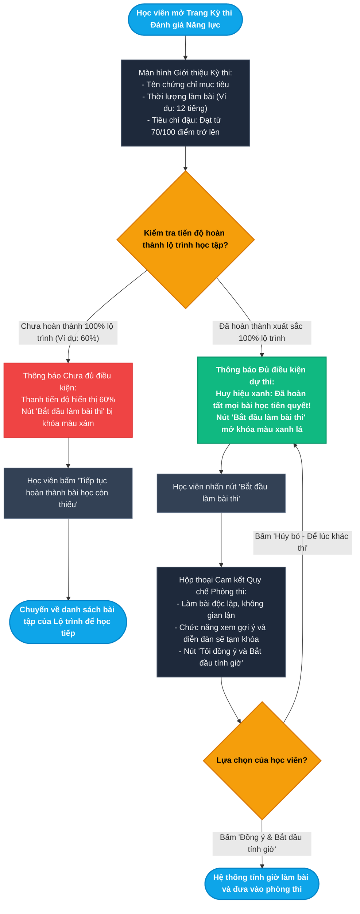
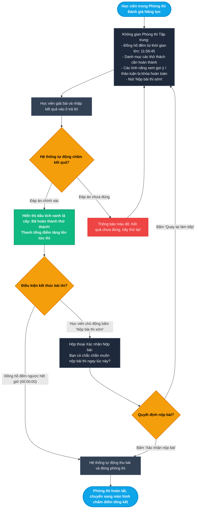
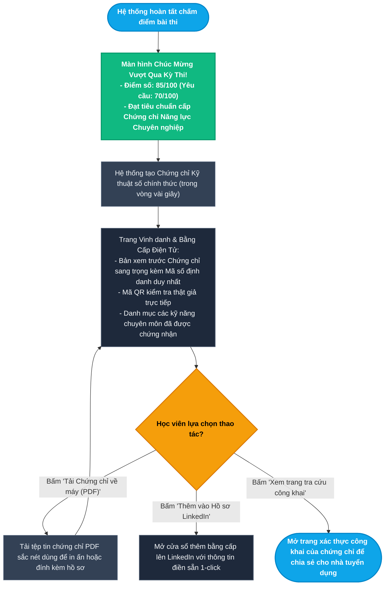
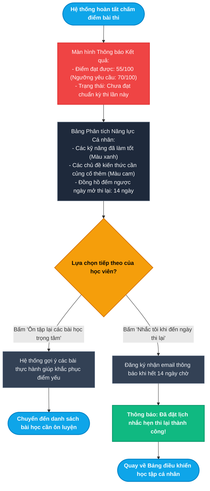
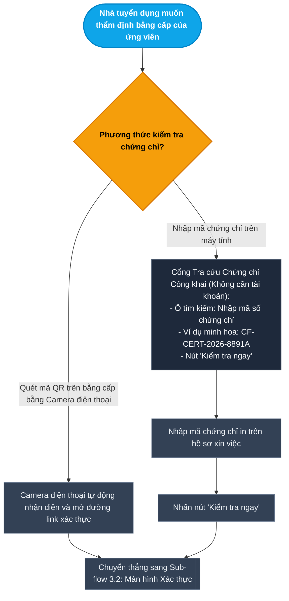
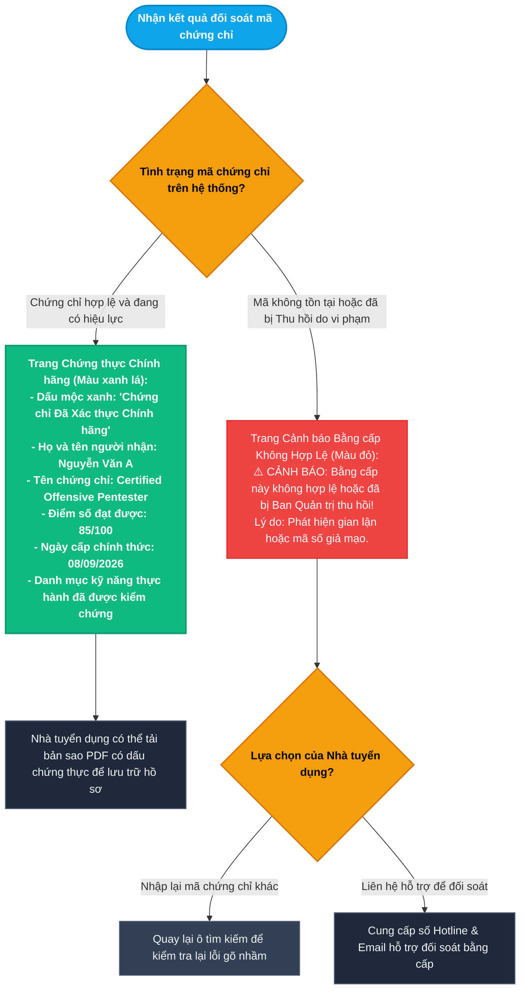

# Epic 6: Practical Capstone Exams & Verifiable Digital Certificates
## Tài liệu Thiết kế Kiến trúc User Flow Chi tiết (User Journey & Experience Flows)

* **Hệ thống:** CyberForce Cyber Range & Practical Security Platform
* **Tài liệu tham chiếu:** [EPIC_06_CAPSTONE_EXAMS_DIGITAL_CERTIFICATES.md](file:///home/quocbao/Documents/University/ChuyenDe4/CyberForge/docs/05-epics/EPIC_06_CAPSTONE_EXAMS_DIGITAL_CERTIFICATES.md)
* **Vai trò phụ trách:** Product Designer (UX Architect)
* **Phiên bản:** 1.0 (Strict Non-Tech User Experience Focus)

---

## 📑 MỤC LỤC TỔNG QUAN CÁC TIỂU LUỒNG (USER FLOWS)

Toàn bộ hành trình trải nghiệm của Học viên thi lấy chứng chỉ và Nhà tuyển dụng kiểm tra bằng cấp được xây dựng dưới góc nhìn **hoàn toàn phi kỹ thuật (non-tech)** qua **6 tiểu luồng trực quan**:

- **MODULE 1: ĐĂNG KÝ & THAM GIA KỲ THI ĐÁNH GIÁ NĂNG LỰC (EXAM REGISTRATION & TEST ENVIRONMENT)**
  - [Sub-flow 1.1: Kiểm tra Điều kiện Tiên quyết & Đăng ký Bài thi (US-06.01)](#sub-flow-11-kiểm-tra-điều-kiện-tiên-quyết--đăng-ký-bài-thi-us-0601)
  - [Sub-flow 1.2: Trải nghiệm Trong Phòng Thi & Nộp Bài Đánh giá (US-06.01)](#sub-flow-12-trải-nghiệm-trong-phòng-thi--nộp-bài-đánh-giá-us-0601)
- **MODULE 2: KẾT QUẢ THI & QUẢN LÝ CHỨNG CHỈ SỐ (EXAM OUTCOMES & DIGITAL CERTIFICATES)**
  - [Sub-flow 2.1: Nhận Kết quả Thi Đạt Chuẩn & Nhận Chứng chỉ Số (US-06.02)](#sub-flow-21-nhận-kết-quả-thi-đạt-chuẩn--nhận-chứng-chỉ-số-us-0602)
  - [Sub-flow 2.2: Xử lý Kết quả Chưa Đạt & Hướng dẫn Ôn tập Thi lại (US-06.02)](#sub-flow-22-xử-lý-kết-quả-chưa-đạt--hướng-dẫn-ôn-tập-thi-lại-us-0602)
- **MODULE 3: TRA CỨU & XÁC THỰC CHỨNG CHỈ CÔNG KHAI (PUBLIC CERTIFICATE VERIFICATION)**
  - [Sub-flow 3.1: Nhà Tuyển dụng Quét Mã QR hoặc Nhập Mã Tra cứu Chứng chỉ (US-06.03)](#sub-flow-31-nhà-tuyển-dụng-quét-mã-qr-hoặc-nhập-mã-tra-cứu-chứng-chỉ-us-0603)
  - [Sub-flow 3.2: Màn hình Kết quả Xác thực: Chứng chỉ Hợp lệ vs Bị thu hồi (US-06.03)](#sub-flow-32-màn-hình-kết-quả-xác-thực-chứng-chỉ-hợp-lệ-vs-bị-thu-hồi-us-0603)

---

## I. NGUYÊN TẮC THIẾT KẾ TRẢI NGHIỆM CHO NGƯỜI DÙNG NON-TECH

1. **Góc nhìn Thuần túy Người dùng Thường (Non-Tech Human Perspective):**
   - Tập trung vào những gì một người dùng bình thường nhìn thấy, hiểu được và cảm nhận: *Thẻ bài thi, nút bấm bắt đầu, thanh tiến trình % hoàn thành, đồng hồ đếm ngược giờ thi, bằng cấp PDF đẹp mắt, mã QR quét bằng camera điện thoại, nút chia sẻ lên mạng xã hội*.
   - Tuyệt đối không dùng thuật ngữ kỹ thuật chuyên sâu (không nói về thuật toán mã hóa, chuỗi băm, hạ tầng máy chủ, cổng kết nối hay cơ sở dữ liệu).
2. **Nguyên tắc "No Dead End" (Không có lối cụt):**
   - Học viên chưa đủ điều kiện thi được dẫn dắt quay lại hoàn thành các bài học còn thiếu.
   - Thí sinh thi trượt nhận được phân tích điểm yếu kèm lộ trình ôn tập và đồng hồ báo ngày được thi lại.
   - Nhà tuyển dụng quét phải bằng giả/hết hạn được cung cấp số điện thoại hoặc email liên hệ để đối soát.
3. **Minh bạch, Tin cậy & Tạo Động lực:**
   - Chứng chỉ được trình bày trang trọng, có đầy đủ căn cứ xác thực trực quan (huy hiệu xanh, dấu mộc chứng nhận, mã số tra cứu) giúp người học tự hào chia sẻ và nhà tuyển dụng hoàn toàn an tâm.

---

## II. CHI TIẾT CÁC TIỂU LUỒNG USER FLOW (MERMAID FLOWCHARTS & MATRICES)

---

### Sub-flow 1.1: Kiểm tra Điều kiện Tiên quyết & Đăng ký Bài thi (US-06.01)

Học viên kiểm tra tính hợp lệ về tiến độ hoàn thành bài học trước khi được phép kích hoạt kỳ thi thực hành năng lực tổng hợp.

#### Sơ đồ Flowchart (Mermaid)

#### Bảng State Transition Matrix (Sub-flow 1.1)

| Bước | Màn hình / Trạng thái | Hành động người dùng | Điều kiện kiểm tra | Màn hình tiếp theo | Cơ chế thoát hiểm (No Dead End) |
| :--- | :--- | :--- | :--- | :--- | :--- |
| **1.1.1** | Trang giới thiệu bài thi | Nhấp xem thông tin kỳ thi | Đã đăng nhập tài khoản học viên | Màn hình tóm tắt thể lệ, thời lượng và tiêu chí đậu | Có nút quay lại Trang chủ hoặc Lộ trình |
| **1.1.2** | Màn hình giới thiệu | Quan sát nút bắt đầu thi | Chưa học xong 100% các bài học | Nút thi bị khóa mờ, kèm thanh phần trăm còn thiếu | Nút "Tiếp tục học" dẫn thẳng tới bài chưa làm |
| **1.1.3** | Màn hình giới thiệu | Quan sát nút bắt đầu thi | Đã hoàn thành trọn vẹn 100% lộ trình | Nút "Bắt đầu làm bài thi" sáng rõ màu xanh lá | Người học chủ động chọn thời điểm bắt đầu thi |
| **1.1.4** | Màn hình đủ điều kiện | Nhấn nút "Bắt đầu làm bài thi" | Đã sẵn sàng thi | Hộp thoại Cam kết Quy chế Phòng thi | Có nút "Hủy bỏ" nếu chưa muốn bắt đầu ngay |
| **1.1.5** | Hộp thoại cam kết | Bấm "Đồng ý & Bắt đầu tính giờ" | Học viên cam kết thi cử văn minh | Đồng hồ đếm ngược bắt đầu chạy, mở phòng thi | Dẫn thẳng vào giao diện làm bài chính thức |

---

### Sub-flow 1.2: Trải nghiệm Trong Phòng Thi & Nộp Bài Đánh giá (US-06.01)

Không gian làm bài thi nghiêm túc, tập trung với đồng hồ đếm ngược lớn, chấm điểm tự động tức thì và bảo vệ bài làm khi nộp bài.

#### Sơ đồ Flowchart (Mermaid)

#### Bảng State Transition Matrix (Sub-flow 1.2)

| Bước | Màn hình / Trạng thái | Hành động người dùng | Điều kiện kiểm tra | Màn hình tiếp theo | Cơ chế thoát hiểm (No Dead End) |
| :--- | :--- | :--- | :--- | :--- | :--- |
| **1.2.1** | Phòng thi chính thức | Theo dõi đồng hồ và đọc đề bài | Đang trong thời gian làm bài | Giao diện phòng thi tối giản, hiển thị các nhiệm vụ cần làm | Có nút trợ giúp về mặt kỹ thuật nếu phòng thi trục trặc |
| **1.2.2** | Ô nộp đáp án | Nhập kết quả bài làm và bấm Gửi | Đáp án chưa chính xác | Báo đỏ nhắc nhở thử lại, không trừ điểm | Học viên tiếp tục thử các phương án khác |
| **1.2.3** | Ô nộp đáp án | Nhập kết quả bài làm và bấm Gửi | Đáp án hoàn toàn chính xác | Tích xanh lá cây xuất hiện, điểm số tổng tăng lên | Thanh tiến độ thi tự động cập nhật phần trăm hoàn thành |
| **1.2.4** | Phòng thi chính thức | Nhấn nút "Nộp bài thi sớm" | Đã làm xong trước thời hạn | Hộp thoại xác nhận nộp bài | Nút "Quay lại làm tiếp" để kiểm tra lại bài làm |
| **1.2.5** | Phòng thi chính thức | Thời gian thi chạm mốc 00:00:00 | Hết giờ làm bài | Tự động lưu toàn bộ các câu đã làm đúng và nộp bài | Không làm mất bất kỳ kết quả nào học viên đã ghi điểm |

---

### Sub-flow 2.1: Nhận Kết quả Thi Đạt Chuẩn & Nhận Chứng chỉ Số (US-06.02)

Màn hình chúc mừng học viên vượt qua kỳ thi với số điểm xuất sắc, nhận Chứng chỉ số chính thức có mã QR chống làm giả và chia sẻ niềm vui lên mạng xã hội nghề nghiệp.

#### Sơ đồ Flowchart (Mermaid)

#### Bảng State Transition Matrix (Sub-flow 2.1)

| Bước | Màn hình / Trạng thái | Hành động người dùng | Điều kiện kiểm tra | Màn hình tiếp theo | Cơ chế thoát hiểm (No Dead End) |
| :--- | :--- | :--- | :--- | :--- | :--- |
| **2.1.1** | Màn hình chờ kết quả | Xem thông báo điểm | Điểm thi $\ge 70/100$ điểm | Màn hình pháo hoa chúc mừng vượt qua kỳ thi | Có bản tóm tắt điểm số chi tiết từng phần |
| **2.1.2** | Màn hình chúc mừng | Chờ cấp chứng chỉ | Đạt điểm đậu | Trang trưng bày Chứng chỉ Số chính thức | Quá trình diễn ra tự động chỉ trong vài giây |
| **2.1.3** | Trang chứng chỉ số | Nhấn nút "Tải Chứng chỉ PDF" | Muốn lưu về máy hoặc in ấn | Trình duyệt tải ngay file chứng chỉ chất lượng cao | Nút tải lại nếu đường truyền mạng ngắt giữa chừng |
| **2.1.4** | Trang chứng chỉ số | Nhấn nút "Thêm vào LinkedIn" | Muốn làm đẹp hồ sơ xin việc | Hộp thoại liên kết LinkedIn điền sẵn tên bằng và tổ chức cấp | Thao tác 1-click tiện lợi, không cần gõ tay |
| **2.1.5** | Trang chứng chỉ số | Nhấn "Xem trang tra cứu công khai" | Muốn lấy đường dẫn chia sẻ | Mở Cổng tra cứu xác thực chứng chỉ | Nút sao chép đường dẫn (Copy Link) tiện dụng |

---

### Sub-flow 2.2: Xử lý Kết quả Chưa Đạt & Hướng dẫn Ôn tập Thi lại (US-06.02)

Phản hồi nhẹ nhàng, văn minh khi điểm số chưa đạt chuẩn, cung cấp bản phân tích kỹ năng cần cải thiện và đặt lịch thi lại rõ ràng.

#### Sơ đồ Flowchart (Mermaid)

#### Bảng State Transition Matrix (Sub-flow 2.2)

| Bước | Màn hình / Trạng thái | Hành động người dùng | Điều kiện kiểm tra | Màn hình tiếp theo | Cơ chế thoát hiểm (No Dead End) |
| :--- | :--- | :--- | :--- | :--- | :--- |
| **2.2.1** | Màn hình kết quả thi | Đọc thông báo kết quả | Điểm thi $< 70/100$ điểm | Màn hình thông báo chưa đạt kèm lời động viên | Không có cảm giác tiêu cực, luôn có định hướng bước tiếp |
| **2.2.2** | Bảng phân tích kỹ năng | Xem chi tiết điểm số | Chưa vượt qua bài thi | Bảng phân tích điểm mạnh và điểm yếu cụ thể | Giúp học viên biết chính xác mình cần ôn lại phần nào |
| **2.2.3** | Bảng phân tích kỹ năng | Đọc thông tin thời gian thi lại | Quy định giãn cách thi lại 14 ngày | Đồng hồ hiển thị số ngày còn lại để được đăng ký lại | Nút "Nhắc tôi qua email" khi đến ngày mở thi |
| **2.2.4** | Bảng phân tích kỹ năng | Bấm "Ôn tập lại bài học trọng tâm" | Muốn cải thiện điểm số | Danh mục các bài học ôn luyện được đề xuất riêng | Nút đưa thẳng vào bài học cần rèn luyện thêm |
| **2.2.5** | Màn hình kết quả | Bấm "Quay về Dashboard" | Học viên muốn tạm nghỉ ngơi | Trở lại trang chủ học tập cá nhân | Đưa học viên về khu vực an toàn, không bị kẹt ở màn hình thi |

---

### Sub-flow 3.1: Nhà Tuyển dụng Quét Mã QR hoặc Nhập Mã Tra cứu Chứng chỉ (US-06.03)

Quy trình tra cứu cực kỳ dễ dàng cho Nhà tuyển dụng hoặc Khách bên ngoài: Có thể dùng điện thoại quét mã QR trên bản in hoặc nhập mã số trên web mà không cần đăng nhập.

#### Sơ đồ Flowchart (Mermaid)

#### Bảng State Transition Matrix (Sub-flow 3.1)

| Bước | Màn hình / Trạng thái | Hành động người dùng | Điều kiện kiểm tra | Màn hình tiếp theo | Cơ chế thoát hiểm (No Dead End) |
| :--- | :--- | :--- | :--- | :--- | :--- |
| **3.1.1** | Thiết bị di động / Máy ảnh | Dùng điện thoại soi vào mã QR trên bằng | Mã QR rõ nét, còn nguyên vẹn | Tự động mở đường dẫn tra cứu chứng chỉ trên trình duyệt | Không cần cài đặt thêm ứng dụng nào khác |
| **3.1.2** | Cổng tra cứu trên web | Mở trang kiểm tra chứng chỉ | Không cần tài khoản đăng nhập | Ô nhập mã chứng chỉ to, rõ ràng và thân thiện | Có ảnh hướng dẫn vị trí in mã số trên bằng cấp |
| **3.1.3** | Cổng tra cứu trên web | Nhập mã số và bấm "Kiểm tra ngay" | Đã điền mã số chứng chỉ | Hiển thị biểu tượng đang tìm kiếm dữ liệu | Thời gian phản hồi tức thì dưới 1 giây |

---

### Sub-flow 3.2: Màn hình Kết quả Xác thực: Chứng chỉ Hợp lệ vs Bị thu hồi (US-06.03)

Màn hình hiển thị kết quả thẩm định bằng cấp trực quan: Chứng chỉ chuẩn được dán huy hiệu xanh bảo chứng, chứng chỉ giả hoặc bị thu hồi được cảnh báo rõ ràng để bảo vệ nhà tuyển dụng.

#### Sơ đồ Flowchart (Mermaid)

#### Bảng State Transition Matrix (Sub-flow 3.2)

| Bước | Màn hình / Trạng thái | Hành động người dùng | Điều kiện kiểm tra | Màn hình tiếp theo | Cơ chế thoát hiểm (No Dead End) |
| :--- | :--- | :--- | :--- | :--- | :--- |
| **3.2.1** | Màn hình kết quả | Xem thông tin xác thực | Chứng chỉ chuẩn, còn hiệu lực | Màn hình xanh lá cây khẳng định bằng cấp chính hãng | Hiển thị đầy đủ điểm số và danh mục kỹ năng của ứng viên |
| **3.2.2** | Trang chứng chỉ hợp lệ | Bấm nút "Tải bản sao đối soát" | Nhà tuyển dụng cần lưu trữ hồ sơ | Tải file PDF chứng thực có dấu xác nhận điện tử | Tiện lợi cho công tác lưu trữ hồ sơ nhân sự |
| **3.2.3** | Màn hình kết quả | Tra cứu mã không tồn tại | Gõ sai mã hoặc bằng giả mạo | Cảnh báo đỏ: "Chứng chỉ không tồn tại" | Nút "Nhập lại mã" để kiểm tra xem có gõ sai ký tự không |
| **3.2.4** | Màn hình kết quả | Tra cứu mã bị kỷ luật | Chứng chỉ đã bị thu hồi do gian lận | Cảnh báo đỏ: "Chứng chỉ đã bị hủy bỏ hiệu lực" kèm lý do | Giúp nhà tuyển dụng phòng tránh ứng viên không trung thực |
| **3.2.5** | Màn hình cảnh báo đỏ | Cần làm rõ nghi vấn | Nghi ngờ có sự nhầm lẫn | Hiển thị kênh liên hệ hỗ trợ trực tiếp của CyberForce | Có hotline và email hỗ trợ giải đáp thắc mắc ngay |
