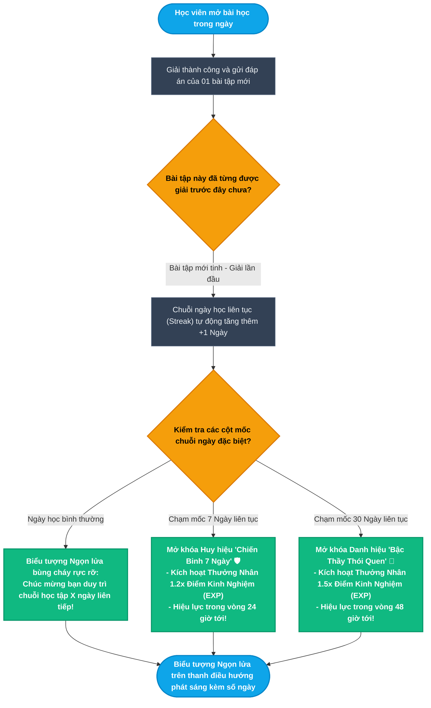
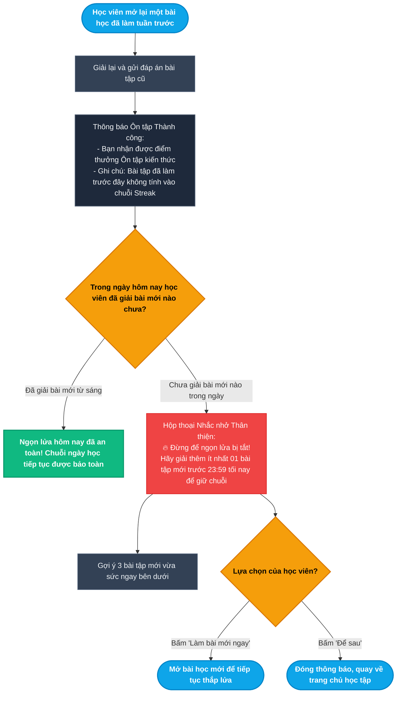
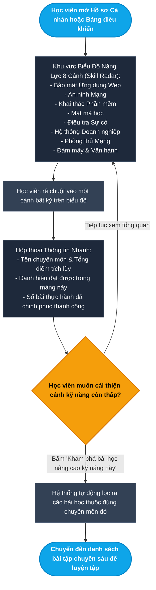
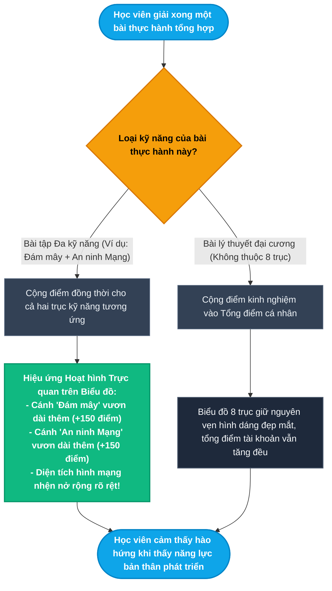
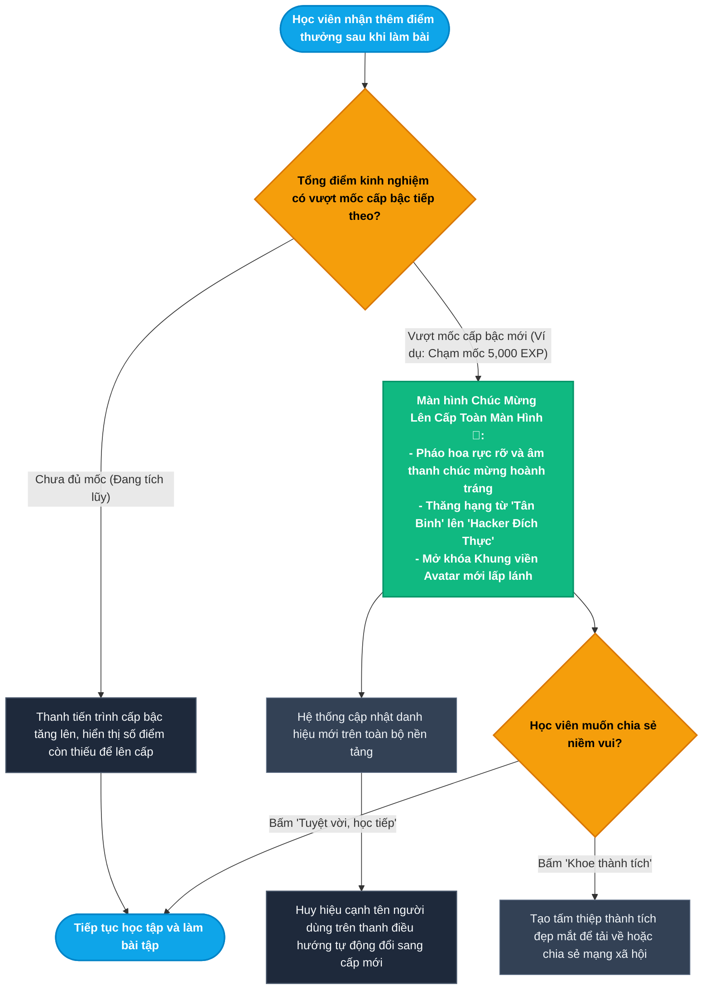
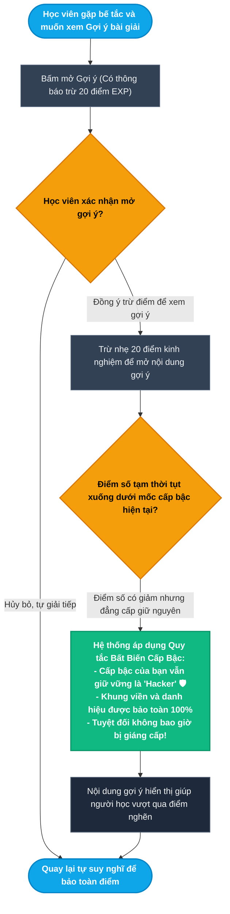

# Epic 7: Gamification, Streaks & 8-Axis Skill Radar
## Tài liệu Thiết kế Kiến trúc User Flow Chi tiết (User Journey & Experience Flows)

* **Hệ thống:** CyberForce Cyber Range & Practical Security Platform
* **Tài liệu tham chiếu:** [EPIC_07_GAMIFICATION_STREAKS_SKILL_RADAR.md](file:///home/quocbao/Documents/University/ChuyenDe4/CyberForge/docs/05-epics/EPIC_07_GAMIFICATION_STREAKS_SKILL_RADAR.md)
* **Vai trò phụ trách:** Product Designer (UX Architect)
* **Phiên bản:** 1.0 (Strict Non-Tech User Experience Focus)

---

## 📑 MỤC LỤC TỔNG QUAN CÁC TIỂU LUỒNG (USER FLOWS)

Toàn bộ trải nghiệm tạo động lực học tập, duy trì thói quen hàng ngày và theo dõi sự tiến bộ của bản thân được thiết kế dưới góc nhìn **hoàn toàn phi kỹ thuật (non-tech)** qua **6 tiểu luồng trực quan**:

- **MODULE 1: CHUỖI NGÀY HỌC LIÊN TỤC & THƯỞNG HỆ SỐ NHÂN EXP (DAILY STREAKS & MULTIPLIERS)**
  - [Sub-flow 1.1: Hoàn Thành Bài Học Mới & Nuôi Dưỡng Ngọn Lửa Streak (US-07.01)](#sub-flow-11-hoàn-thành-bài-học-mới--nuôi-dưỡng-ngọn-lửa-streak-us-0701)
  - [Sub-flow 1.2: Phản Hồi Khi Ôn Tập Bài Cũ & Cảnh Báo Nguy Cơ Đứt Chuỗi (US-07.01)](#sub-flow-12-phản-hồi-khi-ôn-tập-bài-cũ--cảnh-báo-nguy-cơ-đứt-chuỗi-us-0701)
- **MODULE 2: BIỂU ĐỒ NĂNG LỰC 8 CÁNH & CỘNG ĐIỂM ĐA KỸ NĂNG (8-AXIS SKILL RADAR)**
  - [Sub-flow 2.1: Khám Phá Biểu Đồ Radar Năng Lực Trên Hồ Sơ Cá Nhân (US-07.02)](#sub-flow-21-khám-phá-biểu-đồ-radar-năng-lực-trên-hồ-sơ-cá-nhân-us-0702)
  - [Sub-flow 2.2: Trải Nghiệm Mở Rộng Biểu Đồ Khi Hoàn Thành Bài Tập Đa Kỹ Năng (US-07.02)](#sub-flow-22-trải-nghiệm-mở-rộng-biểu-đồ-khi-hoàn-thành-bài-tập-đa-kỹ-năng-us-0702)
- **MODULE 3: HỆ THỐNG CẤP BẬC DANH VỌNG & HUY HIỆU THÀNH TÍCH (RANK TIERS & ACHIEVEMENTS)**
  - [Sub-flow 3.1: Thăng Tiến Cấp Bậc Danh Vọng & Vinh Danh Toàn Màn Hình (US-07.03)](#sub-flow-31-thăng-tiến-cấp-bậc-danh-vọng--vinh-danh-toàn-màn-hình-us-0703)
  - [Sub-flow 3.2: Cơ Chế Bảo Toàn Cấp Bậc - Không Bị Giáng Hạng Khi Trừ Điểm (US-07.03)](#sub-flow-32-cơ-chế-bảo-toàn-cấp-bậc---không-bị-giáng-hạng-khi-trừ-điểm-us-0703)

---

## I. NGUYÊN TẮC THIẾT KẾ TRẢI NGHIỆM CHO NGƯỜI DÙNG NON-TECH

1. **Trải nghiệm Game Hóa Thân Thiện & Đầy Cảm Hứng (Inspiring Gamification):**
   - Tập trung vào những yếu tố mang lại niềm vui học tập: *Ngọn lửa chuỗi ngày cháy rực rỡ, huy hiệu sáng lấp lánh, hiệu ứng pháo hoa khi lên cấp, biểu đồ mạng nhện hình hoa nở rộng*.
   - Người học không cần hiểu cách máy chủ tính toán; chỉ cần biết: *Hôm nay làm bài mới $\rightarrow$ Ngọn lửa tiếp tục cháy $\rightarrow$ Điểm kinh nghiệm nhân đôi*.
2. **Cơ chế "No Dead End" (Luôn có động lực bước tiếp):**
   - Làm lại bài cũ không bị mất công vô ích mà vẫn được cộng điểm ôn tập và có nút gợi ý bài mới làm ngay để giữ chuỗi.
   - Bị trừ điểm do xem gợi ý cũng không bao giờ bị tụt cấp bậc danh vọng, giúp học viên luôn giữ được sự tự tin.
3. **Minh bạch & Trực quan Hóa Sự Tiến Bộ:**
   - Biểu đồ năng lực 8 trục giúp người học nhìn thấy ngay mảng nào mình giỏi (cánh biểu đồ vươn dài) và mảng nào cần học thêm (cánh biểu đồ còn ngắn) mà không cần đọc những bảng báo cáo khô khan.

---

## II. CHI TIẾT CÁC TIỂU LUỒNG USER FLOW (MERMAID FLOWCHARTS & MATRICES)

---

### Sub-flow 1.1: Hoàn Thành Bài Học Mới & Nuôi Dưỡng Ngọn Lửa Streak (US-07.01)

Mỗi ngày giải thành công ít nhất một bài tập mới trước nửa đêm để nuôi ngọn lửa học tập liên tục và nhận các phần thưởng nhân điểm hấp dẫn.

#### Sơ đồ Flowchart (Mermaid)

#### Bảng State Transition Matrix (Sub-flow 1.1)

| Bước | Màn hình / Trạng thái | Hành động người dùng | Điều kiện kiểm tra | Màn hình tiếp theo | Cơ chế thoát hiểm (No Dead End) |
| :--- | :--- | :--- | :--- | :--- | :--- |
| **1.1.1** | Giao diện bài học | Hoàn thành và nộp đáp án | Bài tập mới chưa từng giải trước đó | Thông báo chúc mừng kèm số điểm kinh nghiệm nhận được | Nút "Tiếp tục bài tiếp theo" |
| **1.1.2** | Màn hình chúc mừng | Quan sát biểu tượng ngọn lửa | Đã giải bài mới trước 23:59 theo giờ cá nhân | Ngọn lửa bốc cháy kèm số ngày tăng lên (+1) | Tự động ghi nhận theo đúng múi giờ nơi học viên sinh sống |
| **1.1.3** | Màn hình chúc mừng | Đạt mốc 7 ngày liên tục | Chuỗi đạt đúng 7 ngày | Hộp thoại trao tặng huy hiệu "Chiến Binh 7 Ngày" | Kích hoạt nhân 1.2x điểm trong 24 giờ tiếp theo |
| **1.1.4** | Màn hình chúc mừng | Đạt mốc 30 ngày liên tục | Chuỗi đạt tròn 1 tháng | Hộp thoại vinh danh "Bậc Thầy Thói Quen" | Kích hoạt nhân 1.5x điểm trong 48 giờ tiếp theo |
| **1.1.5** | Thanh điều hướng | Di chuột vào biểu tượng ngọn lửa | Ngọn lửa đang cháy | Bảng lịch tuần hiển thị các ngày đã hoàn thành | Giúp học viên theo dõi nhịp độ học tập trong tuần |

---

### Sub-flow 1.2: Phản Hồi Khi Ôn Tập Bài Cũ & Cảnh Báo Nguy Cơ Đứt Chuỗi (US-07.01)

Phân biệt rõ ràng giữa việc ôn tập bài cũ và việc chinh phục bài mới, nhắc nhở kịp thời để học viên không bị đứt chuỗi ngày đáng tiếc.

#### Sơ đồ Flowchart (Mermaid)

#### Bảng State Transition Matrix (Sub-flow 1.2)

| Bước | Màn hình / Trạng thái | Hành động người dùng | Điều kiện kiểm tra | Màn hình tiếp theo | Cơ chế thoát hiểm (No Dead End) |
| :--- | :--- | :--- | :--- | :--- | :--- |
| **1.2.1** | Phòng học đã hoàn thành | Giải lại bài tập cũ | Bài tập đã có tích xanh hoàn thành từ trước | Nhận điểm kinh nghiệm ôn tập | Giữ giá trị cho việc ôn lại kiến thức |
| **1.2.2** | Hộp thoại sau bài làm | Xem thông báo Streak | Đã giải bài mới khác trong ngày hôm nay | Thông báo ngọn lửa hôm nay đã an toàn | Yên tâm tiếp tục ôn tập tự do |
| **1.2.3** | Hộp thoại sau bài làm | Xem thông báo Streak | Chưa làm bài mới nào trong ngày | Hộp thoại nhắc nhở ngọn lửa sắp tắt kèm thời gian đếm lùi | Không làm hoang mang, chỉ dẫn cụ thể việc cần làm |
| **1.2.4** | Hộp thoại nhắc nhở | Xem các bài gợi ý | Cần tìm bài mới nhanh chóng | Danh sách 3 bài học mới phù hợp trình độ | Bấm 1-click vào làm ngay bài mới |
| **1.2.5** | Hộp thoại nhắc nhở | Bấm "Để sau" | Người học bận việc khác | Đóng hộp thoại nhắc nhở, trở về Dashboard | Cho phép học viên chủ động sắp xếp thời gian trước 23:59 |

---

### Sub-flow 2.1: Khám Phá Biểu Đồ Radar Năng Lực Trên Hồ Sơ Cá Nhân (US-07.02)

Biểu đồ hình mạng nhện 8 trục sinh động giúp học viên và nhà tuyển dụng dễ dàng nhìn thấy bức tranh tổng thể về chuyên môn mà không cần đọc số liệu phức tạp.

#### Sơ đồ Flowchart (Mermaid)

#### Bảng State Transition Matrix (Sub-flow 2.1)

| Bước | Màn hình / Trạng thái | Hành động người dùng | Điều kiện kiểm tra | Màn hình tiếp theo | Cơ chế thoát hiểm (No Dead End) |
| :--- | :--- | :--- | :--- | :--- | :--- |
| **2.1.1** | Hồ sơ cá nhân | Cuộn chuột đến phần Kỹ năng | Đã đăng nhập hoặc xem trang hồ sơ công khai | Biểu đồ Radar 8 trục màu sắc hiện đại, cân đối | Biểu diễn diện tích trực quan, dễ hiểu |
| **2.1.2** | Biểu đồ Radar | Di chuột vào một đỉnh của biểu đồ | Muốn xem chi tiết một kỹ năng | Khung nổi hiển thị số điểm và cấp độ chuyên môn | Tự động ẩn đi khi di chuột ra ngoài |
| **2.1.3** | Khung nổi chi tiết | Bấm nút "Luyện tập kỹ năng này" | Cánh kỹ năng này điểm còn thấp | Chuyển đến thư viện bài học được lọc sẵn theo chủ đề | Giúp người học định hướng phát triển cân bằng các mảng |
| **2.1.4** | Biểu đồ Radar | Xem trên điện thoại di động | Màn hình kích thước nhỏ | Biểu đồ tự co giãn mượt mà, hỗ trợ chạm ngón tay để xem chi tiết | Đảm bảo trải nghiệm tốt trên mọi thiết bị |

---

### Sub-flow 2.2: Trải Nghiệm Mở Rộng Biểu Đồ Khi Hoàn Thành Bài Tập Đa Kỹ Năng (US-07.02)

Chứng kiến biểu đồ năng lực tự động nở rộng đồng thời trên nhiều hướng khi hoàn thành một bài tập mang tính thực chiến tổng hợp.

#### Sơ đồ Flowchart (Mermaid)

#### Bảng State Transition Matrix (Sub-flow 2.2)

| Bước | Màn hình / Trạng thái | Hành động người dùng | Điều kiện kiểm tra | Màn hình tiếp theo | Cơ chế thoát hiểm (No Dead End) |
| :--- | :--- | :--- | :--- | :--- | :--- |
| **2.2.1** | Màn hình hoàn thành bài | Nộp đáp án bài thực hành liên môn | Bài tập có gắn nhiều nhãn kỹ năng | Thông báo nhận điểm thưởng kèm danh sách các trục được tăng | Hiển thị cụ thể điểm cộng cho từng kỹ năng |
| **2.2.2** | Hồ sơ năng lực | Quan sát biểu đồ sau khi nộp bài | Vừa hoàn thành bài thực hành | Đồ họa hoạt hình biểu đồ nở rộng tại các cánh tương ứng | Cảm giác thành tựu rõ rệt và trực quan |
| **2.2.3** | Màn hình hoàn thành bài | Nộp bài lý thuyết đại cương | Bài học căn bản không chia theo 8 trục | Điểm kinh nghiệm tổng tăng lên, biểu đồ giữ nguyên | Mọi bài tập đều có giá trị nâng cấp tài khoản |
| **2.2.4** | Bảng xếp hạng kỹ năng | Nhấp xem thứ hạng theo mảng | Muốn so tài với cộng đồng | Bảng xếp hạng các học viên xuất sắc nhất trong từng chuyên môn | Nút quay lại hồ sơ cá nhân |

---

### Sub-flow 3.1: Thăng Tiến Cấp Bậc Danh Vọng & Vinh Danh Toàn Màn Hình (US-07.03)

Khoảnh khắc tích lũy đủ điểm kinh nghiệm để vượt ngưỡng, mở khóa danh hiệu mới với hiệu ứng vinh danh toàn màn hình đầy tự hào.

#### Sơ đồ Flowchart (Mermaid)

#### Bảng State Transition Matrix (Sub-flow 3.1)

| Bước | Màn hình / Trạng thái | Hành động người dùng | Điều kiện kiểm tra | Màn hình tiếp theo | Cơ chế thoát hiểm (No Dead End) |
| :--- | :--- | :--- | :--- | :--- | :--- |
| **3.1.1** | Màn hình hoàn thành bài | Nhận điểm kinh nghiệm | Chưa chạm ngưỡng mốc cấp bậc mới | Thanh tiến trình tiến thêm một đoạn, hiện rõ số điểm cần thêm | Giúp người học biết còn cách mốc bao xa |
| **3.1.2** | Màn hình hoàn thành bài | Nhận điểm kinh nghiệm | Vượt ngưỡng mốc thăng hạng | Hộp thoại chúc mừng thăng cấp phủ khắp màn hình | Âm thanh sinh động, pháo hoa rực rỡ |
| **3.1.3** | Màn hình chúc mừng thăng cấp | Xem danh hiệu và quà tặng | Đã lên hạng thành công | Hiển thị danh hiệu mới và khung viền đại diện mới | Tự động áp dụng vào ảnh đại diện |
| **3.1.4** | Màn hình chúc mừng | Bấm nút "Khoe thành tích" | Muốn chia sẻ cho bạn bè | Tạo ảnh thiệp mừng cá nhân hóa để tải về | Nút lưu ảnh hoặc chia sẻ 1-click |
| **3.1.5** | Màn hình chúc mừng | Bấm nút "Tiếp tục học" | Đã xem xong phần thưởng | Đóng hộp thoại chúc mừng, trở lại giao diện bài học | Tiếp tục hành trình học tập thuận tiện |

---

### Sub-flow 3.2: Cơ Chế Bảo Toàn Cấp Bậc - Không Bị Giáng Hạng Khi Trừ Điểm (US-07.03)

Tạo cảm giác an tâm tuyệt đối cho người học: Điểm số có thể biến động khi mở gợi ý nhưng danh hiệu và đẳng cấp đã đạt được luôn được giữ vững trọn đời.

#### Sơ đồ Flowchart (Mermaid)

#### Bảng State Transition Matrix (Sub-flow 3.2)

| Bước | Màn hình / Trạng thái | Hành động người dùng | Điều kiện kiểm tra | Màn hình tiếp theo | Cơ chế thoát hiểm (No Dead End) |
| :--- | :--- | :--- | :--- | :--- | :--- |
| **3.2.1** | Khung câu hỏi bài tập | Bấm nút xem Gợi ý | Gợi ý có quy định trừ điểm kinh nghiệm | Hộp thoại nhắc nhở số điểm sẽ bị trừ | Nút "Hủy bỏ" để tự giải nếu không muốn mất điểm |
| **3.2.2** | Hộp thoại gợi ý | Xác nhận mở xem gợi ý | Đồng ý đổi điểm lấy hướng dẫn giải | Nội dung gợi ý mở ra, số điểm giảm nhẹ | Học viên nắm được gợi ý để giải tiếp |
| **3.2.3** | Thanh điều hướng | Quan sát cấp bậc sau khi trừ điểm | Điểm số rơi xuống dưới ngưỡng mốc vừa lên | Cấp bậc và huy hiệu giữ nguyên vẹn 100% | Cam kết bảo toàn danh hiệu, không hạ cấp bậc |
| **3.2.4** | Bảng tiến trình | Xem điểm số hiện tại | Sau khi bị trừ điểm | Điểm kinh nghiệm tích lũy hiển thị chính xác số thực tế | Học viên hoàn toàn yên tâm tiếp tục trải nghiệm |
