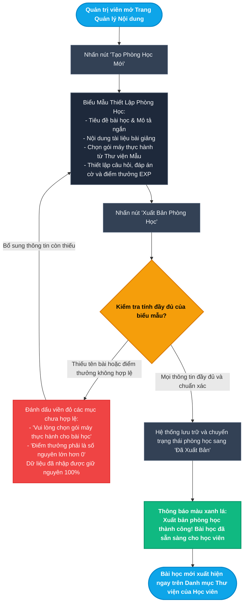
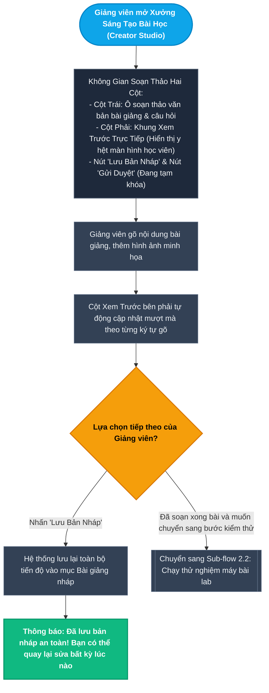
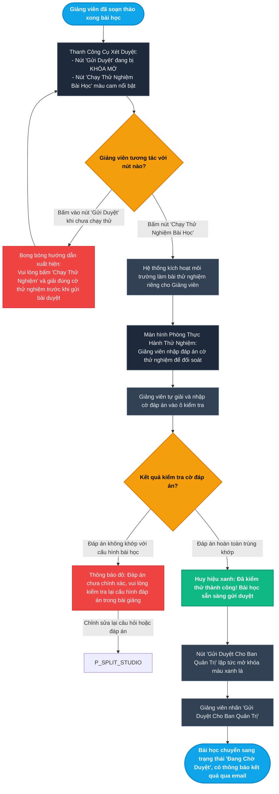
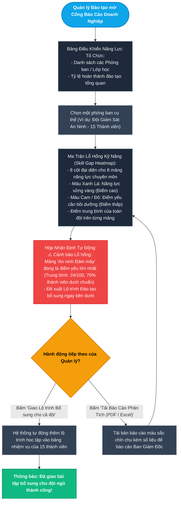
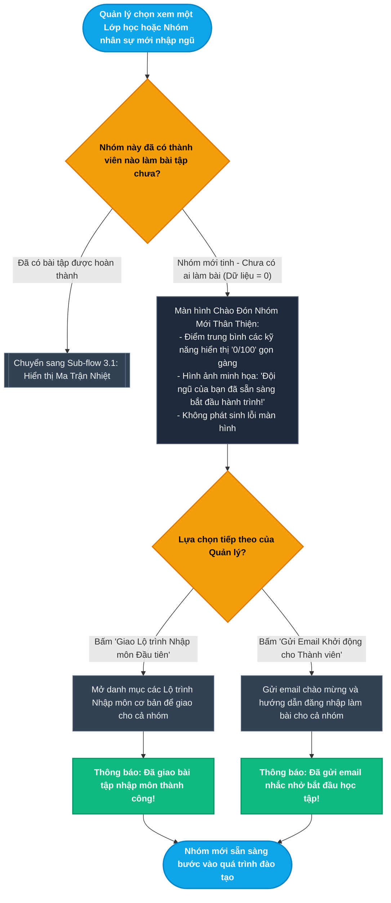

# Epic 8: Lab Creator Studio & University/Enterprise Analytics
## Tài liệu Thiết kế Kiến trúc User Flow Chi tiết (User Journey & Experience Flows)

* **Hệ thống:** CyberForge Cyber Range & Practical Security Platform
* **Tài liệu tham chiếu:** [EPIC_08_LAB_CREATOR_STUDIO_ANALYTICS.md](file:///home/quocbao/Documents/University/ChuyenDe4/CyberForge/docs/05-epics/EPIC_08_LAB_CREATOR_STUDIO_ANALYTICS.md)
* **Vai trò phụ trách:** Product Designer (UX Architect)
* **Phiên bản:** 1.0 (Strict Non-Tech User Experience Focus)

---

## 📑 MỤC LỤC TỔNG QUAN CÁC TIỂU LUỒNG (USER FLOWS)

Toàn bộ trải nghiệm quản trị nội dung đào tạo, không gian sáng tạo bài giảng và cổng phân tích năng lực tổ chức được thiết kế dưới góc nhìn **hoàn toàn phi kỹ thuật (non-tech)** qua **5 tiểu luồng trực quan**:

- **MODULE 1: QUẢN TRỊ NỘI DUNG ĐÀO TẠO DÀNH CHO ADMIN (CONTENT CMS)**
  - [Sub-flow 1.1: Tạo Mới & Xuất Bản Phòng Học Hoàn Chỉnh (US-08.01)](#sub-flow-11-tạo-mới--xuất-bản-phòng-học-hoàn-chỉnh-us-0801)
- **MODULE 2: XƯỞNG SÁNG TẠO BÀI HỌC DÀNH CHO GIẢNG VIÊN (LAB CREATOR STUDIO)**
  - [Sub-flow 2.1: Soạn Thảo Bài Giảng & Xem Trước Hiển Thị Thời Gian Thực (US-08.02)](#sub-flow-21-soạn-thảo-bài-giảng--xem-trước-hiển-thị-thời-gian-thực-us-0802)
  - [Sub-flow 2.2: Chạy Thử Nghiệm Chất Lượng & Gửi Duyệt Bài Giảng (US-08.02)](#sub-flow-22-chạy-thử-nghiệm-chất-lượng--gửi-duyệt-bài-giảng-us-0802)
- **MODULE 3: BÁO CÁO PHÂN TÍCH NĂNG LỰC DOANH NGHIỆP & ĐẠI HỌC (ENTERPRISE / UNIVERSITY ANALYTICS)**
  - [Sub-flow 3.1: Khám Phá Ma Trận Lỗ Hổng Kỹ Năng Đội Ngũ (US-08.03)](#sub-flow-31-khám-phá-ma-trận-lỗ-hổng-kỹ-năng-đội-ngũ-us-0803)
  - [Sub-flow 3.2: Phản Hồi Trực Quan Khi Nhóm Mới Chưa Có Dữ Liệu Học Tập (US-08.03)](#sub-flow-32-phản-hồi-trực-quan-khi-nhóm-mới-chưa-có-dữ-liệu-học-tập-us-0803)

---

## I. NGUYÊN TẮC THIẾT KẾ TRẢI NGHIỆM CHO NGƯỜI DÙNG NON-TECH

1. **Góc nhìn Người dùng Phi Kỹ thuật (Non-Tech Human Perspective):**
   - Tập trung vào các thao tác trực quan quen thuộc: *Biểu mẫu nhập liệu có hướng dẫn rõ ràng, trình soạn thảo bài giảng có khung xem trước như văn bản thông thường, nút 'Chạy thử nghiệm' để bảo đảm bài tập hoạt động tốt trước khi xuất bản, biểu đồ nhiệt màu sắc giúp nhìn thấy ngay điểm mạnh/điểm yếu của nhân sự*.
   - Loại bỏ hoàn toàn các chi tiết kỹ thuật phức tạp (không nhắc đến kho container, hạ tầng ảo hóa, lệnh điều khiển máy chủ, cổng mạng hay truy vấn cơ sở dữ liệu).
2. **Cơ chế "No Dead End" (Không có lối cụt):**
   - Nhập thiếu thông tin bài học: Hệ thống viền đỏ vị trí cần bổ sung và giữ nguyên vẹn nội dung đã gõ.
   - Chưa chạy thử bài tập: Hiển thị hướng dẫn từng bước kích hoạt chạy thử trước khi gửi duyệt.
   - Lớp học mới chưa có bài làm: Giao diện hiển thị trạng thái chào đón kèm nút hành động hữu ích để bắt đầu giao bài tập đầu tiên.
3. **Minh bạch & Đảm bảo Chất lượng Đào tạo:**
   - Người sáng tạo bài giảng luôn an tâm vì có thể kiểm tra bài làm của chính mình trước khi đến tay học viên; người quản lý doanh nghiệp có trong tay báo cáo sắc nét để trình bày trực tiếp với ban giám đốc.

---

## II. CHI TIẾT CÁC TIỂU LUỒNG USER FLOW (MERMAID FLOWCHARTS & MATRICES)

---

### Sub-flow 1.1: Tạo Mới & Xuất Bản Phòng Học Hoàn Chỉnh (US-08.01)

Quản trị viên sử dụng biểu mẫu trực quan để khởi tạo bài học mới, thiết lập nội dung lý thuyết, cấu hình phần thưởng và xuất bản lên thư viện cho học viên.

#### Sơ đồ Flowchart (Mermaid)

#### Bảng State Transition Matrix (Sub-flow 1.1)

| Bước | Màn hình / Trạng thái | Hành động người dùng | Điều kiện kiểm tra | Màn hình tiếp theo | Cơ chế thoát hiểm (No Dead End) |
| :--- | :--- | :--- | :--- | :--- | :--- |
| **1.1.1** | Bảng quản trị nội dung | Nhấn nút "Tạo Phòng Học Mới" | Có quyền quản trị nội dung (Admin) | Biểu mẫu thiết lập phòng học chi tiết | Nút "Hủy bỏ" quay lại danh sách bài học |
| **1.1.2** | Biểu mẫu phòng học | Nhập thông tin bài giảng và câu hỏi | Đang trong quá trình soạn thảo | Nội dung được tự động lưu tạm (Auto-draft) | Không lo mất dữ liệu nếu lỡ tắt trình duyệt |
| **1.1.3** | Biểu mẫu phòng học | Nhấn nút "Xuất Bản Phòng Học" | Bỏ trống tiêu đề hoặc điểm thưởng là số âm | Viền đỏ ô nhập sai kèm thông báo hướng dẫn cụ thể | Toàn bộ văn bản đã gõ được giữ nguyên vẹn |
| **1.1.4** | Biểu mẫu phòng học | Nhấn nút "Xuất Bản Phòng Học" | Đầy đủ tiêu đề, gói bài tập và điểm thưởng hợp lệ | Màn hình thông báo xuất bản thành công | Nút xem trước bài học thực tế trên giao diện học viên |
| **1.1.5** | Danh mục bài học | Kiểm tra bài vừa tạo | Đã ở trạng thái Đã Xuất Bản | Bài học hiển thị trên danh mục chung cho người học | Nút "Sửa bài" nếu muốn cập nhật thêm nội dung |

---

### Sub-flow 2.1: Soạn Thảo Bài Giảng & Xem Trước Hiển Thị Thời Gian Thực (US-08.02)

Giảng viên sử dụng không gian làm việc chia hai cột tiện lợi: Cột soạn bài bên trái và Cột xem trước hiển thị trực quan bên phải y như giao diện học viên.

#### Sơ đồ Flowchart (Mermaid)

#### Bảng State Transition Matrix (Sub-flow 2.1)

| Bước | Màn hình / Trạng thái | Hành động người dùng | Điều kiện kiểm tra | Màn hình tiếp theo | Cơ chế thoát hiểm (No Dead End) |
| :--- | :--- | :--- | :--- | :--- | :--- |
| **2.1.1** | Trang chủ Creator | Mở một bài giảng đang biên soạn | Đã được cấp quyền Giảng viên (Creator) | Không gian làm việc 2 cột tiện lợi | Nút "Trở về Danh sách Bài giảng của tôi" |
| **2.1.2** | Cột soạn thảo bên trái | Gõ nội dung bài giảng và chèn ảnh | Người dùng thao tác gõ phím bình thường | Khung bên phải phản chiếu ngay lập tức định dạng văn bản | Hỗ trợ thanh công cụ định dạng trực quan (đậm, nghiêng, danh sách) |
| **2.1.3** | Khung làm việc Studio | Nhấn nút "Lưu Bản Nháp" | Muốn tạm dừng để hôm sau soạn tiếp | Thông báo đã lưu bản nháp thành công | Cho phép thoát ra ngoài mà không bị mất chữ nào |
| **2.1.4** | Khung làm việc Studio | Kéo dãn thanh chia giữa hai cột | Muốn mở rộng khung xem trước bài giảng | Kích thước hai cột co giãn linh hoạt theo ý muốn | Có nút đặt lại kích thước cân bằng mặc định |

---

### Sub-flow 2.2: Chạy Thử Nghiệm Chất Lượng & Gửi Duyệt Bài Giảng (US-08.02)

Cơ chế kiểm thử bắt buộc giúp giảng viên tự trải nghiệm và giải thử bài tập của chính mình, bảo đảm bài học không bị lỗi trước khi gửi tới Ban Quản trị xét duyệt.

#### Sơ đồ Flowchart (Mermaid)

#### Bảng State Transition Matrix (Sub-flow 2.2)

| Bước | Màn hình / Trạng thái | Hành động người dùng | Điều kiện kiểm tra | Màn hình tiếp theo | Cơ chế thoát hiểm (No Dead End) |
| :--- | :--- | :--- | :--- | :--- | :--- |
| **2.2.1** | Thanh công cụ duyệt bài | Bấm thử nút "Gửi Duyệt" | Chưa thực hiện bước chạy thử nghiệm | Nút bị khóa, hiện gợi ý cần chạy thử trước | Hướng dẫn rõ ràng, không làm người dùng bối rối |
| **2.2.2** | Thanh công cụ duyệt bài | Bấm nút "Chạy Thử Nghiệm Bài Học" | Đã soạn đầy đủ câu hỏi và cờ | Mở phòng thực hành chạy thử nghiệm | Có nút hủy chạy thử nếu muốn sửa tiếp |
| **2.2.3** | Phòng chạy thử | Nhập cờ đáp án tự giải | Cờ không khớp đáp án đã lưu | Báo lỗi đáp án không trùng khớp | Cho phép quay lại biểu mẫu sửa lại đáp án đúng |
| **2.2.4** | Phòng chạy thử | Nhập cờ đáp án tự giải | Cờ hoàn toàn chính xác | Thông báo đã hoàn thành kiểm thử chất lượng bài học | Nút "Gửi duyệt" chuyển sang màu xanh khả dụng |
| **2.2.5** | Phòng sáng tạo | Nhấn nút "Gửi Duyệt Cho Ban Quản Trị" | Đã vượt qua bước kiểm thử | Thông báo bài học đã gửi vào hàng đợi xét duyệt | Dashboard cập nhật nhãn trạng thái "Đang chờ duyệt" |

---

### Sub-flow 3.1: Khám Phá Ma Trận Lỗ Hổng Kỹ Năng Đội Ngũ (US-08.03)

Quản lý đào tạo doanh nghiệp hoặc Trưởng khoa Đại học theo dõi bức tranh năng lực an ninh mạng của toàn bộ nhân viên/sinh viên thông qua biểu đồ nhiệt màu sắc trực quan và tải báo cáo trình ban lãnh đạo.

#### Sơ đồ Flowchart (Mermaid)

#### Bảng State Transition Matrix (Sub-flow 3.1)

| Bước | Màn hình / Trạng thái | Hành động người dùng | Điều kiện kiểm tra | Màn hình tiếp theo | Cơ chế thoát hiểm (No Dead End) |
| :--- | :--- | :--- | :--- | :--- | :--- |
| **3.1.1** | Cổng Báo cáo Doanh nghiệp | Chọn phòng ban muốn phân tích | Đã đăng nhập tài khoản Quản lý Doanh nghiệp/Trường học | Mở bảng Ma trận Kỹ năng chi tiết của nhóm đó | Có menu chuyển nhanh sang các phòng ban khác |
| **3.1.2** | Ma trận Kỹ năng (Heatmap) | Quan sát bảng màu nhiệt | Nhóm đã có dữ liệu thực hành | Bảng nhiệt trực quan: Xanh (tốt), Cam/Đỏ (yếu) | Rê chuột vào từng ô xem điểm thành viên cụ thể |
| **3.1.3** | Khung Nhận định tự động | Đọc phân tích lỗ hổng kỹ năng | Hệ thống tự phát hiện mảng điểm thấp nhất | Khung nổi bật chỉ rõ lỗ hổng và đề xuất lộ trình khắc phục | Giúp người quản lý ra quyết định đào tạo đúng đắn |
| **3.1.4** | Khung Nhận định | Bấm "Giao Lộ trình Bổ sung" | Muốn nâng cao kỹ năng cho đội | Xác nhận giao lộ trình học cho toàn bộ thành viên trong nhóm | Thành viên sẽ nhận được thông báo học tập mới |
| **3.1.5** | Ma trận Kỹ năng | Bấm "Tải Báo Cáo (PDF / Excel)" | Cần tài liệu báo cáo lãnh đạo | Trình duyệt tải ngay tệp báo cáo định dạng chuyên nghiệp | Có lựa chọn tải bản PDF in màu hoặc file Excel số liệu |

---

### Sub-flow 3.2: Phản Hồi Trực Quan Khi Nhóm Mới Chưa Có Dữ Liệu Học Tập (US-08.03)

Trải nghiệm tinh tế, thân thiện khi người quản lý mở xem một nhóm nhân viên hoặc sinh viên mới nhập học chưa từng làm bài tập nào, bảo đảm giao diện gọn gàng và hướng dẫn bước tiếp theo rõ ràng.

#### Sơ đồ Flowchart (Mermaid)

#### Bảng State Transition Matrix (Sub-flow 3.2)

| Bước | Màn hình / Trạng thái | Hành động người dùng | Điều kiện kiểm tra | Màn hình tiếp theo | Cơ chế thoát hiểm (No Dead End) |
| :--- | :--- | :--- | :--- | :--- | :--- |
| **3.2.1** | Danh sách phòng ban | Chọn nhóm nhân viên mới | Chưa có thành viên nào giải bài tập | Màn hình trạng thái trống được thiết kế đẹp mắt | Điểm số hiển thị 0/100 an toàn, không gây hiểu lầm |
| **3.2.2** | Màn hình nhóm mới | Xem thông tin nhóm | Không có lịch sử hoạt động | Hình vẽ minh họa truyền cảm hứng kèm nút hành động khởi động | Người quản lý biết chính xác cần làm gì tiếp theo |
| **3.2.3** | Màn hình nhóm mới | Bấm "Giao Lộ trình Nhập môn" | Muốn chỉ định bài học bắt buộc | Cửa sổ chọn bài học cơ bản và bấm giao cho cả nhóm | Tiện lợi, không cần giao từng người một |
| **3.2.4** | Màn hình nhóm mới | Bấm "Gửi Email Khởi động" | Muốn nhắc nhở nhân viên đăng nhập | Hệ thống gửi thư mời kèm đường dẫn bài học | Có thông báo xác nhận số lượng email đã gửi thành công |
| **3.2.5** | Màn hình nhóm mới | Bấm "Quay lại danh sách nhóm" | Muốn xem các phòng ban khác | Trở lại danh sách các phòng ban trong tổ chức | Điều hướng linh hoạt, thuận tiện |
